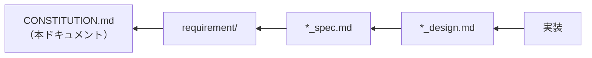

# プロジェクト原則

**バージョン**: 1.0.0
**最終更新日**: 2026-08-15
**ステータス**: 有効

## 目的

このドキュメントは agent-effort-db の開発を統制する**非交渉原則**を定義します。
`.sdd/requirement/` 配下の PRD、`.sdd/specification/` 配下の spec / design、および実装コードは
すべてこれらの原則に従う必要があります。

原則に反する設計・実装は、原則そのものを改訂する合意を経ない限り採用できません。

## 原則階層

```
1. ビジネス原則（最優先）
   ↓
2. アーキテクチャ原則
   ↓
3. 開発手法原則
   ↓
4. 技術制約
```

優先度が高い原則が低い原則に優先します。

## ドキュメント上の位置づけ



## 原則 ID 体系

| プレフィックス | カテゴリ      | 主な影響先                       |
|:--------|:----------|:----------------------------|
| `B-xxx` | ビジネス原則    | PRD の背景・目的・上位要求             |
| `A-xxx` | アーキテクチャ原則 | design のアーキテクチャ設計、モジュール分割   |
| `D-xxx` | 開発手法原則    | テスト戦略、検証方法の選択               |
| `T-xxx` | 技術制約      | 技術スタック選定、design の技術判断       |

---

## 1. ビジネス原則（最優先）

### B-001: 実測主義

**原則**: 見積もりの根拠は実測データに置く。推定器を内蔵することを目的としない。

**背景**: Claude Code / AI エージェントが出す工数見積もりは「人間が実施する前提」で算出されるため大きく外れる。
本プロジェクトは**実際にかかった工数を蓄積し、見積もりの参照母集団（reference class）として使える状態にする**ことを担う。

**適用範囲**: 機能の採否判断、データモデル設計

**検証方法**:

- [ ] 追加する機能が実測データの蓄積または参照に寄与している
- [ ] 推定ロジック・予測モデルをシステム内に持ち込んでいない

### B-002: エージェントネイティブな単位

**原則**: 「人日」を単位に採用しない。セッション数 / ターン数 / 実経過時間など、
エージェントの作業実態が直接観測できる単位で表現する。

**背景**: 人日はエージェント実行時間と対応関係がなく、変換の過程で実測値の意味が失われる。

**適用範囲**: データモデル、集約ビュー、CLI の出力

**検証方法**:

- [ ] 保存・表示する値が観測可能な単位で表現されている
- [ ] 人日等への換算処理を持たない

**違反例**:

- ターン数から人日を推定する換算係数をコードに持つ
- 実時間を「工数（人時）」として保存する

**準拠例**:

- `turns` / `tool_calls` / `wall_clock_min` をそのまま保持する

### B-003: 分布として扱う

**原則**: 集計・参照時は単一の代表値ではなく分布（中央値 / p90 等）として提示する。

**背景**: エージェントの実工数はばらつきが大きく、点推定は誤った確信を生む。

**適用範囲**: 集約ビュー、参照系コマンドの出力

**検証方法**:

- [ ] 集約結果から分布（中央値 / p90 等）を取り出せる
- [ ] 平均値のみを提示する集約になっていない

### B-004: 実データを公開範囲に漏洩させない

**原則**: 実セッションログ・収集済み DB・環境固有値をリポジトリに含めない。

**背景**: **本リポジトリは PUBLIC である。** 本原則は運用上の推奨ではなく必須要件として扱う。
将来 org へ移管する余地はあるが、移管によって公開範囲が変わるわけではないため本原則は緩和されない。

**適用範囲**: すべてのコミット、テストデータ、設定値

**検証方法**:

- [ ] 実セッションログ（`~/.claude/projects/**/*.jsonl`）をコピー・コミットしていない
- [ ] 収集済み DB ファイルをリポジトリに含めていない
- [ ] 社内固有値（Jira キー、内部リポジトリ名、Slack ID 等）をハードコードしていない
- [ ] `.gitignore` が上記を網羅している

**違反例**:

- 動作確認のために実ログを `tests/fixtures/` にコピーする
- チケットキーの正規表現に実在のプロジェクトキーを直接書く

**準拠例**:

- 合成した架空のログをフィクスチャとして使う
- チケットキーの形式を gitignore 済みの `config.toml` から読み込む

---

## 2. アーキテクチャ原則

### A-001: 収集と参照の分離

**原則**: skill / MCP / hook / プラグインはすべて**後付けのビュー**である。先に DB と CLI を作る。
参照側の都合で収集側のデータ構造を歪めない。

**適用範囲**: モジュール構成、データモデル

**検証方法**:

- [ ] 収集モジュールが特定の参照形態に依存していない
- [ ] 参照側の要望が収集スキーマの変更理由になっていない

### A-002: raw 層を必ず残す

**原則**: セッション単位・PR 単位の実測値を raw 層として保持し、集約は**ビュー**として提供する。
生データを潰して集約値だけを保存しない。

**背景**: どの特徴量が見積もりに効くかは未確定であり、集約方法は後から変わる。raw を失うと再集計ができない。

**適用範囲**: DB スキーマ、収集処理

**検証方法**:

- [ ] 収集した値が加工前の形で raw テーブルに存在する
- [ ] 集約はビューとして定義され、実体テーブルとして持たれていない

**違反例**:

- 収集時に平均値だけを計算してテーブルに保存し、元のセッション行を残さない

**準拠例**:

- `sessions` / `pull_requests` に raw を保持し、`task_effort` をビューとして定義する

### A-003: 収集は冪等である

**原則**: インクリメンタル収集を何度実行しても結果が一致するよう、
ユニークキー（`session_id` / `(repo, pr_number)`）に対する upsert として実装する。

**適用範囲**: すべての収集処理

**検証方法**:

- [ ] 同一入力に対する複数回の収集で行数が一致する
- [ ] 同一入力に対する複数回の収集で各列の値が一致する
- [ ] 一括収集と単一収集の結果が一致する

**違反例**:

- 収集を単純な INSERT で実装し、再実行で重複行が増える
- 収集前に全行 DELETE してから INSERT する（既存データを失う）

**準拠例**:

- ユニークキーに対する INSERT ... ON CONFLICT DO UPDATE

### A-004: 紐付かないレコードを捨てない

**原則**: `issue_key` が抽出できないレコードも `unlinked` として保持する。

**背景**: join できない事実そのものが、ブランチ命名規約の不備を示す観測データである。

**適用範囲**: 突き合わせ処理、収集処理

**検証方法**:

- [ ] キーが抽出できないレコードが DB に残っている
- [ ] 未紐付け件数を観測できる

### A-005: セッションログを一次データソースとする

**原則**: Claude Code 自身のセッションログを一次データソースとし、
ターン数・ツール呼び出し回数・実経過時間を取得する。
GitHub の issue / PR の経過時間はレビュー待ち・放置を含みノイジーであるため、**補助的な特徴量**として扱う。

**適用範囲**: データモデル、収集の優先順位

**検証方法**:

- [ ] 主要な実測値がセッションログ由来である
- [ ] PR の経過時間を主要な工数指標として扱っていない

### A-006: 将来の分岐は CLI の外側で吸収する

**原則**: 独立リポジトリの CLI ツールとして実装する。
将来の分岐は CLI の呼び出し元を追加するか、ストレージ層の接続先を差し替えることで実現する。

| 将来の分岐   | 吸収方法                              |
|:--------|:----------------------------------|
| hook 収集 | hook から CLI を 1 コマンド叩く            |
| プラグイン化  | 本リポジトリに `plugin.json` と skill を追加 |
| MCP 化   | CLI 関数を import する薄い `mcp.py` を追加  |
| チームDB化  | ストレージ層の接続先だけ差し替え                   |

**背景**: DB の寿命はプラグインより長い / CLI なら hook・cron・MCP どこからでも同じコマンドを呼べる /
チーム配布単位として自然。単発スクリプト化・プラグインリポジトリ同居は却下済み。

**適用範囲**: パッケージ構成、CLI 設計

**検証方法**:

- [ ] すべての機能が CLI コマンドとして呼び出せる
- [ ] 特定の起動元（hook 等）を前提とした処理が CLI 内部に入っていない

---

## 3. 開発手法原則

### D-001: 仕様駆動

**原則**: AI-SDD ワークフローに従い、仕様を真実の源とする。
`Specify → Plan → Tasks → Implement & Review` の 4 フェーズを経る。

**適用範囲**: すべての新機能・変更

**検証方法**:

- [ ] 実装対象の要求が PRD に定義されている
- [ ] `*_spec.md` / `*_design.md` が実装前に存在する
- [ ] `.sdd/` 配下の操作が `AI-SDD-PRINCIPLES.md` に準拠している

### D-002: テストフィクスチャは合成データのみ

**原則**: `tests/fixtures/` には合成した jsonl のみを置く。実ログのコピーは B-004 により禁止される。

**適用範囲**: すべてのテスト

**検証方法**:

- [ ] フィクスチャがすべて手で構成した合成データである
- [ ] フィクスチャに実在の識別子・パス・チケットキーが含まれていない

### D-003: 実ログ断片をテストに固定しない

**原則**: ローカルの実ログを観察して得た知見は**パーサの設計**に反映し、
観察した断片そのものを期待値としてテストに焼き付けない。

**背景**: セッションログの構造はバージョン差異がありうる。
特定バージョンの実ログに固定すると、ログ形式変更時に誤った失敗／誤った成功を生む。

**適用範囲**: セッションログパーサとそのテスト

**検証方法**:

- [ ] テストが特定バージョンのログ形式に依存していない
- [ ] 未知フィールドを含む入力でテストが失敗しない
- [ ] パース不能なレコードを含む入力で収集が継続することを検証している

**違反例**:

- 実ログから 1 行コピーし、その全フィールドを期待値としてアサートする

**準拠例**:

- 「ターンの区切りが何で表現されるか」という構造の性質をフィクスチャとして再構成する

### D-004: join 率が低い場合は命名規約の見直しを優先する

**原則**: 突き合わせ実装後は join 率を確認する。
join 率が低い場合、抽出ロジックを複雑化させる前にブランチ命名規約の見直しを検討する。

**適用範囲**: 突き合わせ処理の設計

**検証方法**:

- [ ] join 率を測定した
- [ ] 低い場合、抽出ロジックの追加前に命名規約の見直しを検討した

### D-005: 設計判断は設計的正しさで決める

**原則**: 修正方針・実装方針の判断は**設計的に正しいか**で決める。実装量の推定で判断しない。

**背景**: 実装量は着手するまでわからない。推定で設計を曲げると、結局やり直しになり総コストが増える。

**適用範囲**: すべての設計判断

**検証方法**:

- [ ] 選択した方針の理由が設計原則で説明できる
- [ ] 「実装が大きそうだから」が方針決定の理由になっていない

**違反例**:

- 収集側の修正が大きそうなので、参照側の SQL で無理に補正する
- データ構造を直すべき箇所を、出力時の文字列処理で回避する

**準拠例**:

- 「データの構造化はデータソースに近い層で行う」という原則に従って収集側を直す

---

## 4. 技術制約

### T-001: Python 3.12 以上 / uv

**原則**: 実行環境は Python 3.12 以上とし、パッケージ管理・実行は uv で行う。

**適用範囲**: すべてのソースコード、開発環境

**検証方法**:

- [ ] `pyproject.toml` の `requires-python` が 3.12 以上である
- [ ] 依存の追加・実行が uv 経由で完結する

### T-002: 依存を最小に保つ

**原則**: CLI フレームワークは typer、DB アクセスは標準ライブラリの `sqlite3` を使う。
DB 層に ORM を導入しない。

**背景**: ローカル DB として配布するため、依存の少なさが導入障壁を下げる。
また raw 層はスキーマが素直であり ORM の恩恵が薄い。

**適用範囲**: 依存関係、DB アクセス層

**検証方法**:

- [ ] DB アクセスが標準ライブラリで完結している
- [ ] 依存追加時に、代替できない理由を design に記録した

**違反例**:

- 記述の短さを理由に ORM を導入する

**準拠例**:

- `sqlite3` と素の SQL で実装し、スキーマ定義を DDL として保持する

### T-003: GitHub 連携は gh CLI 経由

**原則**: `gh` CLI の subprocess 呼び出しで実装し、API クライアントライブラリは使わない。

**背景**: 認証を `gh auth` に委譲でき、トークン管理を本ツールが負わない。

**適用範囲**: GitHub 連携全体

**検証方法**:

- [ ] GitHub アクセスが `gh` 経由である
- [ ] 本システムがトークンを保持・保存していない

**違反例**:

- API クライアントを導入し、トークンを設定ファイルに保存させる

**準拠例**:

- `gh` の出力を JSON で受け取ってパースする

### T-004: DB 配置は設定で上書き可能

**原則**: DB の配置場所を設定で外部から与えられるようにする。
デフォルトは `~/.claude/plugins/data/effort-db/effort.db`、環境変数 `EFFORT_DB_PATH` で上書きできる。
環境固有値は gitignore 済みの `config.toml` 経由で渡す（B-004）。

**適用範囲**: 設定解決、DB 接続

**検証方法**:

- [ ] 環境変数によるパス上書きが機能する
- [ ] 設定ファイル不在時にデフォルト値で動作する

### T-005: CLI コマンド名は `effort-db`

**原則**: 配布される実行可能コマンド名を `effort-db` とする。

**適用範囲**: `pyproject.toml` のエントリポイント

**検証方法**:

- [ ] `[project.scripts]` に `effort-db` が定義されている

---

## 原則追加のガイドライン

### 良い原則の条件

| 条件        | 説明                         |
|:----------|:---------------------------|
| **検証可能**  | チェックリストで検証できること            |
| **明確**    | 曖昧さがなく、準拠/違反の判断が明確であること    |
| **正当化可能** | なぜその原則が必要かが説明できること         |
| **永続的**   | 一時的な方針ではなく、長期的に守るべき原則であること |

### 追加プロセス

```
1. 提案（Issue 等で議論）
   ↓
2. 原則ファイルに追加
   ↓
3. バージョンを更新（新規原則の追加はマイナーアップ）
   ↓
4. 影響を受ける PRD / spec / design を更新
   ↓
5. /constitution validate で検証
```

## セマンティックバージョニング

| バージョン種別 | 用途                  | 例             |
|:--------|:--------------------|:--------------|
| Major   | 既存原則の削除・大幅変更（破壊的変更） | 1.0.0 → 2.0.0 |
| Minor   | 新しい原則の追加            | 1.0.0 → 1.1.0 |
| Patch   | 原則の表現修正、誤字修正        | 1.0.0 → 1.0.1 |

## 関連ドキュメント

| ドキュメント                                            | 参照方法                |
|:--------------------------------------------------|:--------------------|
| [effort-db.md](requirement/effort-db.md)          | 各要求に準拠する原則 ID を併記   |
| [ROADMAP.md](../ROADMAP.md)                       | 各マイルストーンの完了条件に原則を反映 |
| `specification/*_spec.md`                         | 原則に基づいた設計を記述        |
| `specification/*_design.md`                       | 設計判断が原則に準拠していることを明記 |

## 変更履歴

### v1.0.0 (2026-08-15)

**初版原則の確立**

- B-001〜B-004: ビジネス原則を定義（実測主義、エージェントネイティブな単位、分布として扱う、実データ保護）
- A-001〜A-006: アーキテクチャ原則を定義（収集と参照の分離、raw 層保持、冪等性、未紐付け保持、一次データソース、CLI 外側での拡張）
- D-001〜D-005: 開発手法原則を定義（仕様駆動、合成フィクスチャ、実ログ非固定、join 率優先、設計的正しさ）
- T-001〜T-005: 技術制約を定義（Python 3.12+/uv、依存最小、gh CLI 経由、DB 配置設定化、コマンド名）

---

*この原則は生きたドキュメントです。プロジェクトの学びに応じて進化すべきものです。*
