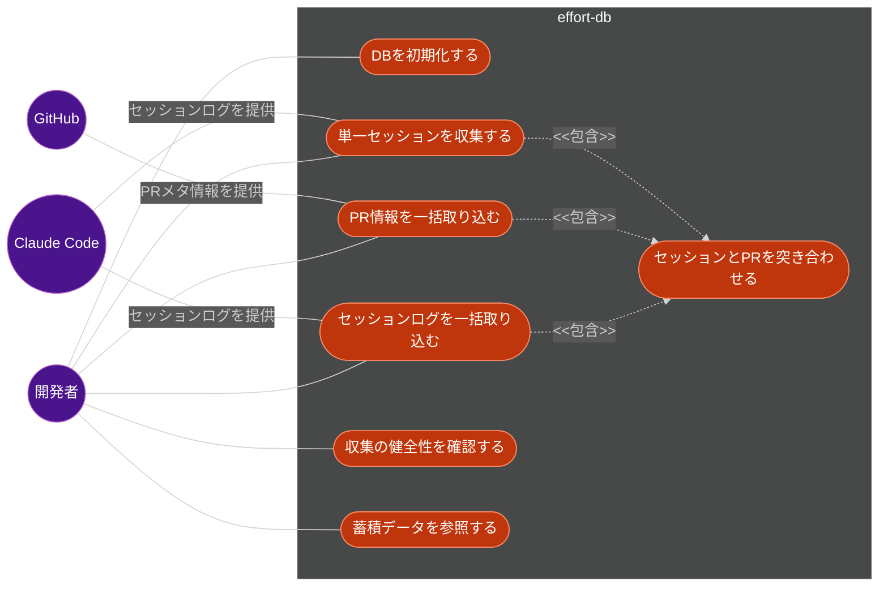
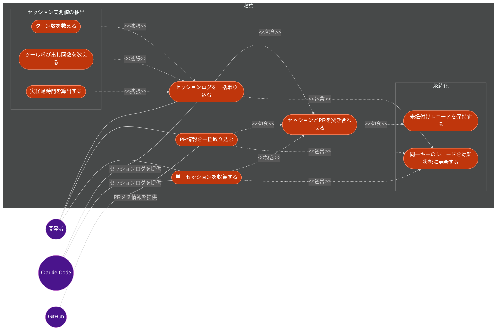
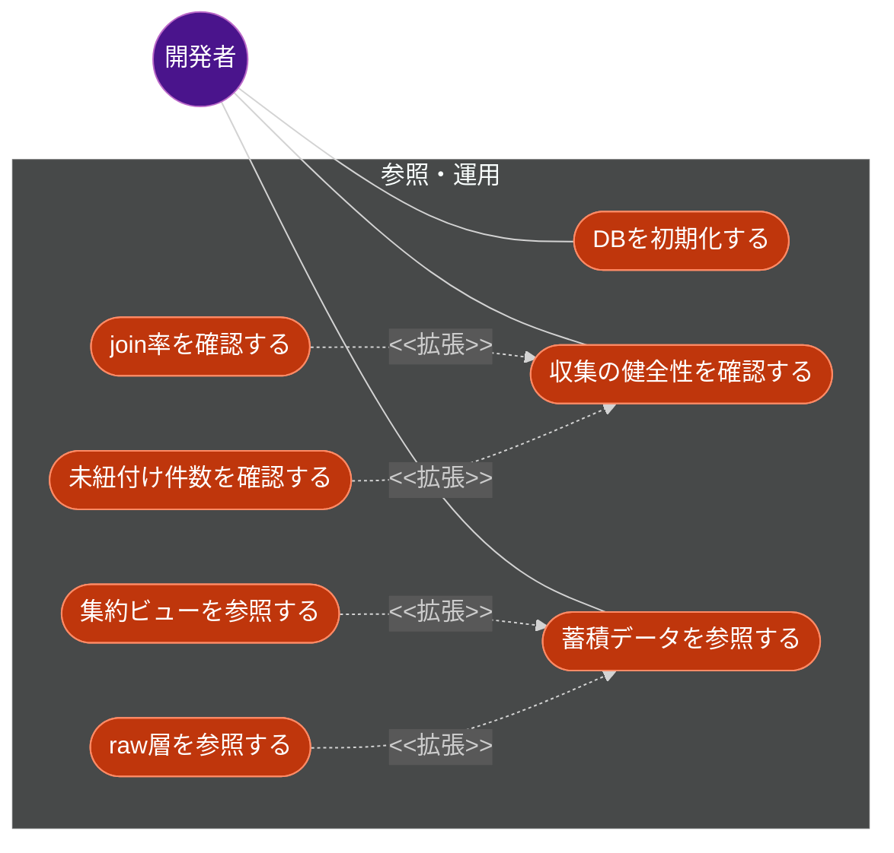
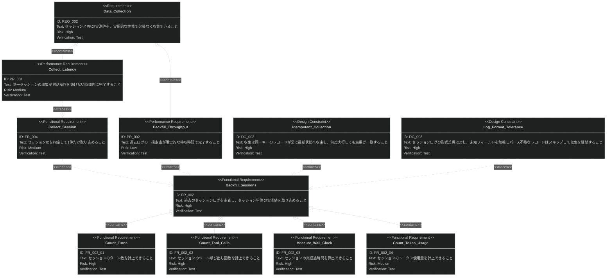
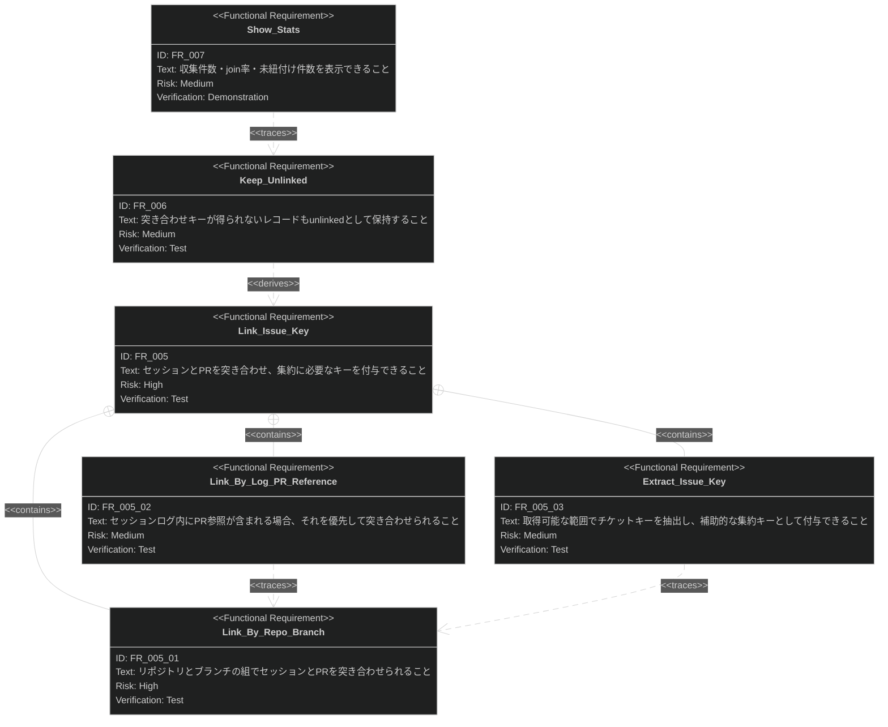

# AIエージェント実工数DB & CLI 要求仕様書

## 概要

Claude Code / AI エージェントが実際に費やした工数を実測データとして収集・蓄積し、
以降の見積もりの参照母集団（reference class）として使えるローカル DB と CLI を定義する。

Claude Code が出す工数見積もりは「人間が実施する前提」で算出されるため大きく外れる。
本システムは推定器を内蔵するのではなく、**実測値を失わずに蓄積し、いつでも参照できる状態にする**ことを担う。

本 PRD の対象範囲は **CLI として完結する範囲**（DB 初期化・収集・突き合わせ・健全性確認・参照）である。
hook による自動収集、MCP 化、プラグイン／skill としての参照 UI はスコープ外とし、
[7. スコープ外](#7-スコープ外) に明記する。

本 PRD は [CONSTITUTION.md](../CONSTITUTION.md) の原則に準拠する。
各要求には準拠する原則 ID（`B-xxx` / `A-xxx` / `D-xxx` / `T-xxx`）を併記する。

---

# 1. 要求図の読み方

## 1.1. 要求タイプ

- **requirement**: 一般的な要求（本 PRD ではユーザー要求レベルの上位要求に使用）
- **functionalRequirement**: 機能要求
- **performanceRequirement**: パフォーマンス要求
- **interfaceRequirement**: インターフェース要求
- **designConstraint**: 設計制約

## 1.2. リスクレベル

- **high**: 高リスク（ビジネスクリティカル、実装困難）
- **medium**: 中リスク（重要だが代替可能）
- **low**: 低リスク（Nice to have）

## 1.3. 検証方法

- **analysis**: 分析による検証
- **test**: テストによる検証
- **demonstration**: デモンストレーションによる検証
- **inspection**: インスペクション（レビュー）による検証

## 1.4. 関係タイプ

- **contains**: 包含関係（親要求が子要求を含む。子はすべて必須）
- **derives**: 派生関係（要求から別の要求が導出される）
- **satisfies**: 満足関係（要素が要求を満たす）
- **verifies**: 検証関係（テストケースが要求を検証する）
- **refines**: 詳細化関係（要求をより詳細に定義する）
- **traces**: トレース関係（要求間の追跡可能性）

## 1.5. 要求 ID 命名規約

| プレフィックス   | 対象      | 形式          |
|:----------|:--------|:------------|
| `REQ_xxx` | 上位要求    | `REQ_001`   |
| `FR_xxx`  | 機能要求    | `FR_001`    |
| `PR_xxx`  | パフォーマンス要求 | `PR_001`    |
| `IR_xxx`  | インターフェース要求 | `IR_001`    |
| `DC_xxx`  | 設計制約    | `DC_001`    |

サブ機能要求は `FR_002_01` 形式で親 ID を含める。
ID はカテゴリごとに昇順を保ち、欠番を作らない。

---

# 2. 要求一覧

## 2.1. ユースケース図（概要）

### アクター

| アクター            | 種別    | 役割                                                                    |
|:----------------|:------|:----------------------------------------------------------------------|
| 開発者             | 人間    | CLI を実行して収集・参照を行う。蓄積データを見積もりの参照母集団として使う                              |
| Claude Code     | 外部システム | セッションログ（`~/.claude/projects/**/*.jsonl`）の生成元。本システムは読み取りのみを行う          |
| GitHub          | 外部システム | PR のメタ情報の提供元。`gh` CLI 経由で取得する                                         |

### ユースケース

| ID  | ユースケース          | 対応 CLI コマンド             | 説明                                             |
|:----|:----------------|:-----------------------|:-----------------------------------------------|
| UC1 | DBを初期化する        | `init`                 | DB ファイル・テーブル・集約ビューを冪等に作成する                      |
| UC2 | セッションログを一括取り込む  | `backfill sessions`    | 過去のセッションログを走査し、セッション単位の実測値を取り込む                 |
| UC3 | PR情報を一括取り込む     | `backfill prs`         | 対象リポジトリの PR メタ情報を取り込む                           |
| UC4 | 単一セッションを収集する    | `collect-session <id>` | セッション ID を指定して 1 件だけ取り込む（インクリメンタル収集用）           |
| UC5 | セッションとPRを突き合わせる | （他ユースケースに包含）           | リポジトリ・ブランチを主キーにセッションと PR を突き合わせ、得られる場合はチケットキーを付与する |
| UC6 | 収集の健全性を確認する     | `stats`                | 収集件数・join 率・未紐付け件数を表示する                         |
| UC7 | 蓄積データを参照する      | `query "..."`          | 任意の SQL を実行して集約ビュー・raw 層を参照する                   |

## 2.2. ユースケース図（詳細）

### 収集

### 参照・運用

## 2.3. 機能一覧（テキスト形式）

- 実測データの収集
    - DB 初期化
        - テーブル・集約ビューの冪等な作成
    - セッションログの一括取り込み
        - ターン数の計上
        - ツール呼び出し回数の計上
        - 実経過時間の算出
        - トークン使用量の計上
    - PR 情報の一括取り込み
        - 差分規模・レビュー往復回数・作成／マージ時刻の取得
    - 単一セッションのインクリメンタル収集
    - セッションと PR の突き合わせ
        - リポジトリ・ブランチによる突き合わせ
        - ログ内 PR 参照による突き合わせ
        - チケットキーの抽出と付与
- データ品質と健全性
    - 未紐付けレコードの保持
    - 収集健全性の確認（件数 / join 率 / 未紐付け件数）
- 蓄積データの参照
    - 集約ビューの提供
    - 任意 SQL による参照

---

# 3. 要求図（SysML Requirements Diagram）

## 3.1. 全体要求図

```mermaid
%%{init: {'theme': 'dark'}}%%
requirementDiagram

    requirement EffortDB_System {
        id: REQ_001
        text: "AIエージェントの実工数を実測データとして蓄積し、見積もりの参照母集団として使えること"
        risk: high
        verifymethod: demonstration
    }

    requirement Data_Collection {
        id: REQ_002
        text: "セッションとPRの実測値を、実用的な性能で欠損なく収集できること"
        risk: high
        verifymethod: test
    }

    requirement Data_Reference {
        id: REQ_003
        text: "蓄積データを分布として参照できること"
        risk: medium
        verifymethod: demonstration
    }

    requirement Data_Quality {
        id: REQ_004
        text: "収集データの品質と紐付け状況を観測できること"
        risk: high
        verifymethod: test
    }

    requirement Architecture_Constraint {
        id: REQ_005
        text: "収集と参照を分離し、外部形式の差異と将来の参照形態の追加に耐える構造であること"
        risk: high
        verifymethod: inspection
    }

    functionalRequirement Init_DB {
        id: FR_001
        text: "DBファイル・テーブル・集約ビューを冪等に作成できること"
        risk: low
        verifymethod: test
    }

    functionalRequirement Backfill_Sessions {
        id: FR_002
        text: "過去のセッションログを走査し、セッション単位の実測値を取り込めること"
        risk: high
        verifymethod: test
    }

    functionalRequirement Backfill_PRs {
        id: FR_003
        text: "対象リポジトリのPRメタ情報を取り込めること"
        risk: medium
        verifymethod: test
    }

    functionalRequirement Collect_Session {
        id: FR_004
        text: "セッションIDを指定して1件だけ取り込めること"
        risk: medium
        verifymethod: test
    }

    functionalRequirement Link_Issue_Key {
        id: FR_005
        text: "セッションとPRを突き合わせ、集約に必要なキーを付与できること"
        risk: high
        verifymethod: test
    }

    functionalRequirement Keep_Unlinked {
        id: FR_006
        text: "突き合わせキーが得られないレコードもunlinkedとして保持すること"
        risk: medium
        verifymethod: test
    }

    functionalRequirement Show_Stats {
        id: FR_007
        text: "収集件数・join率・未紐付け件数を表示できること"
        risk: medium
        verifymethod: demonstration
    }

    functionalRequirement Raw_Query {
        id: FR_008
        text: "任意のSQLを実行して蓄積データを参照できること"
        risk: low
        verifymethod: test
    }

    functionalRequirement Aggregate_View {
        id: FR_009
        text: "リポジトリ・ブランチ単位およびチケット単位で実測値を集約したビューを提供すること"
        risk: medium
        verifymethod: test
    }

    EffortDB_System - contains -> Data_Collection
    EffortDB_System - contains -> Data_Reference
    EffortDB_System - contains -> Data_Quality
    EffortDB_System - contains -> Architecture_Constraint

    Data_Collection - contains -> Init_DB
    Data_Collection - contains -> Backfill_Sessions
    Data_Collection - contains -> Backfill_PRs
    Data_Collection - contains -> Collect_Session
    Data_Collection - contains -> Link_Issue_Key

    Data_Quality - contains -> Keep_Unlinked
    Data_Quality - contains -> Show_Stats

    Data_Reference - contains -> Raw_Query
    Data_Reference - contains -> Aggregate_View

    Backfill_Sessions - traces -> Link_Issue_Key
    Backfill_PRs - traces -> Link_Issue_Key
    Collect_Session - traces -> Backfill_Sessions
    Keep_Unlinked - derives -> Link_Issue_Key
    Show_Stats - traces -> Keep_Unlinked
    Aggregate_View - traces -> Link_Issue_Key
```

## 3.2. サブシステム詳細図

> 以降の図に現れる設計制約（DC）は、CONSTITUTION.md の A 原則・T 原則を
> SysML 制約として明示したものである。PRD 独自の新しい技術判断を追加するものではない。

### 収集サブシステム

### 突き合わせサブシステム

セッションと PR を突き合わせるキーは 1 種類ではない。
確実性の高い順に段階的に適用し、いずれも得られない場合のみ `unlinked` とする。

### アーキテクチャ・制約

```mermaid
%%{init: {'theme': 'dark'}}%%
requirementDiagram

    requirement Architecture_Constraint {
        id: REQ_005
        text: "収集と参照を分離し、外部形式の差異と将来の参照形態の追加に耐える構造であること"
        risk: high
        verifymethod: inspection
    }

    interfaceRequirement CLI_Interface {
        id: IR_001
        text: "すべての機能を単一のCLIコマンド体系から呼び出せること"
        risk: high
        verifymethod: inspection
    }

    interfaceRequirement Session_Log_Input {
        id: IR_002
        text: "セッションログを読み取り専用の入力として扱うこと"
        risk: high
        verifymethod: inspection
    }

    interfaceRequirement GitHub_Interface {
        id: IR_003
        text: "GitHub連携は認証を外部委譲した形で行うこと"
        risk: medium
        verifymethod: inspection
    }

    interfaceRequirement Config_Interface {
        id: IR_004
        text: "DB配置と環境固有値を設定で外部から与えられること"
        risk: high
        verifymethod: test
    }

    designConstraint Separate_Collect_Reference {
        id: DC_001
        text: "収集と参照を分離し、参照側の都合で収集側のデータ構造を歪めないこと"
        risk: high
        verifymethod: inspection
    }

    designConstraint Keep_Raw_Layer {
        id: DC_002
        text: "raw層を必ず残し、集約はビューとして提供すること"
        risk: high
        verifymethod: inspection
    }

    designConstraint Idempotent_Collection {
        id: DC_003
        text: "収集は同一キーのレコードが常に最新状態へ収束し、何度実行しても結果が一致すること"
        risk: high
        verifymethod: test
    }

    designConstraint No_Real_Data_In_Repo {
        id: DC_004
        text: "実セッションログ・収集済みDB・環境固有値をリポジトリに含めないこと"
        risk: high
        verifymethod: inspection
    }

    designConstraint Minimal_Dependencies {
        id: DC_005
        text: "依存を最小に保ち、DB層に追加の抽象化層を導入しないこと"
        risk: medium
        verifymethod: inspection
    }

    designConstraint Agent_Native_Units {
        id: DC_006
        text: "実測値をエージェントネイティブな単位で保持し、点推定に丸めないこと"
        risk: high
        verifymethod: inspection
    }

    designConstraint Future_Extension_Outside_CLI {
        id: DC_007
        text: "hook・MCP・プラグイン・チーム共有などの将来の分岐をCLIの外側で吸収できること"
        risk: medium
        verifymethod: inspection
    }

    designConstraint Log_Format_Tolerance {
        id: DC_008
        text: "セッションログの形式差異に対し、未知フィールドを無視しパース不能なレコードはスキップして収集を継続すること"
        risk: high
        verifymethod: test
    }

    Architecture_Constraint - contains -> CLI_Interface
    Architecture_Constraint - contains -> Session_Log_Input
    Architecture_Constraint - contains -> GitHub_Interface
    Architecture_Constraint - contains -> Config_Interface
    Architecture_Constraint - contains -> Separate_Collect_Reference
    Architecture_Constraint - contains -> Keep_Raw_Layer
    Architecture_Constraint - contains -> Idempotent_Collection
    Architecture_Constraint - contains -> No_Real_Data_In_Repo
    Architecture_Constraint - contains -> Minimal_Dependencies
    Architecture_Constraint - contains -> Agent_Native_Units
    Architecture_Constraint - contains -> Future_Extension_Outside_CLI
    Architecture_Constraint - contains -> Log_Format_Tolerance

    Future_Extension_Outside_CLI - traces -> CLI_Interface
    No_Real_Data_In_Repo - traces -> Session_Log_Input
    Config_Interface - traces -> No_Real_Data_In_Repo
```

---

# 4. 要求の詳細説明

## 4.1. 上位要求

### REQ_001: 実工数の蓄積と参照

AI エージェントの実工数を実測データとして蓄積し、見積もりの参照母集団（reference class）として使える状態にする。
推定器を内蔵することは目的ではない（B-001）。

**含まれる要求:** REQ_002 / REQ_003 / REQ_004 / REQ_005
**検証方法:** デモンストレーションによる検証

### REQ_002: 実測データの収集

セッション単位の実測値と PR 単位のメタ情報を欠損なく収集する。
セッションログを一次データソースとし、GitHub の経過時間は補助的な特徴量として扱う（A-005）。

**含まれる要求:** FR_001 / FR_002 / FR_003 / FR_004 / FR_005 / PR_001 / PR_002
**検証方法:** テストによる検証

### REQ_003: 蓄積データの参照

蓄積データを、点推定ではなく分布として観察できる形で参照できる（B-003）。
参照形態は SQL とビューであり、専用 UI は本 PRD のスコープ外とする。

**含まれる要求:** FR_008 / FR_009
**検証方法:** デモンストレーションによる検証

### REQ_004: データ品質と健全性

収集データがどれだけ紐付いているかを観測できる。
join できない事実そのものが、突き合わせキーの選択や命名規約の不備を示す観測データであるため、失敗を隠さず可視化する（A-004 / D-004）。
join 率はキーの種類ごとに区別して観測できる（FR_007）。

**含まれる要求:** FR_006 / FR_007
**検証方法:** テストによる検証

### REQ_005: アーキテクチャと制約

収集と参照を分離し、将来の参照形態（hook / MCP / プラグイン / チーム共有）の追加を
CLI の外側で吸収できる構造とする（A-001 / A-006）。

**含まれる要求:** IR_001〜IR_004 / DC_001〜DC_008
**検証方法:** インスペクションによる検証

## 4.2. 機能要求

### FR_001: DB 初期化

DB ファイル、raw 層のテーブル、集約ビューを作成する。
繰り返し実行しても既存データが失われず、結果が変わらない（冪等）。

**準拠原則:** A-002
**検証方法:** テストによる検証

### FR_002: セッションログの一括取り込み

過去のセッションログを走査し、セッション単位の実測値を DB に取り込む。

**含まれる機能:**

- FR_002_01: ターン数の計上
- FR_002_02: ツール呼び出し回数の計上
- FR_002_03: 実経過時間の算出
- FR_002_04: トークン使用量の計上

いずれの値をログのどのフィールドから導くかは、実ログ構造の観察に基づいて決定する。
観察して得た知見はパーサの設計に反映し、観察した断片そのものを期待値としてテストに固定しない（D-003）。
セッションの単位はログファイル 1 件と一致しない場合があるため、セッション識別子で束ねた集合に対して実測値を算出する。

**準拠原則:** A-005 / D-002 / D-003
**検証方法:** テストによる検証

### FR_003: PR 情報の一括取り込み

対象リポジトリの PR メタ情報（差分規模、レビュー往復回数、作成時刻、マージ時刻、ラベル）を取り込む。
取り込みフィールドの追加は spec で定義する。
PR の経過時間はレビュー待ち・放置を含みノイジーであるため、一次データではなく補助的な特徴量として保持する。

**準拠原則:** A-005 / T-003
**検証方法:** テストによる検証

### FR_004: 単一セッションのインクリメンタル収集

セッション ID を指定して 1 件だけ取り込む。
一括取り込みと同じ結果に収束し、既存レコードがある場合は上書き更新される。

このコマンドを起動する仕組み（hook / cron 等）は本 PRD のスコープ外とし、コマンドの提供のみを対象とする。

**準拠原則:** A-003 / A-006
**検証方法:** テストによる検証

### FR_005: セッションと PR の突き合わせ

セッションと PR を突き合わせ、集約に必要なキーを付与する。
突き合わせキーは 1 種類ではなく、確実性の高い順に段階的に適用する。

**含まれる機能:**

- FR_005_01: リポジトリとブランチの組による突き合わせ（主経路）
- FR_005_02: セッションログ内の PR 参照による突き合わせ（得られる場合は優先）
- FR_005_03: チケットキーの抽出と付与（補助的な集約キー）

チケットキーを単独の主キーとしない。実測において、ブランチ名にチケットキーが含まれる割合は
集約が成立する水準に達しないことが確認されている。
チケットキーの形式はプロジェクト固有であるため、設定から与えられる（IR_004、B-004）。

いずれのキーも得られない場合は FR_006 により `unlinked` として保持する。

**準拠原則:** A-004 / B-004 / D-004
**検証方法:** テストによる検証

### FR_006: 未紐付けレコードの保持

いずれの突き合わせキーも得られないレコードも破棄せず `unlinked` として保持する。
紐付けの失敗は削除対象ではなく観測対象である。

**準拠原則:** A-004
**検証方法:** テストによる検証

### FR_007: 収集健全性の確認

収集済み件数、突き合わせキーごとの join 率、未紐付け件数を表示する。
join 率はキーの種類ごとに区別して表示する（どのキーで紐付いたかが分かること）。
join 率が低い場合、抽出ロジックを複雑化させる前に、より確実なキーの採用または命名規約の見直しを検討する判断材料とする。

**準拠原則:** D-004
**検証方法:** デモンストレーションによる検証

### FR_008: 任意 SQL による参照

任意の SQL を実行し、集約ビューおよび raw 層を参照できる。
想定外の分析軸が必要になった場合の逃げ道として機能する。

**準拠原則:** A-002
**検証方法:** テストによる検証

### FR_009: 集約ビューの提供

リポジトリ・ブランチ単位でセッション数・総ターン数・総実時間・トークン使用量・差分規模を集約したビューを提供する。
チケットキーが付与されているレコードについては、チケット単位でも集約できる。
集約はビューとして提供し、raw 層を潰して集約値だけを保存しない。

**準拠原則:** A-002 / B-002
**検証方法:** テストによる検証

## 4.3. パフォーマンス要求

### PR_001: 単一セッション収集の応答時間

`collect-session` による単一セッションの収集は、対話操作を妨げない時間内に完了する。

**目標値:** 1 セッションあたり 1 秒以内

**実測値: 0.26 秒**（ツール呼び出しが最多のセッション / CLI 起動を含む / 2026-08-17）。
暫定値の 3 秒に対して十分な余裕があったため、目標値を 1 秒に引き下げた。
実測の大半は CLI（Python）の起動時間であり、ログの読み取り自体は支配的ではない。
将来 hook から同期的に呼ばれる余地を残すため、応答時間を要求として明示する（A-006）。

**検証方法:** テストによる検証

### PR_002: 一括取り込みのスループット

`backfill sessions` による過去ログの一括走査は、現実的な待ち時間で完了する。

**目標値:** 1,000 セッション分のログを 30 秒以内

**実測値: 1,152 セッション（約 1.6 GB）を 9.0 秒**、ピークメモリ 75 MB（2026-08-17）。
暫定値の 60 秒に対して 7 倍の余裕があったため目標値を 30 秒に引き下げた。
入力全体の大きさに依存しない定常メモリで完走することも確認できた（行単位ストリーミング）。
一括取り込みは頻度が低いため、応答時間より完走することを優先する。
この余裕により、増分収集と並列化のいずれも導入せずに済んでいる（design D12 / D13）。

**検証方法:** テストによる検証

## 4.4. インターフェース要求

### IR_001: CLI インターフェース

すべての機能を単一の CLI コマンド体系から呼び出せる。
hook・cron・MCP などどの経路からも同じコマンドを呼べることが、将来の分岐を CLI の外側で吸収する前提となる。

**準拠原則:** A-006 / T-005
**検証方法:** インスペクションによる検証

### IR_002: セッションログ入力インターフェース

セッションログは読み取り専用の入力として扱う。
本システムがセッションログを書き換え・移動・削除することはない。
また、読み取った内容をリポジトリ内に出力しない（DC_004）。

**準拠原則:** B-004 / A-005
**検証方法:** インスペクションによる検証

### IR_003: GitHub 連携インターフェース

GitHub 連携は認証を外部に委譲した形で行い、本システムがトークンを保持・管理しない。

**準拠原則:** T-003
**検証方法:** インスペクションによる検証

### IR_004: 設定インターフェース

DB の配置場所と環境固有値（チケットキーの形式、対象リポジトリ）を、
コードを変更せずに外部から与えられる。設定ファイルはバージョン管理対象外とする。

**準拠原則:** B-004 / T-004
**検証方法:** テストによる検証

## 4.5. 設計制約

### DC_001: 収集と参照の分離

収集と参照を分離する。skill / MCP / hook / プラグインはすべて後付けのビューであり、
参照側の都合で収集側のデータ構造を歪めない。

**準拠原則:** A-001
**検証方法:** インスペクションによる検証

### DC_002: raw 層の保持

セッション単位・PR 単位の実測値を raw 層として保持し、集約はビューとして提供する。
どの特徴量が見積もりに効くかは未確定であり、raw を失うと再集計ができない。

**準拠原則:** A-002
**検証方法:** インスペクションによる検証

### DC_003: 収集の冪等性

同一キーのレコードは何度収集しても常に最新状態へ収束し、実行回数によって結果が変わらない。
実現方式は design で定める。

**準拠原則:** A-003
**検証方法:** テストによる検証

### DC_004: 実データをリポジトリに含めない

実セッションログ、収集済み DB、環境固有値をリポジトリに含めない。
テストフィクスチャは合成データのみを用いる。
本リポジトリは PUBLIC であり、本制約は運用上の推奨ではなく必須要件である。

**準拠原則:** B-004 / D-002
**検証方法:** インスペクションによる検証

### DC_005: 依存の最小化

依存を最小に保ち、DB 層に追加の抽象化層を導入しない。
ローカル DB として配布するため、依存の少なさが導入障壁を下げる。

**準拠原則:** T-001 / T-002
**検証方法:** インスペクションによる検証

### DC_006: エージェントネイティブな単位

実測値はセッション数・ターン数・実経過時間などエージェントの作業実態が直接観測できる単位で保持し、
人日への換算や点推定への丸め込みを行わない。

**準拠原則:** B-002 / B-003
**検証方法:** インスペクションによる検証

### DC_007: 将来の分岐を CLI の外側で吸収する

hook 収集・プラグイン化・MCP 化・チーム共有 DB 化のいずれも、
CLI の呼び出し元を追加するか、ストレージ層の接続先を差し替えることで実現できる構造とする。

**準拠原則:** A-006
**検証方法:** インスペクションによる検証

### DC_008: ログ形式差異への耐性

セッションログの形式には版差異がありうる。
未知フィールドは無視し、パース不能なレコードはスキップして収集を継続する。
1 レコードの破損が一括取り込み全体を失敗させてはならない。

**準拠原則:** D-003
**検証方法:** テストによる検証

---

# 5. 制約事項

## 5.1. 技術的制約

- 実行環境は Python 3.12 以上（T-001）
- CLI・DB アクセス層の依存を最小に保つ制約がある（T-002 / DC_005）。具体的なライブラリ選定は design で定める
- GitHub 連携は認証を外部委譲した形で行い、トークンを本システムが保持しない（T-003 / IR_003）
- 単一利用者のローカル DB を前提とし、同時書き込みの競合制御は要求に含めない
- セッションログの構造は外部仕様であり、本システムから変更できない（DC_008）

## 5.2. ビジネス的制約

- 本リポジトリは PUBLIC である。実データ・環境固有値の混入は許容されない（B-004 / DC_004）
- 収集対象は利用者自身のローカルセッションログであり、他者のログを収集する要求は含まない

---

# 6. 前提条件

- 利用者のローカル環境に Claude Code のセッションログが存在する
- GitHub 連携を使う場合、認証済みの `gh` CLI が利用可能である
- セッションと PR の突き合わせは、セッションログからリポジトリとブランチが取得できることを前提とする
- チケット単位の集約は、ブランチ名等にチケットキーが含まれる場合にのみ成立する。
  含まれない場合もリポジトリ・ブランチ単位の集約は成立し、チケットキーは未付与として保持される（FR_006）

---

# 7. スコープ外

以下は本 PRD のスコープ外とする。いずれも [CONSTITUTION.md](../CONSTITUTION.md) の A-006 により、
CLI の外側の追加として後から実現できる。

| スコープ外項目                        | 理由・扱い                                                              |
|:-------------------------------|:-------------------------------------------------------------------|
| hook / cron によるインクリメンタル収集の自動起動 | `collect-session` コマンドは提供するが、起動方式は未決定。決定後に hook から CLI を 1 コマンド呼ぶ形で追加する |
| MCP サーバ化                       | CLI 関数を import する薄い層として後から追加する                                     |
| プラグイン / skill としての参照 UI        | 参照側は後付けのビュー。実測データが蓄積される前に参照 UI を設計すると手戻りになる                        |
| Jira API 連携                    | チケットキーは突き合わせのための文字列として扱う。Jira からのメタ情報取得は対象外                        |
| チーム共有 DB 化                     | ストレージ層の接続先の差し替えとして後から対応する                                          |
| Claude Code 以外のエージェントのログ取り込み   | 取り込み対象の拡張余地は残すが、本 PRD では Claude Code のセッションログのみを対象とする              |
| 見積もり値の自動算出・推薦ロジック              | 本システムは参照母集団を提供する。推定器を内蔵しない（B-001）                                  |
| 収集データの可視化・ダッシュボード              | 参照は SQL と集約ビューで行う                                                  |

---

# 8. 用語集

| 用語                    | 定義                                                                     |
|:----------------------|:-----------------------------------------------------------------------|
| セッション                 | Claude Code の 1 回の対話単位。セッションログの 1 ファイルに対応する                           |
| ターン                   | セッション内の対話の往復単位。実工数の主要な観測量のひとつ                                          |
| ツール呼び出し               | エージェントがツールを実行した回数。作業量の観測量のひとつ                                          |
| トークン使用量               | セッションで消費した入出力トークン数。作業規模とコストの観測量のひとつ                                    |
| 実経過時間（wall clock）      | セッションの開始から終了までの実時間                                                     |
| 突き合わせキー               | セッションと PR を同一の作業単位として結びつけるためのキー。リポジトリとブランチの組を主とし、ログ内 PR 参照・チケットキーを併用する    |
| チケットキー（`issue_key`）   | チケット単位の集約に用いる補助的なキー。ブランチ名等から抽出する。形式はプロジェクト固有であり設定から与える。単独の主キーとはしない       |
| `unlinked`            | チケットキーが抽出できず、突き合わせができなかったレコードの状態。破棄せず保持する                              |
| join 率                | 収集レコードのうち突き合わせができた割合。キーの種類ごとに区別して観測する。データ品質の指標                          |
| raw 層                 | セッション単位・PR 単位の実測値をそのまま保持する層。集約前のデータ                                    |
| 集約ビュー                 | raw 層をチケットキー単位で集約した参照用のビュー。実体としてデータを持たない                              |
| backfill              | 過去に蓄積されたログ・PR を一括して取り込む操作                                             |
| 参照母集団（reference class） | 見積もり時に「似た作業が過去どれだけかかったか」を参照するための実測データの集合                              |

---

# 付録: 新規要件追加時の下流伝播チェックリスト

新規要件 ID（`FR` / `PR` / `IR` / `DC` 等）の追加・リネーム時に以下をすべて満たすこと。

- [ ] PRD 内の ID がカテゴリごとに昇順を保っている
- [ ] spec のトレーサビリティ表に対応行を追加した
- [ ] design のトレーサビリティ表に対応行を追加した
- [ ] ID 命名規約（1.5. 要求 ID 命名規約）を守っている
- [ ] 準拠する CONSTITUTION.md の原則 ID を併記した
- [ ] requirement-analyzer エージェントを実行して整合確認した
- [ ] 3 層（PRD / spec / design）のトレース行が同一 PR に含まれている

---

**この PRD は、AI エージェントが仕様化（Specify）フェーズで参照する、ビジネス要求の真実の源となります。**
