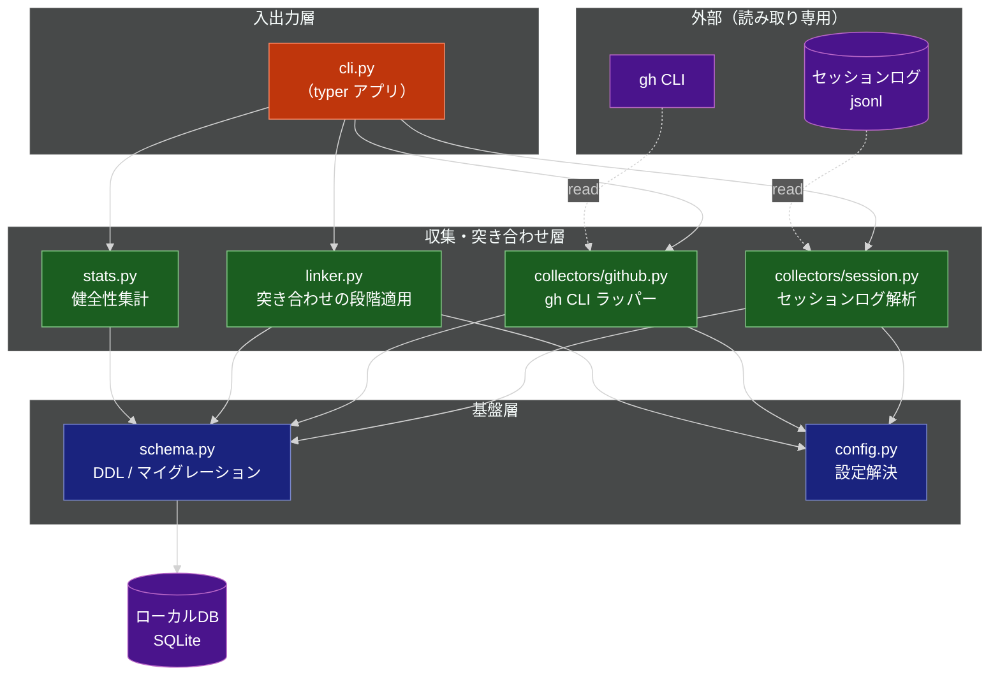
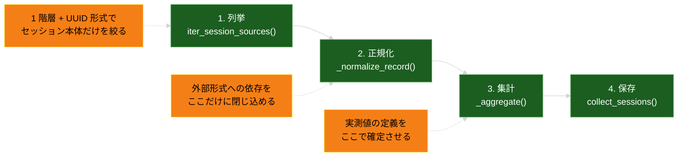

# AIエージェント実工数DB & CLI 技術設計書

**関連 Spec:** [effort-db_spec.md](effort-db_spec.md)
**関連 PRD:** [effort-db.md](../requirement/effort-db.md)

---

# 1. 実装ステータス

**ステータス:** 🟢 本設計に追随済み（残るのは M8 の実データ検証と PRD の目標値の確定）

## 1.1. 実装進捗

| モジュール/機能                                                                       | ステータス | 備考                                       |
|:-------------------------------------------------------------------------------|:------|:-----------------------------------------|
| `config.py`（DB パス解決 / `issue_key_patterns`）                                    | 🟢    | 既定パターンを持たない方針も実装済み（B-004）                |
| `schema.py`（v2: raw 層 / リンク層 / 集約ビュー）                                        | 🟢    | v1 → v2 の移行込みで実装済み（5 章の DDL に対応）          |
| `cli.py`（`init` / `backfill sessions` / `backfill prs` / `collect-session` / `link` / `stats` / `query`） | 🟢    | `link` / `query` を実装し `relink` を置き換えた。`query` は読み取り専用（D20） |
| `collectors/session.py`                                                        | 🟢    | PR 参照 / サブエージェント分の分離 / トークン 4 種 × 主・サブ / `log_versions` / `skipped_records` / `collected_at` まで実装済み |
| `collectors/github.py`                                                         | 🟢    | `gh` 経由。認証失敗の判定と `head_branch` の取得も実装済み       |
| `linker.py`（段階適用 / 由来の記録 / キー抽出）                                              | 🟢    | `(repo, branch)` 主軸 + ログ内 PR 参照優先で実装済み        |
| `stats.py`（健全性集計）                                                             | 🟢    | 由来ごとの join 率と、PR 収集済みリポジトリに限った率を算出          |

### 本設計との差分

**差分は残っていない。** 実測データに基づく判断への追随は M7-0 / M7-A / M7-B で完了した。

| 項目            | 解消内容                                                   | 根拠            |
|:--------------|:-------------------------------------------------------|:--------------|
| join キー       | `(repo, branch)` 主軸 + ログ内 PR 参照優先 + `issue_key` 補助にした   | O10 / O18 / D6 |
| リンクの由来        | `session_pr_links.link_source` として保持するようにした              | D10 / FR-013  |
| ログ内 PR 参照     | `session_pr_refs` に収集し、突き合わせの第 1 段で使うようにした               | O18 / FR-011  |
| PR の head ブランチ | `gh` の取得列に `headRefName` を追加した                          | D6 / FR-010   |
| `query`       | 読み取り専用で実装した                                            | D20 / FR-016  |
| スキーマ          | v2（リンク層 + `effort_by_branch` / `effort_by_issue`）に移行した   | D9 / D10      |
| サブエージェントのツール数 | `sidechain_tool_calls` として別列に保持するようにした                    | O6 / O26 / D2 / D16 |
| トークン使用量       | 4 種 × 主・サブの 8 列を収集するようにした                              | O20 / O21 / D19 |
| 収集時刻の記録        | `collected_at` を記録するようにした（増分判定は入れない）                     | D13 / O25     |

**実装が本設計より優れていた点は 9.2 の D14〜D18 として取り込んだ。**

進行順序は [ROADMAP.md](../../ROADMAP.md) を参照。

---

# 2. 設計目標

| 目標                          | 対応する要件                    |
|:----------------------------|:--------------------------|
| セッションログから実測値を欠損なく導出する        | FR-002〜FR-007             |
| 外部形式（ログ）の変化に収集全体を巻き込まれない構造にする | FR-020 / NFR-003 / NFR-004 |
| 収集を何度実行しても結果が収束する           | FR-019                    |
| 突き合わせの成否と由来を観測可能にする         | FR-013 / FR-015           |
| 1.6 GB 規模の入力を定常メモリで処理する     | NFR-008                   |
| 依存を最小に保ち、導入障壁を上げない          | DC_005                    |

---

# 3. 技術スタック

| 領域        | 採用技術                        | 選定理由                                                                    |
|:----------|:----------------------------|:------------------------------------------------------------------------|
| 言語        | Python 3.12+                | T-001。`X \| None` 記法・`match` 文が使える。標準の `tomllib` が利用可能                 |
| パッケージ管理   | uv                          | T-001                                                                   |
| CLI       | typer                       | T-002。サブコマンド階層を型注釈で表現でき、追加の設定ファイルを持たない                                 |
| DB        | sqlite3（標準ライブラリ）            | T-002。ローカル DB として配布するため依存を増やさない。raw 層はスキーマが素直で ORM の恩恵が薄い                |
| ログ解析      | json（標準ライブラリ）               | jsonl は 1 行 1 JSON。行単位ストリーミングで足り、追加依存が不要                                |
| 設定        | tomllib（標準ライブラリ）            | Python 3.11+ 標準。`config.toml` の読み取りに追加依存が不要（spec FR-021）                 |
| GitHub 連携 | `gh` CLI（subprocess）        | T-003。認証を `gh auth` に委譲し、トークンを本ツールが保持しない                                |
| テスト       | pytest                      | 既存構成を踏襲                                                                 |
| 静的解析      | ruff / mypy                 | 既存構成を踏襲                                                                 |

**採用しなかった選択肢**:

| 選択肢                          | 却下理由                                                          |
|:-----------------------------|:--------------------------------------------------------------|
| ORM（SQLAlchemy 等）            | T-002 / DC_005。raw 層は素の DDL で表現でき、マイグレーションも `user_version` で足る |
| PyGithub 等の API クライアント       | T-003。トークン管理を本ツールが負うことになる                                     |
| pandas による集計                 | 集約はビュー（SQL）で行う方針（A-002）と重複し、依存が重い                             |
| jsonl の並列パース（multiprocessing） | まず逐次で NFR-002 を測る。目標未達が確認されてから検討する（D-005：推定で設計を曲げない）          |

---

# 4. アーキテクチャ

## 4.1. システム構成図



**依存方向は上から下への単方向とする。** 基盤層が収集層を参照してはならない。
収集層が CLI を参照してはならない（A-001：参照形態を収集側が知らない）。

## 4.2. モジュール分割

| モジュール名                      | 責務                                            | 依存関係                    | 配置場所                                   |
|:----------------------------|:----------------------------------------------|:------------------------|:---------------------------------------|
| `cli`                       | コマンド定義、引数解釈、結果の表示。ドメインロジックを持たない                | collectors / linker / stats / schema / config | `src/effort_db/cli.py`                 |
| `collectors.session`        | ログ所在の列挙、セッション単位の実測値の導出、DB への収束保存               | schema / config         | `src/effort_db/collectors/session.py`  |
| `collectors.github`         | `gh` の呼び出し、PR メタ情報の正規化、DB への収束保存               | schema / config         | `src/effort_db/collectors/github.py`   |
| `linker`                    | 突き合わせの段階適用、由来付きリンクの保存、チケットキー抽出                 | schema / config         | `src/effort_db/linker.py`              |
| `stats`                     | 収集件数・キー種別ごとの join 率・未紐付け件数の算出                 | linker / schema         | `src/effort_db/stats.py`               |
| `schema`                    | 接続の生成、DDL、ビュー定義、スキーマバージョン管理とマイグレーション            | なし                      | `src/effort_db/schema.py`              |
| `config`                    | DB パス解決、`config.toml` の読み込み                   | なし                      | `src/effort_db/config.py`              |

**spec 4.1 の型は専用モジュール（`models`）に集約せず、その型を生み出すモジュールに置く。**
`SessionRecord` は `collectors.session`、`LinkSource` / `LinkResult` は `linker` が持つ。
型だけのモジュールを設けると、依存方向が「型 ← 実装」と「実装 → 型」の二重になり、
どこに定義があるかを探す手間が増える一方で、得られるのは名前空間の分離だけである。
`stats` が `linker` を参照するのは、由来（`LinkSource`）の定義を共有するためであり、
依存方向（上から下）は保たれている。

## 4.3. セッションログ解析の内部構造

`collectors/session.py` を 4 段に分ける。段を分ける理由は、
**外部形式に依存する部分を 1 段に閉じ込め、形式変化の影響範囲を限定するため**である（FR-020 / NFR-004）。



| 段     | 関数                        | 責務                                                       |
|:------|:--------------------------|:---------------------------------------------------------|
| 1. 列挙 | `iter_session_files()`    | セッション本体（1 階層 + UUID 形式）を列挙する。1 ファイル = 1 セッション（D3 / D4）      |
| 2. 正規化 | `_normalize_record()`     | 生レコードを内部表現へ変換する。**未知の形は None を返してスキップする**（FR-020）       |
| 3. 集計 | `_aggregate()`            | 正規化済みレコード列から実測値を算出する。ターン等の定義はここに集約する（FR-003〜FR-006）     |
| 4. 保存 | `collect_sessions()`      | `SessionRecord` を収束保存する（FR-019）                          |

spec 4 章の公開 API `parse_session_file(path) -> SessionRecord` は、
**2. 正規化と 3. 集計を束ねた関数**として実装する。
1 ファイルを受け取り、正規化を各レコードに適用し、集計して `SessionRecord` を返す。
`collect_sessions()` は `parse_session()` の結果を保存するだけであり、実測値の算出を行わない。
段を分けたまま公開 API を 1 つに保つことで、テストは段ごとに書ける一方、
呼び出し側は内部構成を知らずに済む。

---

# 5. データモデル

## 5.1. スキーマ v2 の DDL

現行の v1 から、以下を変更する（変更理由は 9.2 を参照）。

| 変更                                                        | 根拠         |
|:----------------------------------------------------------|:-----------|
| `sessions` にサブエージェントのツール呼び出し列を追加                          | D2 / D16   |
| `sessions` にトークン列を 4 種 × 主 / サブの 8 列追加                     | D19 / O20 / O21 |
| `sessions` に `log_versions` / `skipped_records` / `collected_at` を追加 | NFR-003 / NFR-004 / D13 |
| `pull_requests` に `head_branch` を追加                        | D6 / FR-010 |
| `session_pr_refs` / `session_pr_links` を追加                 | D10 / FR-013 |
| `task_effort` を `effort_by_branch` / `effort_by_issue` に置き換え | D9        |
| `source_file_count` は**設けない**（D4 撤回により常に 1 になるため）          | D4 / O4    |

**件数列・トークン列に `NOT NULL DEFAULT 0` を付けない。**
メッセージが 1 件も無いログで「0 件」と断定してはならないためである（D18）。
0（観測できて 0 だった）と NULL（観測できなかった）を区別する。

```sql
-- セッション（raw 層）
CREATE TABLE IF NOT EXISTS sessions (
  session_id           TEXT PRIMARY KEY,
  repo                 TEXT,
  branch               TEXT,
  issue_key            TEXT,          -- 補助キー。抽出できない場合は NULL
  started_at           TEXT,          -- ISO8601
  ended_at             TEXT,
  wall_clock_min       REAL,
  turns                INTEGER,       -- 人由来の発話回数。空ログでは NULL（D18）
  tool_calls           INTEGER,       -- 主エージェント
  sidechain_tool_calls INTEGER,       -- サブエージェント（D2 / D16）
  input_tokens         INTEGER,       -- 主エージェント分（D19）
  output_tokens        INTEGER,
  cache_read_tokens    INTEGER,
  cache_creation_tokens INTEGER,
  sidechain_input_tokens         INTEGER,   -- サブエージェント分（D19）
  sidechain_output_tokens        INTEGER,
  sidechain_cache_read_tokens    INTEGER,
  sidechain_cache_creation_tokens INTEGER,
  interrupted          INTEGER DEFAULT 0,   -- 中断の有無（D17）
  log_versions         TEXT,          -- 観測されたログ形式バージョン（カンマ区切り）
  skipped_records      INTEGER,       -- 解釈できずスキップしたレコード数（NFR-003）
  collected_at         TEXT           -- 収集時刻。再収集の判断に用いる（D13）
);

CREATE INDEX IF NOT EXISTS idx_sessions_repo_branch ON sessions (repo, branch);
CREATE INDEX IF NOT EXISTS idx_sessions_issue_key   ON sessions (issue_key);

-- PR（raw 層）
CREATE TABLE IF NOT EXISTS pull_requests (
  repo          TEXT    NOT NULL,
  pr_number     INTEGER NOT NULL,
  head_branch   TEXT,                 -- 突き合わせに用いる
  issue_key     TEXT,
  additions     INTEGER,
  deletions     INTEGER,
  changed_files INTEGER,
  review_rounds INTEGER,
  created_at    TEXT,
  merged_at     TEXT,
  labels        TEXT,
  collected_at  TEXT,
  PRIMARY KEY (repo, pr_number)
);

CREATE INDEX IF NOT EXISTS idx_prs_repo_head_branch ON pull_requests (repo, head_branch);
CREATE INDEX IF NOT EXISTS idx_prs_issue_key        ON pull_requests (issue_key);

-- セッションログから抽出した PR 参照（raw 層）
-- ログに含まれる事実そのものであり、リンクの導出結果とは分けて保持する（A-002）
CREATE TABLE IF NOT EXISTS session_pr_refs (
  session_id TEXT    NOT NULL,
  repo       TEXT    NOT NULL,
  pr_number  INTEGER NOT NULL,
  PRIMARY KEY (session_id, repo, pr_number)
);

-- セッションと PR の対応（リンク層）
CREATE TABLE IF NOT EXISTS session_pr_links (
  session_id  TEXT    NOT NULL,
  repo        TEXT    NOT NULL,
  pr_number   INTEGER NOT NULL,
  link_source TEXT    NOT NULL,       -- 'log_reference' | 'repo_branch'
  linked_at   TEXT,
  PRIMARY KEY (session_id, repo, pr_number)
);

CREATE INDEX IF NOT EXISTS idx_links_source ON session_pr_links (link_source);
CREATE INDEX IF NOT EXISTS idx_links_pr     ON session_pr_links (repo, pr_number);

-- 集約層：リポジトリ・ブランチ単位（spec FR-017）
-- ビューは init_db が DROP した後に作り直す（列が増えたときに古い定義が残らないようにする）
-- 注意: リンクは 1 セッションに複数付きうる（O22 では 11% のセッション）。JOIN すると
-- sessions の行が複製され SUM が重複計上されるため、PR 側の値は相関サブクエリで求める
CREATE VIEW effort_by_branch AS
SELECT s.repo,
       s.branch,
       COUNT(*)                    AS sessions,
       SUM(s.turns)                AS total_turns,
       SUM(s.tool_calls)           AS total_tool_calls,
       SUM(s.sidechain_tool_calls) AS total_sidechain_tool_calls,
       SUM(s.wall_clock_min)       AS total_min,
       SUM(s.input_tokens)          AS total_input_tokens,
       SUM(s.output_tokens)         AS total_output_tokens,
       SUM(s.cache_read_tokens)     AS total_cache_read_tokens,
       SUM(s.cache_creation_tokens) AS total_cache_creation_tokens,
       SUM(s.sidechain_input_tokens)          AS total_sidechain_input_tokens,
       SUM(s.sidechain_output_tokens)         AS total_sidechain_output_tokens,
       SUM(s.sidechain_cache_read_tokens)     AS total_sidechain_cache_read_tokens,
       SUM(s.sidechain_cache_creation_tokens) AS total_sidechain_cache_creation_tokens,
       (SELECT COUNT(DISTINCT l.pr_number)
        FROM session_pr_links l
        JOIN sessions s2 ON s2.session_id = l.session_id
        WHERE s2.repo = s.repo AND s2.branch = s.branch)   AS linked_prs,
       (SELECT SUM(p.additions + p.deletions)
        FROM pull_requests p
        WHERE p.repo = s.repo
          AND p.pr_number IN (SELECT l.pr_number
                              FROM session_pr_links l
                              JOIN sessions s3 ON s3.session_id = l.session_id
                              WHERE s3.repo = s.repo AND s3.branch = s.branch)) AS diff_size
FROM sessions s
WHERE s.repo IS NOT NULL AND s.branch IS NOT NULL
GROUP BY s.repo, s.branch;

-- 集約層：チケット単位（spec FR-018。issue_key が付与されたものだけ）
-- 列構成は effort_by_branch と揃える（集約軸のみが異なる）
CREATE VIEW effort_by_issue AS
SELECT s.issue_key,
       COUNT(*)                    AS sessions,
       SUM(s.turns)                AS total_turns,
       SUM(s.tool_calls)           AS total_tool_calls,
       SUM(s.sidechain_tool_calls) AS total_sidechain_tool_calls,
       SUM(s.wall_clock_min)       AS total_min,
       SUM(s.input_tokens)          AS total_input_tokens,
       SUM(s.output_tokens)         AS total_output_tokens,
       SUM(s.cache_read_tokens)     AS total_cache_read_tokens,
       SUM(s.cache_creation_tokens) AS total_cache_creation_tokens,
       SUM(s.sidechain_input_tokens)          AS total_sidechain_input_tokens,
       SUM(s.sidechain_output_tokens)         AS total_sidechain_output_tokens,
       SUM(s.sidechain_cache_read_tokens)     AS total_sidechain_cache_read_tokens,
       SUM(s.sidechain_cache_creation_tokens) AS total_sidechain_cache_creation_tokens,
       (SELECT COUNT(DISTINCT l.pr_number)
        FROM session_pr_links l
        JOIN sessions s2 ON s2.session_id = l.session_id
        WHERE s2.issue_key = s.issue_key)                  AS linked_prs,
       (SELECT SUM(p.additions + p.deletions)
        FROM pull_requests p
        WHERE p.issue_key = s.issue_key)                   AS diff_size
FROM sessions s
WHERE s.issue_key IS NOT NULL
GROUP BY s.issue_key;
```

**分布を算出できる粒度を保つ**（B-003）。集約ビューは合計値を提供するが、
`sessions` テーブルがセッション単位の行を保持しているため、
中央値・p90 は `sessions` に対する window 関数で算出できる（spec 6.2 の使用例）。

## 5.2. マイグレーション

`PRAGMA user_version` でバージョンを管理する。v1 → v2 は以下の手順とする。

```python
from __future__ import annotations

import sqlite3

SCHEMA_VERSION = 2


def migrate(conn: sqlite3.Connection) -> None:
    """現在の user_version から SCHEMA_VERSION まで順次適用する。"""
    current = conn.execute("PRAGMA user_version").fetchone()[0]
    if current >= SCHEMA_VERSION:
        return
    if current < 2:
        _migrate_v1_to_v2(conn)
    conn.execute(f"PRAGMA user_version = {SCHEMA_VERSION}")
    conn.commit()


def _migrate_v1_to_v2(conn: sqlite3.Connection) -> None:
    """v1 の列構成に v2 の列を加え、置き換えたビューを作り直す。

    v1 には実データがほぼ存在しない想定だが、A-002 に従い既存行は破棄しない。
    追加列に NOT NULL DEFAULT を付けないのは D18 に従うためであり、
    既存行では「観測できなかった」ことを表す NULL がそのまま入る。
    """
    added = {
        "sessions": [
            ("sidechain_tool_calls", "INTEGER"),
            ("input_tokens", "INTEGER"),
            ("output_tokens", "INTEGER"),
            ("cache_read_tokens", "INTEGER"),
            ("cache_creation_tokens", "INTEGER"),
            ("sidechain_input_tokens", "INTEGER"),
            ("sidechain_output_tokens", "INTEGER"),
            ("sidechain_cache_read_tokens", "INTEGER"),
            ("sidechain_cache_creation_tokens", "INTEGER"),
            ("log_versions", "TEXT"),
            ("skipped_records", "INTEGER"),
            ("collected_at", "TEXT"),
        ],
        "pull_requests": [
            ("head_branch", "TEXT"),
            ("collected_at", "TEXT"),
        ],
    }
    for table, columns in added.items():
        existing = {row[1] for row in conn.execute(f"PRAGMA table_info({table})")}
        for name, decl in columns:
            if name not in existing:
                conn.execute(f"ALTER TABLE {table} ADD COLUMN {name} {decl}")
    # v1 の task_effort は issue_key を主軸にしており、実測に合わないため置き換える（9.2 D9）
    conn.execute("DROP VIEW IF EXISTS task_effort")
```

**段の並べ方を将来のバージョンでも同じ形で足せるようにしておく。**
`migrate()` は `if current < N: _migrate_vN_1_to_vN(conn)` を版数の昇順に並べるだけの構造とし、
新しい版を足すときに既存の段へ手を入れなくて済むようにする。
9.3 に挙げた代替の増分判定（ファイルサイズの比較）が必要になった場合は、
v2 の DDL を書き換えるのではなく v3 の段を足す。

`interrupted` 列（v1 に存在）は残し、**v2 の DDL にも明記する**（5.1）。
新規作成した DB と v1 から移行した DB で列構成が食い違わないようにするためである。
値の導出方法は D17 で確定したが、列を落とすと過去の収集結果を失う（A-002）。

**ビューは DDL の一部として毎回作り直す。** テーブルの列が増えるとビューの `SELECT *`
相当の意味が変わるため、`init_db` は `DROP VIEW` → `CREATE VIEW` を冪等に行う。
raw 層のテーブルは決して落とさない（A-002）。

**適用順序は「テーブル → 列の追加 → 索引 → ビュー」とする。**
索引とビューは後から追加された列（`head_branch` 等）を参照するため、
列が揃う前に実行すると `no such column` で失敗する。
したがって索引の DDL はテーブルの DDL と同じスクリプトに置けない。

---

# 6. インターフェース定義

## 6.1. セッションログの列挙と識別

**実装済み**（`src/effort_db/collectors/session.py`）。以下は設計上の要点のみを記す。

セッション本体は `<project>/<セッションUUID>.jsonl` の 1 階層だけに置かれる。
同じツリーには本体でない transcript が同居するため、**深さとファイル名の両方で絞る**。

| 同居するもの                                        | 除外する理由                                    |
|:---------------------------------------------|:------------------------------------------|
| `<session-uuid>/subagents/agent-*.jsonl`     | サブエージェントの会話。親セッションに tool_calls として加算する（D16） |
| `<session-uuid>/workflows/**/journal.jsonl`  | **複数セッションで同名**。拾うとセッション識別子が衝突する            |

セッション識別子はファイル名（UUID）から取る（D3）。
セッション本体に限れば、ファイル名と中身の識別子は 100% 一致する（O8）。

```python
_SESSION_ID_PATTERN = re.compile(
    r"[0-9a-f]{8}-[0-9a-f]{4}-[0-9a-f]{4}-[0-9a-f]{4}-[0-9a-f]{12}", re.IGNORECASE
)


def iter_session_files(projects_dir: Path | None = None) -> Iterator[Path]:
    """セッション本体の jsonl を列挙する。ディレクトリが無ければ何も返さない。"""
    base = projects_dir if projects_dir is not None else DEFAULT_PROJECTS_DIR
    if not base.is_dir():
        return
    yield from sorted(
        path for path in base.glob("*/*.jsonl") if _SESSION_ID_PATTERN.fullmatch(path.stem)
    )
```

`glob("*/*.jsonl")` が 1 階層に限定する役割を、`fullmatch(path.stem)` が
ファイル名の形式を検証する役割を担う。**どちらか一方だけでは不十分**である
（`workflows/**/journal.jsonl` は深さで、`subagents/agent-*.jsonl` は名前で弾かれる）。


## 6.2. 正規化（外部形式への依存を閉じ込める段）

PR 参照レコード（`type` が `pr-link`）は以下のキーを持つ（O18）。

| キー             | 型   | 用途                                          |
|:---------------|:----|:--------------------------------------------|
| `prNumber`     | int | `session_pr_refs.pr_number`                 |
| `prRepository` | str | `session_pr_refs.repo`。観測範囲では全件が `owner/repo` 形式 |
| `prUrl`        | str | 保存しない（`repo` と `number` から復元できる）             |
| `sessionId`    | str | 保存しない（識別子はファイル名から取る。D3）                     |

**観測が 100% でも型と形式は検証する。** 形式が崩れた場合に例外で収集を止めず、
そのレコードだけを落として継続するためである（FR-020 / NFR-003）。

```python
def _normalize_record(record: object) -> NormalizedRecord | None:
    """生レコードを内部表現へ変換する。解釈できない場合は None を返す（FR-020）。

    未知のフィールド・未知の種別で例外を投げてはならない。
    1 レコードの解釈失敗が収集全体を止めないことが要件である（NFR-003）。
    """
    if not isinstance(record, dict):
        return None

    record_type = record.get("type")
    if not isinstance(record_type, str):
        return None

    timestamp = record.get("timestamp")
    timestamp = timestamp if isinstance(timestamp, str) else None

    branch = record.get("gitBranch")
    branch = branch if isinstance(branch, str) and branch else None

    version = record.get("version")
    version = version if isinstance(version, str) else None

    is_sidechain = record.get("isSidechain") is True

    if record_type == _PR_LINK_TYPE:
        pr_number = record.get("prNumber")
        repository = record.get("prRepository")
        return NormalizedRecord(
            kind="pr_ref",
            timestamp=timestamp,
            repo_hint=repository if isinstance(repository, str) else None,
            branch=branch,
            log_version=version,
            is_sidechain=is_sidechain,
            tool_use_count=0,
            input_tokens=0,
            output_tokens=0,
            cache_read_tokens=0,
            cache_creation_tokens=0,
            pr_number=pr_number if isinstance(pr_number, int) else None,
        )

    message = record.get("message")
    message = message if isinstance(message, dict) else {}
    content = message.get("content")

    if record_type == _TURN_TYPE:
        # ツール実行結果の返却はターンに数えない（9.1 O5 / FR-003）
        kind = "turn" if _is_human_turn(content) else "other"
        return NormalizedRecord(
            kind=kind,
            timestamp=timestamp,
            repo_hint=None,
            branch=branch,
            log_version=version,
            is_sidechain=is_sidechain,
            tool_use_count=0,
            input_tokens=0,
            output_tokens=0,
            cache_read_tokens=0,
            cache_creation_tokens=0,
            pr_number=None,
        )

    if record_type == _ASSISTANT_TYPE:
        usage = message.get("usage")
        usage = usage if isinstance(usage, dict) else {}
        return NormalizedRecord(
            kind="assistant",
            timestamp=timestamp,
            repo_hint=None,
            branch=branch,
            log_version=version,
            is_sidechain=is_sidechain,
            tool_use_count=_count_tool_use(content),
            input_tokens=_as_int(usage.get("input_tokens")),
            output_tokens=_as_int(usage.get("output_tokens")),
            cache_read_tokens=_as_int(usage.get("cache_read_input_tokens")),
            cache_creation_tokens=_as_int(usage.get("cache_creation_input_tokens")),
            pr_number=None,
        )

    return NormalizedRecord(
        kind="other",
        timestamp=timestamp,
        repo_hint=None,
        branch=branch,
        log_version=version,
        is_sidechain=is_sidechain,
        tool_use_count=0,
        input_tokens=0,
        output_tokens=0,
        cache_read_tokens=0,
        pr_number=None,
    )


def _is_human_turn(content: object) -> bool:
    """人由来の発話かを判定する（FR-003）。

    内容が文字列の場合は人の発話とみなす。
    リストの場合、ツール実行結果を含むものは自動的な応答であり、ターンに数えない。
    """
    if isinstance(content, str):
        return bool(content.strip())
    if isinstance(content, list):
        kinds = {
            item.get("type")
            for item in content
            if isinstance(item, dict)
        }
        return "tool_result" not in kinds and bool(kinds)
    return False


def _count_tool_use(content: object) -> int:
    """ツール呼び出しの数を数える（FR-004）。"""
    if not isinstance(content, list):
        return 0
    return sum(
        1
        for item in content
        if isinstance(item, dict) and item.get("type") == "tool_use"
    )


def _as_int(value: object) -> int:
    """数値でない場合は 0 として扱う。例外にしない（FR-020）。"""
    return value if isinstance(value, int) and not isinstance(value, bool) else 0
```

## 6.3. 収束保存（冪等性の実現）

`resolve_links()` が `INSERT OR IGNORE` を使うのに対し、raw 層の保存は
**同一キーの行を最新状態へ更新する**必要がある。両者で戦略が異なる理由は、
リンクが「一度成立したら由来を変えない」一方、実測値は「ログが伸びれば更新される」ためである。

```python
from __future__ import annotations

import sqlite3
from collections.abc import Iterable

from effort_db.collectors.session import CollectResult, SessionRecord

_SESSION_UPSERT = """
INSERT INTO sessions (
  session_id, repo, branch, issue_key, started_at, ended_at, wall_clock_min,
  turns, tool_calls, sidechain_tool_calls, interrupted,
  input_tokens, output_tokens, cache_read_tokens, cache_creation_tokens,
  sidechain_input_tokens, sidechain_output_tokens,
  sidechain_cache_read_tokens, sidechain_cache_creation_tokens,
  log_versions, skipped_records, collected_at
) VALUES (
  :session_id, :repo, :branch, :issue_key, :started_at, :ended_at, :wall_clock_min,
  :turns, :tool_calls, :sidechain_tool_calls, :interrupted,
  :input_tokens, :output_tokens, :cache_read_tokens, :cache_creation_tokens,
  :sidechain_input_tokens, :sidechain_output_tokens,
  :sidechain_cache_read_tokens, :sidechain_cache_creation_tokens,
  :log_versions, :skipped_records, datetime('now')
)
ON CONFLICT (session_id) DO UPDATE SET
  repo                 = excluded.repo,
  branch               = excluded.branch,
  started_at           = excluded.started_at,
  ended_at             = excluded.ended_at,
  wall_clock_min       = excluded.wall_clock_min,
  turns                = excluded.turns,
  tool_calls           = excluded.tool_calls,
  sidechain_tool_calls = excluded.sidechain_tool_calls,
  interrupted          = excluded.interrupted,
  input_tokens         = excluded.input_tokens,
  output_tokens        = excluded.output_tokens,
  cache_read_tokens    = excluded.cache_read_tokens,
  cache_creation_tokens = excluded.cache_creation_tokens,
  sidechain_input_tokens          = excluded.sidechain_input_tokens,
  sidechain_output_tokens         = excluded.sidechain_output_tokens,
  sidechain_cache_read_tokens     = excluded.sidechain_cache_read_tokens,
  sidechain_cache_creation_tokens = excluded.sidechain_cache_creation_tokens,
  log_versions         = excluded.log_versions,
  skipped_records      = excluded.skipped_records,
  collected_at         = datetime('now')
"""


def collect_sessions(
    conn: sqlite3.Connection, records: Iterable[SessionRecord]
) -> CollectResult:
    """セッションを収束保存する（FR-019 / A-003）。

    issue_key は UPDATE 対象に含めない。突き合わせ段（linker）が付与した値を
    再収集で消してはならないためである（A-004：付与済みの情報を失わない）。
    """
    inserted = 0
    updated = 0
    skipped_records = 0
    for record in records:
        exists = conn.execute(
            "SELECT 1 FROM sessions WHERE session_id = ?", (record.session_id,)
        ).fetchone()
        conn.execute(
            _SESSION_UPSERT,
            {
                "session_id": record.session_id,
                "repo": record.repo,
                "branch": record.branch,
                "issue_key": record.issue_key,
                "started_at": record.started_at.isoformat() if record.started_at else None,
                "ended_at": record.ended_at.isoformat() if record.ended_at else None,
                "wall_clock_min": record.wall_clock_min,
                "turns": record.turns,
                "tool_calls": record.tool_calls,
                "sidechain_tool_calls": record.sidechain_tool_calls,
                "interrupted": int(record.interrupted),
                "input_tokens": record.input_tokens,
                "output_tokens": record.output_tokens,
                "cache_read_tokens": record.cache_read_tokens,
                "cache_creation_tokens": record.cache_creation_tokens,
                "sidechain_input_tokens": record.sidechain_input_tokens,
                "sidechain_output_tokens": record.sidechain_output_tokens,
                "sidechain_cache_read_tokens": record.sidechain_cache_read_tokens,
                "sidechain_cache_creation_tokens": record.sidechain_cache_creation_tokens,
                "log_versions": ",".join(record.log_versions),
                "skipped_records": record.skipped_records,
            },
        )
        if exists:
            updated += 1
        else:
            inserted += 1
        skipped_records += record.skipped_records
    conn.commit()
    return CollectResult(
        inserted=inserted,
        updated=updated,
        skipped_sources=0,
        skipped_records=skipped_records,
    )
```

`collect_pull_requests()` も同じ形とする（競合キーが `(repo, pr_number)` になる点だけが異なる）。
`issue_key` を UPDATE 対象から外す扱いも同様である。

## 6.4. 突き合わせ

```python
from __future__ import annotations

import re
import sqlite3
from collections.abc import Sequence

from effort_db.linker import LinkResult, LinkSource  # spec 4.1 の型定義


def resolve_links(conn: sqlite3.Connection, patterns: Sequence[str]) -> LinkResult:
    """突き合わせを確実性の高い順に適用する（FR-010〜FR-014）。

    後続の段は、先行する段で既にリンクが作られたセッションを上書きしない。
    由来の確実性の順序を保つためである（9.2 D6）。
    """
    counts: dict[str, int] = {}

    # 1. ログ内 PR 参照（最も確実）。対象 PR が未収集でもリンクを作る（D21）
    counts["log_reference"] = conn.execute(
        """
        INSERT OR IGNORE INTO session_pr_links (session_id, repo, pr_number, link_source, linked_at)
        SELECT r.session_id, r.repo, r.pr_number, 'log_reference', datetime('now')
        FROM session_pr_refs r
        """
    ).rowcount

    # 2. リポジトリとブランチの一致
    counts["repo_branch"] = conn.execute(
        """
        INSERT OR IGNORE INTO session_pr_links (session_id, repo, pr_number, link_source, linked_at)
        SELECT s.session_id, p.repo, p.pr_number, 'repo_branch', datetime('now')
        FROM sessions s
        JOIN pull_requests p
          ON p.repo = s.repo AND p.head_branch = s.branch
        WHERE s.repo IS NOT NULL
          AND s.branch IS NOT NULL
          AND NOT EXISTS (
            SELECT 1 FROM session_pr_links l WHERE l.session_id = s.session_id
          )
        """
    ).rowcount

    # 3. チケットキーの付与（リンクの成否とは独立に行う）
    issue_keys_assigned = assign_issue_keys(conn, patterns)

    unlinked = conn.execute(
        """
        SELECT COUNT(*) FROM sessions s
        WHERE NOT EXISTS (
          SELECT 1 FROM session_pr_links l WHERE l.session_id = s.session_id
        )
        """
    ).fetchone()[0]
    conn.commit()
    return LinkResult(
        linked_by_source={LinkSource(k): v for k, v in counts.items()},
        unlinked_sessions=unlinked,
        issue_keys_assigned=issue_keys_assigned,
    )


def assign_issue_keys(conn: sqlite3.Connection, patterns: Sequence[str]) -> int:
    """チケットキーを抽出して付与し、更新した行数を返す（FR-012）。

    リンクの成否とは独立に実行する。リンクが作れなかったセッションにも
    チケットキーは付与されうる（A-004）。
    パターン未指定時は何もしない（既定パターンを持たない: B-004）。
    公開関数にするのは、突き合わせを走らせずにキーだけ振り直せるようにするため。
    """
    if not patterns:
        return
    for table, source_column in (("sessions", "branch"), ("pull_requests", "head_branch")):
        rows = conn.execute(
            f"SELECT rowid, {source_column} FROM {table} WHERE issue_key IS NULL"
        ).fetchall()
        for rowid, source_value in rows:
            key = extract_issue_key(source_value, patterns)
            if key is not None:
                conn.execute(
                    f"UPDATE {table} SET issue_key = ? WHERE rowid = ?", (key, rowid)
                )


def extract_issue_key(text: str | None, patterns: Sequence[str]) -> str | None:
    """文字列からチケットキーを抽出する（FR-012）。

    パターンは設定から与える。実在のプロジェクトキーをコードに書いてはならない（B-004）。
    """
    if not text:
        return None
    for pattern in patterns:
        match = re.search(pattern, text)
        if match:
            return match.group(0)
    return None
```

## 6.5. CLI

| コマンド                        | 引数・オプション                                | 対応要件                |
|:----------------------------|:----------------------------------------|:--------------------|
| `effort-db init`            | なし                                      | FR-001              |
| `effort-db backfill sessions` | なし（常に全走査）                              | FR-002 / NFR-002 / D13 |
| `effort-db backfill prs`    | `--repo owner/repo`（必須）/ `--limit`（任意）   | FR-008              |
| `effort-db collect-session` | `<session-id>`（必須）                      | FR-009 / NFR-001    |
| `effort-db link`            | なし                                      | FR-010〜FR-014       |
| `effort-db stats`           | なし（読み取り専用）                              | FR-015              |
| `effort-db query`           | `<sql>`（必須）                             | FR-016 / D20        |

`backfill sessions` は常に全走査とし、絞り込みのオプションを持たない（D13）。
全走査が 8.4 秒で完走するため（O25）、増分判定・`--force`・`--since` のいずれも
「数秒の短縮」と引き換えに恒久的な分岐と取りこぼしの経路を増やすだけになる。
`collected_at` は「いつ時点のデータか」を示す観測値として保存する。

`query` は読み取り専用で実行する（D20）。`stats` も DB を書き換えない。
`link` は独立コマンドであり、`backfill` から自動的に呼ばない（D11）。

`collectors/github.py` の疑似コードは本章に含めない（実装済み）。
`gh pr list --json` で取得する。突き合わせに使う `headRefName` を必ず含めること（FR-010）。
`review_rounds` は **`state` が `CHANGES_REQUESTED` のレビュー件数**と定義する。
「指摘を受けて直し、再度レビューに出したサイクル数」を測りたいのであり、
`APPROVED` / `COMMENTED` はやり直しを強制しないため数えない（承認だけで通った PR は 0 になる）。

`link` を独立したコマンドとする。収集と突き合わせを分けることで、
PR を後から取り込んだ場合にセッションを再収集せずにリンクだけを作り直せる（A-001）。
`backfill` の末尾で自動的に `link` 相当の処理を呼ぶことはしない（副作用を暗黙にしない）。

---

# 7. 非機能要件実現方針

| 要件      | 実現方針                                                                                    |
|:--------|:----------------------------------------------------------------------------------------|
| NFR-001 | 単一セッションは対象ファイルだけを開く。ログツリーの全走査を行わない                                    |
| NFR-002 | 逐次の全走査で達成（O25: 1,147 セッション / 約 1.6 GB を 8.4 秒）。並列化も増分判定も入れない（D12 / D13）      |
| NFR-008 | 行単位ストリーミングで処理し、ファイル全体をメモリに載せない。最大級のファイル（数十 MB 規模）でも定常メモリで完走させる |
| NFR-003 | 正規化段が `None` を返した数を `skipped_records` として保存し、収集結果に件数を含めて返す。例外送出はしない                     |
| NFR-004 | 観測した `log_versions` をセッションごとに保存する。形式差異が疑われる場合、どのバージョンで欠損が出たかを後から SQL で追跡できる             |
| NFR-005 | ログに対する操作は読み取りのみ。書き込み・移動・削除の API を持たない。テストでもフィクスチャを書き換えない                              |
| NFR-006 | フィクスチャは合成データのみ。チケットキーのパターンは設定から与え、既定値を持たない                                             |
| NFR-007 | `gh` を subprocess で呼ぶ。トークンを読まない・保存しない・ログ出力しない。`gh` 未認証時は原因が分かるメッセージで終了する               |

---

# 8. テスト戦略

| テストレベル   | 対象                                     | カバレッジ目標         |
|:---------|:---------------------------------------|:----------------|
| ユニット     | 正規化段（`_normalize_record` / `_is_human_turn` / `_count_tool_use`） | 分岐網羅            |
| ユニット     | 集計段（`_aggregate`）— ターン・ツール呼び出し・時刻範囲・トークンの算出 | 分岐網羅            |
| ユニット     | `extract_issue_key`（パターンは合成）           | 主要分岐            |
| ユニット     | `config` のパス解決優先順位                     | 全経路             |
| 結合       | `backfill sessions` の冪等性（2 回実行で一致）     | 必須              |
| 結合       | `resolve_links` の段階適用と由来の記録            | 由来ごとに 1 ケース以上   |
| 結合       | マイグレーション v1 → v2（既存行の保全）               | 必須              |
| 結合       | 再収集で `issue_key` が消えないこと（付与済みの情報の保全）      | 必須              |
| 結合       | 集約ビューで 1 セッション × 複数 PR の重複計上が起きないこと      | 必須              |
| 結合       | 再収集で `collected_at` が更新されること（いつ時点のデータかが分かる）   | 必須              |
| 結合       | `query` が書き込み SQL を拒否すること（D20）           | 必須              |
| 異常系      | 破損行・未知種別・未知フィールド・空ファイル                  | 収集が継続すること       |
| 異常系      | `gh` 未認証・未インストール                       | メッセージを検証        |

## 8.1. フィクスチャの作り方（D-002 / D-003）

**実ログをコピーしない。** 以下の「構造の性質」を満たす合成 jsonl を組み立てる。

| フィクスチャ                     | 表現する性質                                       |
|:---------------------------|:---------------------------------------------|
| `minimal_session.jsonl`    | 人の発話 1 回とアシスタント応答 1 回のみ                     |
| `tool_heavy_session.jsonl` | ツール実行結果を含む `user` レコードがターンに数えられないこと          |
| `sidechain_session.jsonl`  | サブエージェントのツール呼び出し・トークンが主エージェントと区別されること         |
| `mixed_versions.jsonl`     | 異なる形式バージョンのレコードが混在すること                       |
| `broken_lines.jsonl`       | 解釈できない行・未知種別・未知フィールドが混在しても収集が継続すること           |
| `pr_ref_session.jsonl`     | PR 参照レコードから直接リンクが作られること                      |
| `no_branch_session.jsonl`  | ブランチが得られず `unlinked` になること                   |

**テストは「値」ではなく「関係」を検証する。**
例えば「ターン数が 3」ではなく「ツール応答を N 件加えてもターン数が変わらない」を検証する。
形式バージョンが上がっても意味が保たれる限りテストが壊れないようにするためである（D-003）。

---

# 9. 設計判断

## 9.1. 実ログ構造の観測結果

M1 の設計判断の根拠として、ローカルの実ログを観察した。
以下は**観測された構造の性質**であり、実ログの内容は含まない（B-004 / D-003）。

観測条件: ローカルに存在するログ全体（約 3,800 ファイル / 約 1.6 GB / 約 820 プロジェクトディレクトリ）に対し、
無作為抽出したファイルのキー構造を集計した。標本は複数回に分けて取得しており、各観測の標本を表の「標本」列に示す。

| 標本 | 規模                                              | 対象とした観測                        |
|:---|:------------------------------------------------|:-------------------------------|
| S1 | 60 ファイル / 14,658 行                              | O1 / O2 / O7 / O12 / O13 / O15 |
| S2 | 120 ファイル                                        | O3 / O4 / O5 / O6 / O8 / O14   |
| S3 | 200 ファイル                                        | O9 / O10 / O11                 |
| S4 | 150 ファイル                                        | O16 / O17                      |
| S5 | セッション本体 1,136 件（全数）                             | O4 / O8 / O10 / O17 の訂正        |
| S6 | セッション本体 300 ファイル（1,131 件から無作為抽出）                 | O18 / O22                      |
| S7 | セッション本体 200 ファイル（1,131 件から無作為抽出）                 | O19 / O20                      |
| S8 | セッション本体のうち `subagents/` を持つもの 40 ファイル（無作為抽出）     | O21                            |
| S9 | セッション本体 1,147 件（全数。`backfill sessions` の収集結果）        | O23 / O24 / O25                |
| S10 | セッション本体 1,151 件（全数。M7-B 実装後の再収集結果）                | O26 / O27                      |
| S11 | セッション本体 1,152 件（全数）+ PR 167 件（1 リポジトリ）の収集済み DB      | O28 / O29                      |

S1〜S4 は**セッション本体でないファイルを母集団に含んでいた**（10. v0.3 参照）。
S5 以降はセッション本体（`<project>/<UUID>.jsonl`）のみを母集団としている。

以下の「セッション本体」とは `<project>/<セッションUUID>.jsonl` を指す。
サブエージェント transcript（`<session>/subagents/*.jsonl`）と workflow ジャーナル
（`<session>/workflows/**/journal.jsonl`）は本体ではない。後者はセッション識別子を
共有せず、ファイル名も UUID ではないため、母集団に混ぜると集計が歪む（O4 / O8 の誤りの原因）。

| ID  | 標本  | 観測事実                                                              | 設計への影響                     |
|:----|:----|:--------------------------------------------------------------------|:---------------------------|
| O1 | S1 | レコードは `type` によって 14 種類に分かれる（会話・添付・モード変更・ファイル履歴・PR 参照など）             | 種別ごとに扱いを分ける必要がある。集計対象を限定する |
| O2 | S1 | 会話に相当するのは `user` / `assistant` の 2 種のみ。他は付随情報                       | ターン・ツール呼び出しは会話種別からのみ導く     |
| O3 | S2 | セッション識別子のキー名に揺れがある。大半のレコードに存在するものと、一部にしか存在しない別名が併存                  | 優先順で探索する。片方に依存しない（6.1）     |
| O4 | S5 | **1 セッションが複数のセッション本体ファイルに分割されることはない（0 / 1,136）**。当初 16% と観測したのは本体以外のファイルを混入させた誤り | 1 ファイル = 1 セッションとして扱ってよい（D4 を撤回） |
| O5 | S2 | `user` レコードの大半（約 91%）はツール実行結果の返却であり、人の発話は約 9%                       | ターン数の定義を人由来に限定する（D1）       |
| O6 | S2 | ツール呼び出しの約 37% がサブエージェント内で発生している ⚠️ **全数では 26.1%（O26 で訂正）** | 一括計上すると主エージェントの作業量が過大になる（D2） |
| O7 | S1 | 時刻を持つのは全レコードの約 76%。形式は ISO8601（UTC）                                 | 時刻を持つレコードのみから実経過時間を算出する（D5） |
| O8 | S5 | **セッション本体のファイル名は中身のセッション識別子と完全に一致する（1,136 / 1,136 = 100%）**。当初 68% 不一致と観測したのは本体以外のファイルを混入させた誤り | ファイル名を識別子として使ってよい（D3 を撤回） |
| O9 | S3 | ブランチ名は観測した全レコードで取得できた                                               | ブランチは突き合わせの主キーとして使える（D6）   |
| O10 | S5 | **ブランチ名にチケットキー様の文字列を含むものは 0 件**（ユニークなブランチ名 84 個中 0 個 / gitBranch を持つ 47,299 レコード中 0 件）。当初の 1.3% は本体以外のファイル由来のノイズだった | **チケットキーを join キーにすると 1 件も紐付かない**（D6 の根拠が強化された） |
| O11 | S3 | PR 参照専用のレコード種別が存在し、PR 番号・リポジトリ（`owner/repo` 形式）・URL を保持する。ただし保持するセッションは約 14% ⚠️ **カバー率は O18 で 43% に訂正**（母集団に本体以外のファイルを含んでいた） | 確実で、かつカバー率も当初観測より高い。優先適用するが依存はしない（D6） |
| O12 | S1 | 形式バージョンを表す値が 8 種類観測された                                       | バージョン差異は実在する。DC_008 の前提が裏付けられた（D8） |
| O13 | S1 | アシスタントのレコードはトークン使用量（入力・出力・キャッシュ）を保持する                              | 追加の観測量として収集できる（FR-006）     |
| O14 | S2 | 作業ディレクトリのパス階層の深さが一定しない                                              | パスからリポジトリ名を機械的に導出しない（D7）   |
| O15 | S1 | 抽出範囲では解釈できない行は存在しなかった                                               | それでも DC_008 は将来の形式変化に備えて必要 |
| O16 | S4 | ファイル更新時刻と最終レコード時刻の差は中央値 0.1 秒。更新時刻が最終レコード時刻より 60 秒以上古いファイルは 1 件も無かった（0/149） | 切り詰め・巻き戻しの形跡がない。更新時刻を増分判定に使える（D13） |
| O17 | S5 | **ファイル内の時刻は約 64% のファイルで逆行する**（逆行あり 726 / 判定可能 1,134）。当初 22% と観測したのは母集団が異なっていたため | **実経過時間を先頭と末尾のレコードから求めてはならない**（D5。当初想定よりさらに強い根拠） |
| O18 | S6 | **PR 参照レコードを持つセッションは 43%**（129 / 300）。レコードのキーは `type` / `sessionId` / `prNumber` / `prUrl` / `prRepository` の 5 つで、`prNumber` は全件が整数、`prRepository` は全件が `owner/repo` 形式（2,798 / 2,798）。O11 の 14% は本体以外のファイルを母集団に含んでいた値 | ログ内 PR 参照のカバー率は当初観測の 3 倍あり、突き合わせの第 1 段として実用的（D6 の根拠が強化された）。リポジトリ名は加工せずそのまま突き合わせに使える |
| O19 | S7 | **セッション本体のファイル内に `isSidechain` なアシスタントレコードは 1 件も無い**（0 / 200 ファイル）。サブエージェントの会話は `subagents/` 配下にのみ存在する。`subagents/` を持つセッションは 36.5%（73 / 200） | 本体ファイルと `subagents/` の二重計上は現行形式では起きない。ただし `isSidechain` による除外（D14）は旧形式で本体に混在した場合の防御として残す |
| O20 | S7 | アシスタントのトークン使用量は 4 種（`input_tokens` / `output_tokens` / `cache_read_input_tokens` / `cache_creation_input_tokens`）すべてが**全 assistant レコードに存在する**（各 24,870 / 24,870） | キャッシュ作成分も欠損なく取得できる。3 種だけではキャッシュ効率とコストを再構成できない（D19） |
| O21 | S8 | サブエージェント側が占めるトークンの割合は output 11.7% / input 62.3% / cache_read 10.3% / cache_creation 27.0%（セッション単位の output 比は中央値 13% / p90 21%） | トークンを主エージェント分だけ収集すると、サブエージェントを使うセッションで過小評価になる。ツール呼び出しと同じく別列で保持する（D19） |
| O22 | S6 | PR 参照を持つセッションが参照する PR のユニーク数は中央値 1 / 最大 3。**複数の PR を参照するセッションは 11%**（14 / 129） | 1 セッション × 複数 PR は実在する。集約ビューで JOIN すると重複計上が起きるため、相関サブクエリが必要（5.1 / 9.3） |
| O23 | S9 | ブランチは 99.8% のセッションで得られる（1,145 / 1,147）が、**リポジトリは 53% しか導出できない**（609 / 1,147。うち `owner/repo` 形式は 607） | repo の導出可能率が `(repo, branch)` 突き合わせの上限を決める。導出できないのは作業ディレクトリが `<host>/<owner>/<repo>` レイアウトでない場合（D7 の方式が当たらない） |
| O24 | S9 | 突き合わせの結果、**全体の join 率は 43.9%**（`log_reference` 41.0% / `repo_branch` 2.9%）。**PR を収集済みのリポジトリに限れば 99.5%**（189 / 190） | D6 の判断が実データで裏付けられた（従来のチケットキー単独では 0%）。未紐付けの主因は突き合わせ規則ではなく、**PR の収集範囲**と**repo の導出可能率**である。`stats` が両方の率を出す理由でもある |
| O25 | S9 | 1,147 セッション（約 1.6 GB）の全走査が **8.4 秒**で完走した（逐次処理・定常メモリ） | NFR-002（1,000 セッション 60 秒以内）を全走査のままで満たす。並列化は不要（D12 の「逐次で計測してから判断」の答え）。増分収集の価値は性能ではなく再収集コストの削減にある |
| O26 | S10 | 全数で数え直すと、**サブエージェントが占めるツール呼び出しは 26.1%**（28,358 / 108,532）、**出力トークンは 12.4%**（18.9M / 151.7M） | D2 / D19 の方針は変わらない（無視できない規模である）。ただし O6 の「約 37%」は標本 S2（120 ファイル・母集団に本体以外を含む）の値であり、全数では 26.1% である。トークン側は O21（11.7%）と整合する |
| O27 | S10 | 解釈できずスキップしたレコードは**全 1,151 セッションで 0 件**。`log_versions` の組み合わせは 22 種類。トークン収集を加えても全走査は 8.9 秒 | O15 が全数でも成り立つ。ただし DC_008（形式差異への耐性）は将来の変化に備えて必要である。バージョンの組み合わせが 22 種類ある事実は、単一バージョンを仮定した実装が壊れやすいことを示す |
| O28 | S11 | ターン数の分布は最小値に強く偏る。**ターン数 1 のセッションが 51.4%**（590 / 1,148）を占め、中央値は 1 / p90 は 14 | 分位点は「累積分布が p に達する最小の値」（`MIN(... >= p)`）で求める必要がある。`MAX(... <= p)` は最小値の累積分布が既に 0.5 を超えるため中央値が NULL になる（spec 6.2 の例の誤りを実データが暴いた）。また「ターン数 1」が過半である事実自体が、平均値で語ってはならない根拠になる（B-003） |
| O29 | S11 | 全走査のピークメモリは **75 MB**（入力約 1.6 GB）。`effort_by_branch` の全件参照（440 グループ / 相関サブクエリ 2 本）は **0.08 秒**。`collect-session` は **0.26 秒** | NFR-008（定常メモリ）を満たす。相関サブクエリの中間テーブル化は不要（9.3 の課題を解決）。NFR-001 / PR_001 も達成 |

## 9.2. 決定事項

| ID  | 決定事項                | 選択肢                                                     | 決定内容                                    | 理由                                                                     |
|:----|:--------------------|:--------------------------------------------------------|:----------------------------------------|:-----------------------------------------------------------------------|
| D1  | ターン数の定義            | (a) 会話レコード全数 (b) 人由来の発話のみ (c) アシスタント応答数                 | **(b) 人由来の発話のみ**                       | O5。ツール応答を含めると値の 9 割が自動応答になり、「何回やり取りしたか」という意味を失う                          |
| D2  | サブエージェントの計上        | (a) 合算 (b) 除外 (c) 別列で保持                                 | **(c) 別列で保持**                         | O6 / O26（全数では 26.1%）。合算は主エージェントの作業量を歪め、除外は実作業を失う。A-002 に従い両方を残して解釈は参照側に委ねる。合算値は別列があればビューで得られるが、合算してしまうと主エージェント分を後から復元できない。**トークン使用量にも同じ方針を適用する（D19）** |
| D3  | セッション識別子の取得元       | (a) ファイル名 (b) レコード内のキー                                 | **(a) ファイル名（UUID 形式のものだけを対象とする）** ⚠️ 当初 (b) としたが撤回 | O8（訂正後）。セッション本体のファイル名は識別子と 100% 一致する。当初は本体以外のファイルを混ぜた誤った観測に基づき (b) を選んでいた。ただしキー名の揺れ（O3）自体は実在するため、レコードから識別子を読む場合は優先順探索を残す |
| D4  | セッションの境界           | (a) 1 ファイル = 1 セッション (b) 識別子でファイル群を束ねる                  | **(a) 1 ファイル = 1 セッション** ⚠️ 当初 (b) としたが撤回 | O4（訂正後）。セッション本体が複数ファイルに分割されることはない（0 / 1,136）。当初 16% 分割と観測したのは本体以外のファイルを混ぜた誤り。サブエージェント transcript は別ファイルだが、親セッションに帰属させる（D14 参照） |
| D5  | 実経過時間の算出           | (a) 全レコードの時刻範囲 (b) 会話系レコードの時刻範囲 (c) ファイル mtime          | **(b) 会話系レコードの最小時刻と最大時刻の差**            | O7 / O17（訂正後）。付随レコード（ファイル履歴等）は作業時間ではなく副産物の記録であり範囲を歪める。時刻は**約 64% のファイルで逆行する**ため、先頭・末尾ではなく min / max を取る（当初 22% と見ていたが実際はさらに多い） |
| D6  | 突き合わせキーの主軸         | (a) チケットキー (b) リポジトリ+ブランチ (c) ログ内 PR 参照                 | **(b) を主軸、(c) を優先適用、(a) を補助**          | O9 / O10（訂正後）/ O18。**チケットキーを含むブランチ名は 1 件も存在せず（84 ユニークブランチ中 0 個）、(a) 単独では 1 件も紐付かない**。ブランチは 100% 取得できる。PR 参照は確実でカバー率も 43%（O18。当初 14% と見ていたが本体だけで数え直すと 3 倍あった）。ただし全セッションには付かないため、依存はせず優先適用に留める |
| D7  | リポジトリ名の導出          | (a) 作業ディレクトリのパス (b) PR 参照のリポジトリ値 (c) git remote          | **(a') cwd の走査。PR 参照の値は `session_pr_refs` 側にのみ保持する** ⚠️ 当初 (b) 優先としたが撤回 | O14 / O18。パス階層は一定しないが、**cwd を右から走査してホスト名らしいセグメント（ドットを含む）を見つけ、その直後 2 階層を `owner/repo` とする**方式で導出できる（実装済み）。この方式は社内ホスト名にも対応し、`/Users/<name>` の `<name>` がドットを含む場合を避けるためホーム直下は候補から外す。PR 参照の値を `sessions.repo` に優先採用しない理由は、**セッションが作業対象と別リポジトリの PR に言及しうる**ため（O22 のとおり 1 セッションが最大 3 つの PR を参照する）。PR 参照のリポジトリは観測した事実として `session_pr_refs.repo` に持ち、突き合わせにはそちらを使う。両者の齟齬は SQL で観測できる |
| D8  | 未知の形式への対応          | (a) 既知種別のみ処理し他は例外 (b) 未知は無視して継続                        | **(b) 未知は無視して継続**                      | O12 / O15。バージョン差異が実在する。1 レコードの失敗で 1.6 GB の収集が落ちてはならない（NFR-003）          |
| D9  | v1 の `task_effort` ビュー | (a) 維持 (b) 置き換え                                        | **(b) `effort_by_branch` / `effort_by_issue` に置き換え** | D6 により集約軸が変わった。`issue_key` 単位の集約は 1.3% のデータにしか当たらず、実質的に空になる             |
| D10 | リンクの表現             | (a) `sessions.issue_key` の一致で暗黙に join (b) 由来付きリンクテーブル  | **(b) 由来付きリンクテーブル**                    | FR-013 / FR-015。キー種別ごとの join 率を出すには、どのキーで紐付いたかを記録する必要がある                |
| D11 | 突き合わせの実行タイミング      | (a) 収集の末尾で自動実行 (b) 独立コマンド                               | **(b) 独立コマンド（`link`）**                 | A-001。収集と参照（突き合わせ結果の利用）を分離する。PR を後から取り込んだ際にセッション再収集なしでリンクを作り直せる。暗黙の副作用を持たせない |
| D12 | 一括取り込みの並列化         | (a) 最初から並列 (b) 逐次で計測してから判断                             | **(b) 逐次で計測してから判断 → 計測の結果、並列化しない**       | D-005 / O25。1,147 セッション（約 1.6 GB）の全走査が 8.4 秒で完走し、NFR-002 を逐次のまま満たした。推定で複雑さを先に入れずに済んだ |
| D13 | 増分収集の判定            | (a) 常に全走査 (b) `collected_at` と mtime の比較               | **(a) 常に全走査。`collected_at` は記録するが判定には使わない** ⚠️ 当初 (b) としたが計測により撤回 | O25。**全走査が 8.4 秒で完走し、NFR-002 を満たした**ため、mtime 判定を入れる性能上の理由が無くなった。判定を持つと、ログが書き換えられた場合（O16 では観測されなかったが将来は起こりうる）に取りこぼす経路と、それを回避する `--force` の両方を抱えることになる。**得られる短縮は数秒で、抱えるリスクと分岐は恒久的**である。`collected_at` は「いつ時点のデータか」を示す観測値として記録する（再収集の判断は利用者が SQL で行える）。単一セッションの収集（`collect-session`）は元から対象ファイルだけを開くため、この判断の影響を受けない |
| D19 | トークン使用量の計上         | (a) 主エージェント分のみ (b) 主 + サブを合算 (c) 主とサブを別列・4 種すべて         | **(c) 主エージェントとサブエージェントを別列で保持し、4 種（入力 / 出力 / キャッシュ読み取り / キャッシュ作成）を収集する** | O20 / O21。4 種すべてが全 assistant レコードに存在し、キャッシュ作成分を落とすとコストとキャッシュ効率を再構成できない。サブエージェント分は output の約 12%（セッション単位で中央値 13% / p90 21%）を占めるため (a) は過小評価になり、(b) は主エージェント分を後から復元できない（D2 と同じ理由）。いずれも再 backfill でしか取り直せない観測量である |
| D20 | `query` の書き込み可否      | (a) 任意の SQL を無制限に実行 (b) 読み取り専用に固定                       | **(b) `PRAGMA query_only = ON` で読み取り専用にする** | FR-016 は「参照できる」ことを要求しており、書き込みは要件に含まれない。逃げ道としての SQL 実行で収集済みデータを壊せる状態にしない（A-002：raw 層を失わない）。書き換えが必要な場合は `sqlite3` を直接使えばよく、本 CLI が提供する必要はない |
| D21 | 未収集 PR へのログ参照       | (a) `pull_requests` に存在する PR だけリンクする (b) 存在しなくてもリンクする    | **(b) 存在しなくてもリンクする**                    | 「このセッションがどの PR を出したか」は PR を backfill したかどうかに左右されない観測事実である。(a) にすると join 率が収集範囲に応じて動き、突き合わせの良否を測る指標にならない。集約ビューでは PR 側の値が NULL になるだけで、重複計上や誤りは生じない。収集範囲の影響を見るために、`stats` は PR 収集済みリポジトリに限った join 率も併せて出す |

### 実装から取り込んだ判断

以下は実装（main にマージ済み）が確立した判断であり、本設計に取り込む。

| ID  | 決定事項              | 選択肢                                              | 決定内容                                        | 理由                                                                                              |
|:----|:------------------|:-------------------------------------------------|:--------------------------------------------|:------------------------------------------------------------------------------------------------|
| D14 | ターン数から除外する対象      | (a) `tool_result` を含むものだけ除外 (b) `isSidechain` / `isMeta` も除外 | **(b) 3 種すべて除外**                           | O5。`isSidechain` はサブエージェントの会話、`isMeta` はフックやツールが差し込む擬似 user エントリであり、いずれも人間のプロンプトではない。(a) だけでは過大計上になる |
| D15 | セッションのブランチ帰属      | (a) 最初のブランチ (b) 最後のブランチ (c) 最頻のブランチ              | **(c) 最頻のブランチ（同数なら先に現れた方）**                 | セッション途中でブランチが切り替わる（main で始めて feature へ等）。一瞬だけ滞在したブランチにセッション全体の工数を帰属させない                       |
| D16 | サブエージェント作業の帰属     | (a) 無視 (b) 親セッションに帰属                             | **(b) 親セッションに帰属**（`<session-uuid>/subagents/` の tool_use を加算） | O6。ディレクトリ名が親のセッション UUID なので帰属が一意に決まる。無視すると、サブエージェントを多用するセッションのツール呼び出し数が大きく過小評価される（全体の約 37% を占める）。ただし turns には加算しない（人間のプロンプトが無いため） |
| D17 | 中断の判定             | (a) 構造フィールドのみ (b) テキストマーカーのみ (c) 両方               | **(c) 両方を見る**                              | 構造フィールド（`interruptedMessageId`）は新しい形式では確実だが、実ログにはテキストマーカーだけを持つセッションが存在した（マーカー側が上位集合）。取りこぼしを避ける |
| D18 | 空ログの扱い            | (a) 0 件として記録 (b) NULL として記録                      | **(b) NULL**                               | 観測ではなく論理的判断。メッセージが 1 件も無いログでは「0 件」と断定できない。0 と NULL を区別しないと、集計時に「作業しなかったセッション」と「観測できなかったセッション」が混ざる。**したがって件数列・トークン列に `NOT NULL DEFAULT 0` を付けてはならない**（5.1 の DDL はこれに合わせて訂正した） |

D16 は D2（サブエージェントのツール呼び出しを別列で保持）と組み合わせる。
すなわち**親セッションに帰属させるが、主エージェント分とは別の列に入れる**。
トークン使用量も同じ扱いとする（D19）。

なお O19 のとおり、現行形式ではサブエージェントの会話がセッション本体のファイルに現れることはない。
`subagents/` の集計と本体の集計が二重計上になる懸念は現時点では無いが、
本体側で `isSidechain` なレコードを見つけた場合はサブエージェント側の列に加算する
（旧形式で本体に混在していた場合に、主エージェントの作業量を過大にしないため）。

### 解決済みとなった課題

| 課題               | 解決内容                                                        |
|:-----------------|:------------------------------------------------------------|
| `interrupted` の導出 | 構造フィールドとテキストマーカーの両方を見ることで判定できた（D17）                        |
| 相関サブクエリの実行コスト     | 実データで 0.08 秒（440 グループ）。中間テーブル化は不要（O29）                       |
| NFR-001 / NFR-002 の目標値 | 実測に基づき PRD の PR_001 を 1 秒、PR_002 を 30 秒に確定（O25 / O29）        |
| `review_rounds` の定義 | `state` が `CHANGES_REQUESTED` のレビュー件数と定義した（6.5。M5 の実装で確定）    |
| サブエージェントの帰属      | `<session-uuid>/subagents/` というディレクトリ構造により親セッションへ一意に帰属できた（D16） |
| セッションの境界         | セッション本体に限れば 1 ファイル = 1 セッションであることが確認できた（O4 訂正 / D4）         |

## 9.3. 未解決の課題

| 課題                                     | 影響度 | 対応方針                                                             |
|:---------------------------------------|:----|:-----------------------------------------------------------------|
| トークン使用量の解釈                             | 低   | `input_tokens` はターンごとに文脈全体を含むため、セッション内の単純合計は「投入した文脈量の累計」であって「扱ったコード量」ではない。参照側の指標として使う際の意味づけは実データを見てから決める |
| **repo の導出可能率が 53%**（O23）                 | 高   | cwd が `<host>/<owner>/<repo>` レイアウトでない作業ディレクトリでは repo が取れず、`(repo, branch)` で紐付けられない。cwd から `git remote` を引く（D7 の選択肢 c）ことで補える可能性があるが、**収集時点のディレクトリが今も存在するとは限らない**（クローンの移動・削除）。過去ログに遡って適用できるかを確認してから判断する |
| チケットキーのパターン既定値                          | 低   | 既定値を持たない方針（B-004）。設定未指定時はチケットキー抽出をスキップする挙動とする                    |
| 収集対象の増加でスループットが落ちた場合                     | 低   | 現状は全走査で 8.4 秒（O25）。ログが 1 桁増えて目標を割ったら、まず増分判定（mtime 比較。撤回した D13 の (b)）を入れ、それでも足りなければ並列化（D12）を検討する。順序を決めておくのは、両方を同時に入れて原因を切り分けられなくなるのを避けるため |

---

# 10. 変更履歴

## v0.7（2026-08-17）

M7-C（集約ビューの検証）と M8（実データでの検証）に伴う更新。

**実データでの観測（O28 / O29 / 標本 S11 = 全セッション本体 1,152 件 + PR 167 件）:**

| 観測 | 結果 | 影響 |
|:---|:---|:---|
| ターン数の分布 | ターン数 1 が **51.4%**。中央値 1 / p90 14 | **spec 6.2 の分位点クエリが誤っていた**ことが判明（`MAX(... <= p)` では中央値が NULL になる）。`MIN(... >= p)` に訂正し、退行テストで固定した |
| 相関サブクエリ | 440 グループの全件参照で **0.08 秒** | 中間テーブル化は不要。9.3 の課題を解決済みへ移動 |
| メモリ / 応答 | ピーク **75 MB** / `collect-session` **0.26 秒** | NFR-008 / NFR-001 を達成。PRD の PR_001 を 1 秒、PR_002 を 30 秒に確定 |

**教訓**: 「合計値ではなく分布で扱う」（B-003）という原則を満たすには、
分位点の算出方法まで正しくないと意味がない。**実データに当てるまで誤りに気づけなかった**。
仕様に書いたクエリも、実データで一度実行して値を確認する必要がある。

## v0.6（2026-08-17）

M7-B（観測量の追加）の実装に伴う更新。**本設計との差分はこれで解消した。**

**実データでの観測（O26 / O27 / 標本 S10 = 全セッション本体 1,151 件）:**

| 観測 | 結果 | 影響 |
|:---|:---|:---|
| サブエージェント比率 | ツール呼び出し **26.1%** / 出力トークン **12.4%** | D2 / D19 の方針は不変。**O6 の「約 37%」を訂正**（母集団が S2 だった） |
| スキップ件数 | 全 1,151 セッションで **0 件**。`log_versions` の組み合わせは 22 種類 | O15 が全数でも成立。バージョンの組み合わせが多い事実は DC_008 の必要性を裏付ける |
| スループット | トークン収集を加えても **8.9 秒** | D13（増分判定を入れない）の判断が維持できる |

**判断の変更:**

- **D13 を撤回**（増分判定を入れず常に全走査。`collected_at` は観測値として記録するのみ）。O25 により性能上の理由が無くなり、取りこぼしの経路と `--force` を抱える理由も消えた
- **D12 を確定**（並列化しない）
- 6.5 から `--force` / `--since` を削除。7 章の NFR-001 / NFR-002 の実現方針を実測に合わせて書き換え
- 9.3 の「増分判定が mtime に依存すること」を「収集対象の増加でスループットが落ちた場合」に置き換え（対処の順序を決めておく）

## v0.5（2026-08-17）

M7-0（スキーマ v2）と M7-A（join キーの追随）の実装に伴う更新。

**実データでの観測（O23〜O25 / 標本 S9 = 全セッション本体 1,147 件）:**

| 観測 | 結果 | 影響 |
|:---|:---|:---|
| join 率 | **PR 収集済みリポジトリで 99.5%**（全体 43.9%）。従来のチケットキー単独では 0% | D6 が実データで裏付けられた |
| repo の導出 | **53% しか導出できない**（branch は 99.8%） | 9.3 に高影響度の未解決課題として追加 |
| スループット | 1,147 セッション / 約 1.6 GB を **8.4 秒**で全走査 | D12（並列化しない）を確定。**D13 を撤回**（増分判定を入れず常に全走査。`collected_at` は観測値として記録するのみ） |

- **D21 を追加**（ログ内 PR 参照は対象 PR が未収集でもリンクを作る）。PR の収集範囲で join 率が動くと、突き合わせの良否を測る指標にならない
- 5.2 に適用順序（テーブル → 列の追加 → 索引 → ビュー）を追記。索引とビューが後から追加される列を参照するため、実装で `no such column` を踏んだ
- 6.4 の `_assign_issue_keys` を公開関数 `assign_issue_keys`（付与件数を返す）に変更。突き合わせを走らせずにキーだけ振り直せるようにする
- 6.5 に `review_rounds` の定義を明記（9.3 の未解決課題から解決済みへ移動）
- 1.1 の実装ステータスを更新。join キー / リンクの由来 / ログ内 PR 参照 / `head_branch` / `query` / スキーマの 6 項目を解消済みに移動
- `stats` に「PR 収集済みリポジトリに限った join 率」を追加（spec 4.1 の `Stats`）

## v0.4（2026-08-17）

M7 着手前に実装の実態を検証し、追加観測（O18〜O22。母集団はセッション本体のみ）に基づいて設計を更新した。

**観測の訂正・追加:**

| 対象 | 内容 | 影響 |
|:---|:---|:---|
| O11 | PR 参照のカバー率 14% → **43%**（O18 として測り直し） | D6 の第 1 段（ログ内 PR 参照）の価値が上がった |
| O19 | セッション本体に `isSidechain` なレコードは存在しない | 本体と `subagents/` の二重計上の懸念が消えた |
| O20 | トークンは 4 種すべてが全 assistant レコードに存在する | キャッシュ作成分も収集する（D19） |
| O21 | サブエージェントが占めるトークンは output の約 12% | トークンも主・サブ別列にする（D19） |
| O22 | 複数 PR を参照するセッションは 11% | 相関サブクエリによる重複計上回避が実際に必要 |

**判断の追加・変更:**

- **D19 を追加**（トークンは 4 種 × 主 / サブの 8 列で保持）
- **D20 を追加**（`query` は `PRAGMA query_only` で読み取り専用）
- **D7 を変更**（`sessions.repo` は cwd 走査を正とし、PR 参照のリポジトリ値は `session_pr_refs` 側にのみ保持する）。当初の「PR 参照を優先」は、セッションが作業対象と別リポジトリの PR に言及した場合に repo を取り違える
- D2 / D6 / D18 の記述を上記観測に合わせて更新

**設計内部の矛盾の解消:**

- 5.1 の件数列・トークン列から `NOT NULL DEFAULT 0` を外した。**D18（空ログは NULL）と矛盾していた**
- 5.1 の v2 DDL に `interrupted` を明記した。5.2 は「残す」と書いていたが DDL に無く、新規作成 DB と移行 DB で列構成が食い違っていた
- `source_file_count` を設けない方針に変更した。D4 撤回により常に 1 であり、意味を持たない
- 4.2 から `models` モジュールを削除した。型はそれを生み出すモジュールに置く（実装の実態に合わせた）
- 6.3 / 6.4 の疑似コードの import を実在するモジュールに直した

**未解決課題の整理:**

- `review_rounds` の定義を解決済みへ移動（`CHANGES_REQUESTED` のレビュー件数。6.5 に明記）
- トークン使用量の解釈（`input_tokens` の単純合計が何を意味するか）を新たな課題として追加

## v0.3（2026-08-16）

**観測の誤りの訂正:**

当初の観測（S1〜S4）は `**/*.jsonl` を再帰的に走査し、
**セッション本体でないファイル（サブエージェント transcript / workflow ジャーナル）を母集団に混入させていた**。
ログ全体 3,729 件のうちセッション本体は 1,136 件のみである。
セッション本体だけで数え直した結果（S5）に基づき以下を訂正した。

| 訂正対象 | 当初の記述          | 訂正後                | 影響               |
|:-----|:---------------|:-------------------|:-----------------|
| O4   | 複数ファイル跨ぎ 16%   | **0%**（0 / 1,136）  | D4 を撤回           |
| O8   | ファイル名不一致 68%   | **100% 一致**        | D3 を撤回           |
| O10  | チケットキー含有 1.3%  | **0%**（84 ブランチ中 0） | D6 の根拠が強化        |
| O17  | 時刻の逆行 22%      | **64%**            | D5 の根拠が強化        |

- **D3（レコード内のキーから識別子を取得）を撤回**し、ファイル名（UUID）を採用に変更
- **D4（識別子でファイル群を束ねる）を撤回**し、1 ファイル = 1 セッションに変更
- spec の FR-007 を「複数ファイルを束ねる」から「セッション本体以外を対象外とする」に置き換え
- 6.1 を実装の実態（`iter_session_files`）に合わせて簡素化
- 実装が確立した判断を D14〜D18 として取り込み（`isMeta` 除外 / 最頻ブランチ / サブエージェント帰属 / 中断判定 / 空ログの NULL 扱い）
- 9.3 の未解決課題から `interrupted` の導出とサブエージェント帰属を解決済みへ移動

**教訓**: 母集団の定義を検証せずに統計を取ると、存在しない問題に対して設計してしまう。
観測を記録する際は、**何を母集団としたか**を必ず併記する（9.1 の「標本」列はこのために設けた）。

## v0.2（2026-08-16）

**変更内容:**

- 実ログ構造の観測結果（9.1）に基づき、突き合わせキーの主軸をチケットキーからリポジトリ+ブランチへ変更（D6）
- 由来付きリンクテーブル `session_pr_links` を追加（D10）
- `sessions` にサブエージェント計上・トークン使用量・形式バージョン・スキップ件数の列を追加（D2 / D8 / FR-006）
- v1 の `task_effort` ビューを `effort_by_branch` / `effort_by_issue` に置き換え（D9）
- スキーマバージョンを 2 に上げ、v1 → v2 のマイグレーションを定義（5.2）
- 追加観測（O16 / O17）により、増分判定に更新時刻を使える根拠を得た（D13）。
  あわせて実経過時間の算出を min / max 方式に明示（D5：約 22% のファイルで時刻が逆行するため）

**移行ガイド:**

```sql
-- ❌ v1: チケットキー単位の集約（実測では 1.3% のデータにしか当たらない）
SELECT * FROM task_effort WHERE issue_key = 'XXX-123';

-- ✅ v2: リポジトリ・ブランチ単位の集約
SELECT * FROM effort_by_branch WHERE repo = 'owner/repo' AND branch = 'feature/x';

-- ✅ v2: チケットキーが付与されている場合はチケット単位も使える
SELECT * FROM effort_by_issue WHERE issue_key = 'XXX-123';
```

## v0.1（2026-08-15）

**変更内容:**

- 初版。`init` / スキーマ v1 / 設定解決の実装に対応する設計を記述
