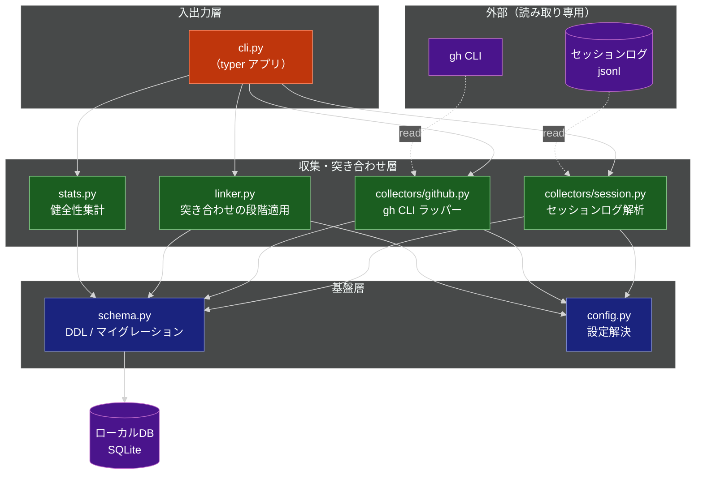
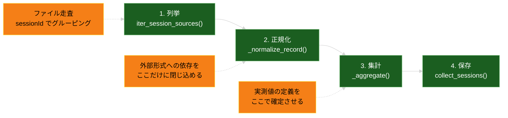

# AIエージェント実工数DB & CLI 技術設計書

**関連 Spec:** [effort-db_spec.md](effort-db_spec.md)
**関連 PRD:** [effort-db.md](../requirement/effort-db.md)

---

# 1. 実装ステータス

**ステータス:** 🟡 部分実装

## 1.1. 実装進捗

| モジュール/機能                            | ステータス | 備考                                              |
|:------------------------------------|:------|:------------------------------------------------|
| `config.py`（DB パス解決）                | 🟢    | 環境変数 > `config.toml` > デフォルトの解決は実装済み             |
| `config.py`（チケットキー形式・対象リポジトリの設定）    | 🔴    | FR-021 の残り                                      |
| `schema.py`（v1: sessions / pull_requests / task_effort） | 🟡    | v2 への拡張が必要（4.3 / 5 章）                           |
| `cli.py`（`init`）                    | 🟢    | 冪等性を含め実装済み                                      |
| `cli.py`（`backfill` / `collect-session` / `stats` / `query` / `link`） | 🔴    | 未実装                                             |
| `collectors/session.py`             | 🔴    | 未実装。本設計の中心                                      |
| `collectors/github.py`              | 🔴    | 未実装                                             |
| `linker.py`                         | 🔴    | 未実装                                             |
| `stats.py`                          | 🔴    | 未作成                                             |

進行順序は [ROADMAP.md](../../ROADMAP.md) の M1〜M7 に従う。

---

# 2. 設計目標

| 目標                          | 対応する要件                    |
|:----------------------------|:--------------------------|
| セッションログから実測値を欠損なく導出する        | FR-002〜FR-007             |
| 外部形式（ログ）の変化に収集全体を巻き込まれない構造にする | FR-020 / NFR-003 / NFR-004 |
| 収集を何度実行しても結果が収束する           | FR-019                    |
| 突き合わせの成否と由来を観測可能にする         | FR-013 / FR-015           |
| 1.6 GB 規模の入力を定常メモリで処理する     | NFR-008                   |
| 依存を最小に保ち、導入障壁を上げない          | DC_005                    |

---

# 3. 技術スタック

| 領域        | 採用技術                        | 選定理由                                                                    |
|:----------|:----------------------------|:------------------------------------------------------------------------|
| 言語        | Python 3.12+                | T-001。`X \| None` 記法・`match` 文が使える。標準の `tomllib` が利用可能                 |
| パッケージ管理   | uv                          | T-001                                                                   |
| CLI       | typer                       | T-002。サブコマンド階層を型注釈で表現でき、追加の設定ファイルを持たない                                 |
| DB        | sqlite3（標準ライブラリ）            | T-002。ローカル DB として配布するため依存を増やさない。raw 層はスキーマが素直で ORM の恩恵が薄い                |
| ログ解析      | json（標準ライブラリ）               | jsonl は 1 行 1 JSON。行単位ストリーミングで足り、追加依存が不要                                |
| 設定        | tomllib（標準ライブラリ）            | Python 3.11+ 標準。`config.toml` の読み取りに追加依存が不要                             |
| GitHub 連携 | `gh` CLI（subprocess）        | T-003。認証を `gh auth` に委譲し、トークンを本ツールが保持しない                                |
| テスト       | pytest                      | 既存構成を踏襲                                                                 |
| 静的解析      | ruff / mypy                 | 既存構成を踏襲                                                                 |

**採用しなかった選択肢**:

| 選択肢                          | 却下理由                                                          |
|:-----------------------------|:--------------------------------------------------------------|
| ORM（SQLAlchemy 等）            | T-002 / DC_005。raw 層は素の DDL で表現でき、マイグレーションも `user_version` で足る |
| PyGithub 等の API クライアント       | T-003。トークン管理を本ツールが負うことになる                                     |
| pandas による集計                 | 集約はビュー（SQL）で行う方針（A-002）と重複し、依存が重い                             |
| jsonl の並列パース（multiprocessing） | まず逐次で NFR-002 を測る。目標未達が確認されてから検討する（D-005：推定で設計を曲げない）          |

---

# 4. アーキテクチャ

## 4.1. システム構成図



**依存方向は上から下への単方向とする。** 基盤層が収集層を参照してはならない。
収集層が CLI を参照してはならない（A-001：参照形態を収集側が知らない）。

## 4.2. モジュール分割

| モジュール名                      | 責務                                            | 依存関係                    | 配置場所                                   |
|:----------------------------|:----------------------------------------------|:------------------------|:---------------------------------------|
| `cli`                       | コマンド定義、引数解釈、結果の表示。ドメインロジックを持たない                | collectors / linker / stats / schema / config | `src/effort_db/cli.py`                 |
| `collectors.session`        | ログ所在の列挙、セッション単位の実測値の導出、DB への収束保存               | schema / config         | `src/effort_db/collectors/session.py`  |
| `collectors.github`         | `gh` の呼び出し、PR メタ情報の正規化、DB への収束保存               | schema / config         | `src/effort_db/collectors/github.py`   |
| `linker`                    | 突き合わせの段階適用、由来付きリンクの保存、チケットキー抽出                 | schema / config         | `src/effort_db/linker.py`              |
| `stats`                     | 収集件数・キー種別ごとの join 率・未紐付け件数の算出                 | schema                  | `src/effort_db/stats.py`               |
| `models`                    | spec 4.1 の型定義（`SessionRecord` / `SessionPullRequestRef` / `LinkSource` 等）。振る舞いを持たない | なし                      | `src/effort_db/models.py`              |
| `schema`                    | 接続の生成、DDL、ビュー定義、スキーマバージョン管理とマイグレーション            | なし                      | `src/effort_db/schema.py`              |
| `config`                    | DB パス解決、`config.toml` の読み込み                   | なし                      | `src/effort_db/config.py`              |

## 4.3. セッションログ解析の内部構造

`collectors/session.py` を 4 段に分ける。段を分ける理由は、
**外部形式に依存する部分を 1 段に閉じ込め、形式変化の影響範囲を限定するため**である（FR-020 / NFR-004）。



| 段     | 関数                        | 責務                                                       |
|:------|:--------------------------|:---------------------------------------------------------|
| 1. 列挙 | `iter_session_sources()`  | ログを走査し、セッション識別子ごとにファイル群を束ねる（FR-007）                      |
| 2. 正規化 | `_normalize_record()`     | 生レコードを内部表現へ変換する。**未知の形は None を返してスキップする**（FR-020）       |
| 3. 集計 | `_aggregate()`            | 正規化済みレコード列から実測値を算出する。ターン等の定義はここに集約する（FR-003〜FR-006）     |
| 4. 保存 | `collect_sessions()`      | `SessionRecord` を収束保存する（FR-019）                          |

spec 4 章の公開 API `parse_session(source) -> SessionRecord` は、
**2. 正規化と 3. 集計を束ねた関数**として実装する。
1 セッション分のログ群を受け取り、正規化を各レコードに適用し、集計して `SessionRecord` を返す。
`collect_sessions()` は `parse_session()` の結果を保存するだけであり、実測値の算出を行わない。
段を分けたまま公開 API を 1 つに保つことで、テストは段ごとに書ける一方、
呼び出し側は内部構成を知らずに済む。

---

# 5. データモデル

## 5.1. スキーマ v2 の DDL

現行の v1 から、以下を変更する（変更理由は 9.2 を参照）。

```sql
-- セッション（raw 層）
CREATE TABLE IF NOT EXISTS sessions (
  session_id           TEXT PRIMARY KEY,
  repo                 TEXT,
  branch               TEXT,
  issue_key            TEXT,          -- 補助キー。抽出できない場合は NULL
  started_at           TEXT,          -- ISO8601
  ended_at             TEXT,
  wall_clock_min       REAL,
  turns                INTEGER NOT NULL DEFAULT 0,   -- 人由来の発話回数
  tool_calls           INTEGER NOT NULL DEFAULT 0,   -- 主エージェント
  sidechain_tool_calls INTEGER NOT NULL DEFAULT 0,   -- サブエージェント
  input_tokens         INTEGER NOT NULL DEFAULT 0,
  output_tokens        INTEGER NOT NULL DEFAULT 0,
  cache_read_tokens    INTEGER NOT NULL DEFAULT 0,
  log_versions         TEXT,          -- 観測されたログ形式バージョン（カンマ区切り）
  source_file_count    INTEGER NOT NULL DEFAULT 1,
  skipped_records      INTEGER NOT NULL DEFAULT 0,
  collected_at         TEXT           -- 収集時刻。再収集の判断に用いる
);

CREATE INDEX IF NOT EXISTS idx_sessions_repo_branch ON sessions (repo, branch);
CREATE INDEX IF NOT EXISTS idx_sessions_issue_key   ON sessions (issue_key);

-- PR（raw 層）
CREATE TABLE IF NOT EXISTS pull_requests (
  repo          TEXT    NOT NULL,
  pr_number     INTEGER NOT NULL,
  head_branch   TEXT,                 -- 突き合わせに用いる
  issue_key     TEXT,
  additions     INTEGER,
  deletions     INTEGER,
  changed_files INTEGER,
  review_rounds INTEGER,
  created_at    TEXT,
  merged_at     TEXT,
  labels        TEXT,
  collected_at  TEXT,
  PRIMARY KEY (repo, pr_number)
);

CREATE INDEX IF NOT EXISTS idx_prs_repo_head_branch ON pull_requests (repo, head_branch);
CREATE INDEX IF NOT EXISTS idx_prs_issue_key        ON pull_requests (issue_key);

-- セッションログから抽出した PR 参照（raw 層）
-- ログに含まれる事実そのものであり、リンクの導出結果とは分けて保持する（A-002）
CREATE TABLE IF NOT EXISTS session_pr_refs (
  session_id TEXT    NOT NULL,
  repo       TEXT    NOT NULL,
  pr_number  INTEGER NOT NULL,
  PRIMARY KEY (session_id, repo, pr_number)
);

-- セッションと PR の対応（リンク層）
CREATE TABLE IF NOT EXISTS session_pr_links (
  session_id  TEXT    NOT NULL,
  repo        TEXT    NOT NULL,
  pr_number   INTEGER NOT NULL,
  link_source TEXT    NOT NULL,       -- 'log_reference' | 'repo_branch'
  linked_at   TEXT,
  PRIMARY KEY (session_id, repo, pr_number)
);

CREATE INDEX IF NOT EXISTS idx_links_source ON session_pr_links (link_source);
CREATE INDEX IF NOT EXISTS idx_links_pr     ON session_pr_links (repo, pr_number);

-- 集約層：リポジトリ・ブランチ単位
-- 集約層：リポジトリ・ブランチ単位（spec FR-017）
-- 注意: リンクは 1 セッションに複数付きうる。JOIN すると sessions の行が複製され
-- SUM が重複計上されるため、PR 側の値は相関サブクエリで求める（9.3 参照）
CREATE VIEW IF NOT EXISTS effort_by_branch AS
SELECT s.repo,
       s.branch,
       COUNT(*)                    AS sessions,
       SUM(s.turns)                AS total_turns,
       SUM(s.tool_calls)           AS total_tool_calls,
       SUM(s.sidechain_tool_calls) AS total_sidechain_tool_calls,
       SUM(s.wall_clock_min)       AS total_min,
       SUM(s.input_tokens)         AS total_input_tokens,
       SUM(s.output_tokens)        AS total_output_tokens,
       SUM(s.cache_read_tokens)    AS total_cache_read_tokens,
       (SELECT COUNT(DISTINCT l.pr_number)
        FROM session_pr_links l
        JOIN sessions s2 ON s2.session_id = l.session_id
        WHERE s2.repo = s.repo AND s2.branch = s.branch)   AS linked_prs,
       (SELECT SUM(p.additions + p.deletions)
        FROM pull_requests p
        WHERE p.repo = s.repo
          AND p.pr_number IN (SELECT l.pr_number
                              FROM session_pr_links l
                              JOIN sessions s3 ON s3.session_id = l.session_id
                              WHERE s3.repo = s.repo AND s3.branch = s.branch)) AS diff_size
FROM sessions s
WHERE s.repo IS NOT NULL AND s.branch IS NOT NULL
GROUP BY s.repo, s.branch;

-- 集約層：チケット単位（spec FR-018。issue_key が付与されたものだけ）
-- 列構成は effort_by_branch と揃える（集約軸のみが異なる）
CREATE VIEW IF NOT EXISTS effort_by_issue AS
SELECT s.issue_key,
       COUNT(*)                    AS sessions,
       SUM(s.turns)                AS total_turns,
       SUM(s.tool_calls)           AS total_tool_calls,
       SUM(s.sidechain_tool_calls) AS total_sidechain_tool_calls,
       SUM(s.wall_clock_min)       AS total_min,
       SUM(s.input_tokens)         AS total_input_tokens,
       SUM(s.output_tokens)        AS total_output_tokens,
       SUM(s.cache_read_tokens)    AS total_cache_read_tokens,
       (SELECT COUNT(DISTINCT l.pr_number)
        FROM session_pr_links l
        JOIN sessions s2 ON s2.session_id = l.session_id
        WHERE s2.issue_key = s.issue_key)                  AS linked_prs,
       (SELECT SUM(p.additions + p.deletions)
        FROM pull_requests p
        WHERE p.issue_key = s.issue_key)                   AS diff_size
FROM sessions s
WHERE s.issue_key IS NOT NULL
GROUP BY s.issue_key;
```

**分布を算出できる粒度を保つ**（B-003）。集約ビューは合計値を提供するが、
`sessions` テーブルがセッション単位の行を保持しているため、
中央値・p90 は `sessions` に対する window 関数で算出できる（spec 6.2 の使用例）。

## 5.2. マイグレーション

`PRAGMA user_version` でバージョンを管理する。v1 → v2 は以下の手順とする。

```python
from __future__ import annotations

import sqlite3

SCHEMA_VERSION = 2


def migrate(conn: sqlite3.Connection) -> None:
    """現在の user_version から SCHEMA_VERSION まで順次適用する。"""
    current = conn.execute("PRAGMA user_version").fetchone()[0]
    if current >= SCHEMA_VERSION:
        return
    if current < 2:
        _migrate_v1_to_v2(conn)
    conn.execute(f"PRAGMA user_version = {SCHEMA_VERSION}")
    conn.commit()


def _migrate_v1_to_v2(conn: sqlite3.Connection) -> None:
    """v1 の列構成に v2 の列を加え、置き換えたビューを作り直す。

    v1 には実データがほぼ存在しない想定だが、A-002 に従い既存行は破棄しない。
    ALTER TABLE ... ADD COLUMN は既存行に対し DEFAULT 値を埋める。
    """
    added = {
        "sessions": [
            ("sidechain_tool_calls", "INTEGER NOT NULL DEFAULT 0"),
            ("input_tokens", "INTEGER NOT NULL DEFAULT 0"),
            ("output_tokens", "INTEGER NOT NULL DEFAULT 0"),
            ("cache_read_tokens", "INTEGER NOT NULL DEFAULT 0"),
            ("log_versions", "TEXT"),
            ("source_file_count", "INTEGER NOT NULL DEFAULT 1"),
            ("skipped_records", "INTEGER NOT NULL DEFAULT 0"),
            ("collected_at", "TEXT"),
        ],
        "pull_requests": [
            ("head_branch", "TEXT"),
            ("collected_at", "TEXT"),
        ],
    }
    for table, columns in added.items():
        existing = {row[1] for row in conn.execute(f"PRAGMA table_info({table})")}
        for name, decl in columns:
            if name not in existing:
                conn.execute(f"ALTER TABLE {table} ADD COLUMN {name} {decl}")
    # v1 の task_effort は issue_key を主軸にしており、実測に合わないため置き換える（9.2 D9）
    conn.execute("DROP VIEW IF EXISTS task_effort")
```

`interrupted` 列（v1 に存在）は残す。値の導出方法が未確定であり、
列を落とすと将来の再収集で埋め直せなくなるため（A-002）。

---

# 6. インターフェース定義

## 6.1. セッションログ解析

```python
from __future__ import annotations

import json
from collections.abc import Iterator
from dataclasses import dataclass
from pathlib import Path

from effort_db.models import SessionSource  # spec 4.1 の型定義

# 実測値の導出に用いるレコード種別。ここに無い種別は集計に影響しない。
_TURN_TYPE = "user"
_ASSISTANT_TYPE = "assistant"
_PR_LINK_TYPE = "pr-link"

# 実経過時間の算出に用いるレコード種別（FR-005）。
# 補助的な種別（ファイル履歴等）は含めない。作業時間ではなく副産物の記録だからである。
_WALL_CLOCK_TYPES = frozenset({"user", "assistant", "system", "pr-link"})


@dataclass(frozen=True)
class NormalizedRecord:
    """外部形式から切り離した内部表現。この型より下流は外部形式を知らない。"""

    kind: str                     # 'turn' | 'assistant' | 'pr_ref' | 'other'
    timestamp: str | None
    repo_hint: str | None         # PR 参照から得られる 'owner/repo'
    branch: str | None
    log_version: str | None
    is_sidechain: bool
    tool_use_count: int
    input_tokens: int
    output_tokens: int
    cache_read_tokens: int
    pr_number: int | None


def iter_session_sources(root: Path) -> Iterator[SessionSource]:
    """ログを走査し、セッション識別子ごとにファイル群を束ねる（FR-007）。

    1 ファイル = 1 セッションを前提にしない。同一セッションが複数ファイルに
    分割される場合があるため、ファイル名ではなく中身の識別子で束ねる（9.1 O4 / O8）。
    """
    by_session: dict[str, list[Path]] = {}
    for path in sorted(root.rglob("*.jsonl")):
        session_id = _peek_session_id(path)
        if session_id is None:
            continue
        by_session.setdefault(session_id, []).append(path)
    for session_id, paths in by_session.items():
        yield SessionSource(session_id=session_id, paths=tuple(paths))


def _peek_session_id(path: Path) -> str | None:
    """先頭の解釈可能なレコードからセッション識別子を得る。

    ファイル全体を読まずに判定する。ファイル名から導出しない（9.1 O8）。
    """
    try:
        with path.open(encoding="utf-8", errors="replace") as fp:
            for line in fp:
                line = line.strip()
                if not line:
                    continue
                try:
                    record = json.loads(line)
                except ValueError:
                    continue
                if not isinstance(record, dict):
                    continue
                # キー名の揺れに備え、優先順に探す（9.1 O3）
                for key in ("sessionId", "session_id"):
                    value = record.get(key)
                    if isinstance(value, str) and value:
                        return value
    except OSError:
        return None
    return None
```

`schema.connect()` は永続化技術を呼び出し側から隠す境界である。
spec の使用例が特定の DB モジュールを import しないようにするために設ける（spec 4 章）。

```python
from __future__ import annotations

import sqlite3
from pathlib import Path


def connect(db_path: Path) -> sqlite3.Connection:
    """DB 接続を取得する。親ディレクトリが無い場合は作成する。

    戻り値の型は実装詳細である。呼び出し側は本関数の戻り値をそのまま
    他の API に渡すだけでよく、永続化技術を知る必要はない。
    """
    db_path.parent.mkdir(parents=True, exist_ok=True)
    conn = sqlite3.connect(db_path)
    # 外部キー制約は既定で無効。リンク層の整合を DB 側でも保つため有効化する
    conn.execute("PRAGMA foreign_keys = ON")
    return conn
```

## 6.2. 正規化（外部形式への依存を閉じ込める段）

```python
def _normalize_record(record: object) -> NormalizedRecord | None:
    """生レコードを内部表現へ変換する。解釈できない場合は None を返す（FR-020）。

    未知のフィールド・未知の種別で例外を投げてはならない。
    1 レコードの解釈失敗が収集全体を止めないことが要件である（NFR-003）。
    """
    if not isinstance(record, dict):
        return None

    record_type = record.get("type")
    if not isinstance(record_type, str):
        return None

    timestamp = record.get("timestamp")
    timestamp = timestamp if isinstance(timestamp, str) else None

    branch = record.get("gitBranch")
    branch = branch if isinstance(branch, str) and branch else None

    version = record.get("version")
    version = version if isinstance(version, str) else None

    is_sidechain = record.get("isSidechain") is True

    if record_type == _PR_LINK_TYPE:
        pr_number = record.get("prNumber")
        repository = record.get("prRepository")
        return NormalizedRecord(
            kind="pr_ref",
            timestamp=timestamp,
            repo_hint=repository if isinstance(repository, str) else None,
            branch=branch,
            log_version=version,
            is_sidechain=is_sidechain,
            tool_use_count=0,
            input_tokens=0,
            output_tokens=0,
            cache_read_tokens=0,
            pr_number=pr_number if isinstance(pr_number, int) else None,
        )

    message = record.get("message")
    message = message if isinstance(message, dict) else {}
    content = message.get("content")

    if record_type == _TURN_TYPE:
        # ツール実行結果の返却はターンに数えない（9.1 O5 / FR-003）
        kind = "turn" if _is_human_turn(content) else "other"
        return NormalizedRecord(
            kind=kind,
            timestamp=timestamp,
            repo_hint=None,
            branch=branch,
            log_version=version,
            is_sidechain=is_sidechain,
            tool_use_count=0,
            input_tokens=0,
            output_tokens=0,
            cache_read_tokens=0,
            pr_number=None,
        )

    if record_type == _ASSISTANT_TYPE:
        usage = message.get("usage")
        usage = usage if isinstance(usage, dict) else {}
        return NormalizedRecord(
            kind="assistant",
            timestamp=timestamp,
            repo_hint=None,
            branch=branch,
            log_version=version,
            is_sidechain=is_sidechain,
            tool_use_count=_count_tool_use(content),
            input_tokens=_as_int(usage.get("input_tokens")),
            output_tokens=_as_int(usage.get("output_tokens")),
            cache_read_tokens=_as_int(usage.get("cache_read_input_tokens")),
            pr_number=None,
        )

    return NormalizedRecord(
        kind="other",
        timestamp=timestamp,
        repo_hint=None,
        branch=branch,
        log_version=version,
        is_sidechain=is_sidechain,
        tool_use_count=0,
        input_tokens=0,
        output_tokens=0,
        cache_read_tokens=0,
        pr_number=None,
    )


def _is_human_turn(content: object) -> bool:
    """人由来の発話かを判定する（FR-003）。

    内容が文字列の場合は人の発話とみなす。
    リストの場合、ツール実行結果を含むものは自動的な応答であり、ターンに数えない。
    """
    if isinstance(content, str):
        return bool(content.strip())
    if isinstance(content, list):
        kinds = {
            item.get("type")
            for item in content
            if isinstance(item, dict)
        }
        return "tool_result" not in kinds and bool(kinds)
    return False


def _count_tool_use(content: object) -> int:
    """ツール呼び出しの数を数える（FR-004）。"""
    if not isinstance(content, list):
        return 0
    return sum(
        1
        for item in content
        if isinstance(item, dict) and item.get("type") == "tool_use"
    )


def _as_int(value: object) -> int:
    """数値でない場合は 0 として扱う。例外にしない（FR-020）。"""
    return value if isinstance(value, int) and not isinstance(value, bool) else 0
```

## 6.3. 収束保存（冪等性の実現）

`resolve_links()` が `INSERT OR IGNORE` を使うのに対し、raw 層の保存は
**同一キーの行を最新状態へ更新する**必要がある。両者で戦略が異なる理由は、
リンクが「一度成立したら由来を変えない」一方、実測値は「ログが伸びれば更新される」ためである。

```python
from __future__ import annotations

import sqlite3
from collections.abc import Iterable

from effort_db.models import CollectResult, SessionRecord

_SESSION_UPSERT = """
INSERT INTO sessions (
  session_id, repo, branch, issue_key, started_at, ended_at, wall_clock_min,
  turns, tool_calls, sidechain_tool_calls,
  input_tokens, output_tokens, cache_read_tokens,
  log_versions, source_file_count, skipped_records, collected_at
) VALUES (
  :session_id, :repo, :branch, :issue_key, :started_at, :ended_at, :wall_clock_min,
  :turns, :tool_calls, :sidechain_tool_calls,
  :input_tokens, :output_tokens, :cache_read_tokens,
  :log_versions, :source_file_count, :skipped_records, datetime('now')
)
ON CONFLICT (session_id) DO UPDATE SET
  repo                 = excluded.repo,
  branch               = excluded.branch,
  started_at           = excluded.started_at,
  ended_at             = excluded.ended_at,
  wall_clock_min       = excluded.wall_clock_min,
  turns                = excluded.turns,
  tool_calls           = excluded.tool_calls,
  sidechain_tool_calls = excluded.sidechain_tool_calls,
  input_tokens         = excluded.input_tokens,
  output_tokens        = excluded.output_tokens,
  cache_read_tokens    = excluded.cache_read_tokens,
  log_versions         = excluded.log_versions,
  source_file_count    = excluded.source_file_count,
  skipped_records      = excluded.skipped_records,
  collected_at         = datetime('now')
"""


def collect_sessions(
    conn: sqlite3.Connection, records: Iterable[SessionRecord]
) -> CollectResult:
    """セッションを収束保存する（FR-019 / A-003）。

    issue_key は UPDATE 対象に含めない。突き合わせ段（linker）が付与した値を
    再収集で消してはならないためである（A-004：付与済みの情報を失わない）。
    """
    inserted = 0
    updated = 0
    skipped_records = 0
    for record in records:
        exists = conn.execute(
            "SELECT 1 FROM sessions WHERE session_id = ?", (record.session_id,)
        ).fetchone()
        conn.execute(
            _SESSION_UPSERT,
            {
                "session_id": record.session_id,
                "repo": record.repo,
                "branch": record.branch,
                "issue_key": record.issue_key,
                "started_at": record.started_at.isoformat() if record.started_at else None,
                "ended_at": record.ended_at.isoformat() if record.ended_at else None,
                "wall_clock_min": record.wall_clock_min,
                "turns": record.turns,
                "tool_calls": record.tool_calls,
                "sidechain_tool_calls": record.sidechain_tool_calls,
                "input_tokens": record.input_tokens,
                "output_tokens": record.output_tokens,
                "cache_read_tokens": record.cache_read_tokens,
                "log_versions": ",".join(record.log_versions),
                "source_file_count": record.source_file_count,
                "skipped_records": record.skipped_records,
            },
        )
        if exists:
            updated += 1
        else:
            inserted += 1
        skipped_records += record.skipped_records
    conn.commit()
    return CollectResult(
        inserted=inserted,
        updated=updated,
        skipped_sources=0,
        skipped_records=skipped_records,
    )
```

`collect_pull_requests()` も同じ形とする（競合キーが `(repo, pr_number)` になる点だけが異なる）。
`issue_key` を UPDATE 対象から外す扱いも同様である。

## 6.4. 突き合わせ

```python
from __future__ import annotations

import re
import sqlite3
from collections.abc import Sequence

from effort_db.models import LinkResult, LinkSource  # spec 4.1 の型定義


def resolve_links(conn: sqlite3.Connection, patterns: Sequence[str]) -> LinkResult:
    """突き合わせを確実性の高い順に適用する（FR-010〜FR-014）。

    後続の段は、先行する段で既にリンクが作られたセッションを上書きしない。
    由来の確実性の順序を保つためである（9.2 D6）。
    """
    counts: dict[str, int] = {}

    # 1. ログ内 PR 参照（最も確実）
    counts["log_reference"] = conn.execute(
        """
        INSERT OR IGNORE INTO session_pr_links (session_id, repo, pr_number, link_source, linked_at)
        SELECT r.session_id, r.repo, r.pr_number, 'log_reference', datetime('now')
        FROM session_pr_refs r
        """
    ).rowcount

    # 2. リポジトリとブランチの一致
    counts["repo_branch"] = conn.execute(
        """
        INSERT OR IGNORE INTO session_pr_links (session_id, repo, pr_number, link_source, linked_at)
        SELECT s.session_id, p.repo, p.pr_number, 'repo_branch', datetime('now')
        FROM sessions s
        JOIN pull_requests p
          ON p.repo = s.repo AND p.head_branch = s.branch
        WHERE s.repo IS NOT NULL
          AND s.branch IS NOT NULL
          AND NOT EXISTS (
            SELECT 1 FROM session_pr_links l WHERE l.session_id = s.session_id
          )
        """
    ).rowcount

    # 3. チケットキーの付与（リンクの成否とは独立に行う）
    _assign_issue_keys(conn, patterns)

    unlinked = conn.execute(
        """
        SELECT COUNT(*) FROM sessions s
        WHERE NOT EXISTS (
          SELECT 1 FROM session_pr_links l WHERE l.session_id = s.session_id
        )
        """
    ).fetchone()[0]
    conn.commit()
    return LinkResult(
        linked_by_source={LinkSource(k): v for k, v in counts.items()},
        unlinked_sessions=unlinked,
    )


def _assign_issue_keys(conn: sqlite3.Connection, patterns: Sequence[str]) -> None:
    """チケットキーを抽出して付与する（FR-012）。

    リンクの成否とは独立に実行する。リンクが作れなかったセッションにも
    チケットキーは付与されうる（A-004）。
    パターン未指定時は何もしない（既定パターンを持たない: B-004）。
    """
    if not patterns:
        return
    for table, source_column in (("sessions", "branch"), ("pull_requests", "head_branch")):
        rows = conn.execute(
            f"SELECT rowid, {source_column} FROM {table} WHERE issue_key IS NULL"
        ).fetchall()
        for rowid, source_value in rows:
            key = extract_issue_key(source_value, patterns)
            if key is not None:
                conn.execute(
                    f"UPDATE {table} SET issue_key = ? WHERE rowid = ?", (key, rowid)
                )


def extract_issue_key(text: str | None, patterns: Sequence[str]) -> str | None:
    """文字列からチケットキーを抽出する（FR-012）。

    パターンは設定から与える。実在のプロジェクトキーをコードに書いてはならない（B-004）。
    """
    if not text:
        return None
    for pattern in patterns:
        match = re.search(pattern, text)
        if match:
            return match.group(0)
    return None
```

## 6.5. CLI

| コマンド                        | 引数・オプション                  | 対応要件                |
|:----------------------------|:--------------------------|:--------------------|
| `effort-db init`            | なし                        | FR-001              |
| `effort-db backfill sessions` | `--since` / `--force`（任意） | FR-002 / NFR-002    |
| `effort-db backfill prs`    | `--repo owner/repo`（必須）   | FR-008              |
| `effort-db collect-session` | `<session-id>`（必須）        | FR-009 / NFR-001    |
| `effort-db link`            | なし                        | FR-010〜FR-014       |
| `effort-db stats`           | なし                        | FR-015              |
| `effort-db query`           | `<sql>`（必須）               | FR-016              |

`collectors/github.py` の疑似コードは本章に含めない。
`gh` から取得できるフィールドの粒度（特に `review_rounds` の定義）が未確定であり、
M5 で確認したうえで本章に追記する（9.3 の未解決課題）。

`link` を独立したコマンドとする。収集と突き合わせを分けることで、
PR を後から取り込んだ場合にセッションを再収集せずにリンクだけを作り直せる（A-001）。
`backfill` の末尾で自動的に `link` 相当の処理を呼ぶことはしない（副作用を暗黙にしない）。

---

# 7. 非機能要件実現方針

| 要件      | 実現方針                                                                                    |
|:--------|:----------------------------------------------------------------------------------------|
| NFR-001 | 単一セッションは対象ファイル群のみを開く。全走査を行わない。`--force` なしの場合は `collected_at` と mtime を比較してスキップする       |
| NFR-002 | 増分収集で 2 回目以降のコストを下げる（`collected_at` と mtime の比較）。逐次処理で目標に届かない場合は並列化を検討する（D12） |
| NFR-008 | 行単位ストリーミングで処理し、ファイル全体をメモリに載せない。最大級のファイル（数十 MB 規模）でも定常メモリで完走させる |
| NFR-003 | 正規化段が `None` を返した数を `skipped_records` として保存し、収集結果に件数を含めて返す。例外送出はしない                     |
| NFR-004 | 観測した `log_versions` をセッションごとに保存する。形式差異が疑われる場合、どのバージョンで欠損が出たかを後から SQL で追跡できる             |
| NFR-005 | ログに対する操作は読み取りのみ。書き込み・移動・削除の API を持たない。テストでもフィクスチャを書き換えない                              |
| NFR-006 | フィクスチャは合成データのみ。チケットキーのパターンは設定から与え、既定値を持たない                                             |
| NFR-007 | `gh` を subprocess で呼ぶ。トークンを読まない・保存しない・ログ出力しない。`gh` 未認証時は原因が分かるメッセージで終了する               |

---

# 8. テスト戦略

| テストレベル   | 対象                                     | カバレッジ目標         |
|:---------|:---------------------------------------|:----------------|
| ユニット     | 正規化段（`_normalize_record` / `_is_human_turn` / `_count_tool_use`） | 分岐網羅            |
| ユニット     | 集計段（`_aggregate`）— ターン・ツール呼び出し・時刻範囲・トークンの算出 | 分岐網羅            |
| ユニット     | `extract_issue_key`（パターンは合成）           | 主要分岐            |
| ユニット     | `config` のパス解決優先順位                     | 全経路             |
| 結合       | `backfill sessions` の冪等性（2 回実行で一致）     | 必須              |
| 結合       | `resolve_links` の段階適用と由来の記録            | 由来ごとに 1 ケース以上   |
| 結合       | マイグレーション v1 → v2（既存行の保全）               | 必須              |
| 結合       | 再収集で `issue_key` が消えないこと（付与済みの情報の保全）      | 必須              |
| 結合       | 集約ビューで 1 セッション × 複数 PR の重複計上が起きないこと      | 必須              |
| 異常系      | 破損行・未知種別・未知フィールド・空ファイル                  | 収集が継続すること       |
| 異常系      | `gh` 未認証・未インストール                       | メッセージを検証        |

## 8.1. フィクスチャの作り方（D-002 / D-003）

**実ログをコピーしない。** 以下の「構造の性質」を満たす合成 jsonl を組み立てる。

| フィクスチャ                     | 表現する性質                                       |
|:---------------------------|:---------------------------------------------|
| `minimal_session.jsonl`    | 人の発話 1 回とアシスタント応答 1 回のみ                     |
| `tool_heavy_session.jsonl` | ツール実行結果を含む `user` レコードがターンに数えられないこと          |
| `sidechain_session.jsonl`  | サブエージェントのツール呼び出しが主エージェントと区別されること              |
| `split_session_a/b.jsonl`  | 同一セッション識別子が 2 ファイルに分かれること                    |
| `mixed_versions.jsonl`     | 異なる形式バージョンのレコードが混在すること                       |
| `broken_lines.jsonl`       | 解釈できない行・未知種別・未知フィールドが混在しても収集が継続すること           |
| `pr_ref_session.jsonl`     | PR 参照レコードから直接リンクが作られること                      |
| `no_branch_session.jsonl`  | ブランチが得られず `unlinked` になること                   |

**テストは「値」ではなく「関係」を検証する。**
例えば「ターン数が 3」ではなく「ツール応答を N 件加えてもターン数が変わらない」を検証する。
形式バージョンが上がっても意味が保たれる限りテストが壊れないようにするためである（D-003）。

---

# 9. 設計判断

## 9.1. 実ログ構造の観測結果

M1 の設計判断の根拠として、ローカルの実ログを観察した。
以下は**観測された構造の性質**であり、実ログの内容は含まない（B-004 / D-003）。

観測条件: ローカルに存在するログ全体（約 3,800 ファイル / 約 1.6 GB / 約 820 プロジェクトディレクトリ）に対し、
無作為抽出したファイルのキー構造を集計した。標本は 4 回に分けて取得しており、各観測の標本を表の「標本」列に示す。

| 標本 | 規模                    | 対象とした観測              |
|:---|:----------------------|:---------------------|
| S1 | 60 ファイル / 14,658 行    | O1 / O2 / O7 / O12 / O13 / O15 |
| S2 | 120 ファイル             | O3 / O4 / O5 / O6 / O8 / O14   |
| S3 | 200 ファイル             | O9 / O10 / O11               |
| S4 | 150 ファイル             | O16 / O17                    |

| ID  | 標本  | 観測事実                                                              | 設計への影響                     |
|:----|:----|:--------------------------------------------------------------------|:---------------------------|
| O1 | S1 | レコードは `type` によって 14 種類に分かれる（会話・添付・モード変更・ファイル履歴・PR 参照など）             | 種別ごとに扱いを分ける必要がある。集計対象を限定する |
| O2 | S1 | 会話に相当するのは `user` / `assistant` の 2 種のみ。他は付随情報                       | ターン・ツール呼び出しは会話種別からのみ導く     |
| O3 | S2 | セッション識別子のキー名に揺れがある。大半のレコードに存在するものと、一部にしか存在しない別名が併存                  | 優先順で探索する。片方に依存しない（6.1）     |
| O4 | S2 | 1 セッションが複数ファイルに分割される場合がある（観測範囲で約 16%、最大 6 ファイル）                     | ファイル単位で集計すると実測値が分断される（D4）  |
| O5 | S2 | `user` レコードの大半（約 91%）はツール実行結果の返却であり、人の発話は約 9%                       | ターン数の定義を人由来に限定する（D1）       |
| O6 | S2 | ツール呼び出しの約 37% がサブエージェント内で発生している                                     | 一括計上すると主エージェントの作業量が過大になる（D2） |
| O7 | S1 | 時刻を持つのは全レコードの約 76%。形式は ISO8601（UTC）                                 | 時刻を持つレコードのみから実経過時間を算出する（D5） |
| O8 | S2 | ファイル名がセッション識別子と一致しない場合が多い（観測範囲で約 68%）                              | ファイル名から識別子を導出しない（6.1）      |
| O9 | S3 | ブランチ名は観測した全レコードで取得できた                                               | ブランチは突き合わせの主キーとして使える（D6）   |
| O10 | S3 | ブランチ名にチケットキー様の文字列を含むものは約 1.3%                                       | **チケットキーを主キーにできない**（D6）    |
| O11 | S3 | PR 参照専用のレコード種別が存在し、PR 番号・リポジトリ（`owner/repo` 形式）・URL を保持する。ただし保持するセッションは約 14% | 確実だがカバー率が低い。優先はするが依存はしない（D6） |
| O12 | S1 | 形式バージョンを表す値が 8 種類観測された                                       | バージョン差異は実在する。DC_008 の前提が裏付けられた（D8） |
| O13 | S1 | アシスタントのレコードはトークン使用量（入力・出力・キャッシュ）を保持する                              | 追加の観測量として収集できる（FR-006）     |
| O14 | S2 | 作業ディレクトリのパス階層の深さが一定しない                                              | パスからリポジトリ名を機械的に導出しない（D7）   |
| O15 | S1 | 抽出範囲では解釈できない行は存在しなかった                                               | それでも DC_008 は将来の形式変化に備えて必要 |
| O16 | S4 | ファイル更新時刻と最終レコード時刻の差は中央値 0.1 秒。更新時刻が最終レコード時刻より 60 秒以上古いファイルは 1 件も無かった（0/149） | 切り詰め・巻き戻しの形跡がない。更新時刻を増分判定に使える（D13） |
| O17 | S4 | ファイル内の時刻が単調非減少なのは約 78%。約 22% で逆行が観測された                              | **実経過時間を先頭と末尾のレコードから求めてはならない**（D5） |

## 9.2. 決定事項

| ID  | 決定事項                | 選択肢                                                     | 決定内容                                    | 理由                                                                     |
|:----|:--------------------|:--------------------------------------------------------|:----------------------------------------|:-----------------------------------------------------------------------|
| D1  | ターン数の定義            | (a) 会話レコード全数 (b) 人由来の発話のみ (c) アシスタント応答数                 | **(b) 人由来の発話のみ**                       | O5。ツール応答を含めると値の 9 割が自動応答になり、「何回やり取りしたか」という意味を失う                          |
| D2  | サブエージェントの計上        | (a) 合算 (b) 除外 (c) 別列で保持                                 | **(c) 別列で保持**                          | O6。合算は主エージェントの作業量を歪め、除外は実作業を失う。A-002 に従い両方を残して解釈は参照側に委ねる                |
| D3  | セッション識別子の取得元       | (a) ファイル名 (b) レコード内のキー                                 | **(b) レコード内のキー（優先順探索）**                | O3 / O8。ファイル名は識別子と一致しない場合が多く、キー名にも揺れがある                                 |
| D4  | セッションの境界           | (a) 1 ファイル = 1 セッション (b) 識別子でファイル群を束ねる                  | **(b) 識別子で束ねる**                        | O4。分割されたログをファイル単位で集計すると実経過時間とターン数が分断される                                 |
| D5  | 実経過時間の算出           | (a) 全レコードの時刻範囲 (b) 会話系レコードの時刻範囲 (c) ファイル mtime          | **(b) 会話系レコードの最小時刻と最大時刻の差**            | O7 / O17。付随レコード（ファイル履歴等）は作業時間ではなく副産物の記録であり範囲を歪める。時刻は約 22% のファイルで逆行するため、先頭・末尾ではなく min / max を取る |
| D6  | 突き合わせキーの主軸         | (a) チケットキー (b) リポジトリ+ブランチ (c) ログ内 PR 参照                 | **(b) を主軸、(c) を優先適用、(a) を補助**          | O9 / O10 / O11。チケットキーは 1.3% しか取得できず集計が成立しない。ブランチは 100% 取得できる。PR 参照は確実だがカバー率 14% |
| D7  | リポジトリ名の導出          | (a) 作業ディレクトリのパス (b) PR 参照のリポジトリ値 (c) git remote          | **(b) を優先し、無い場合は (c)**                 | O14。パス階層が一定せず、機械的な導出は誤りを生む。なお (c) `git remote` の妥当性はログ観測の範囲外であり、M1 の実装時に検証する |
| D8  | 未知の形式への対応          | (a) 既知種別のみ処理し他は例外 (b) 未知は無視して継続                        | **(b) 未知は無視して継続**                      | O12 / O15。バージョン差異が実在する。1 レコードの失敗で 1.6 GB の収集が落ちてはならない（NFR-003）          |
| D9  | v1 の `task_effort` ビュー | (a) 維持 (b) 置き換え                                        | **(b) `effort_by_branch` / `effort_by_issue` に置き換え** | D6 により集約軸が変わった。`issue_key` 単位の集約は 1.3% のデータにしか当たらず、実質的に空になる             |
| D10 | リンクの表現             | (a) `sessions.issue_key` の一致で暗黙に join (b) 由来付きリンクテーブル  | **(b) 由来付きリンクテーブル**                    | FR-013 / FR-015。キー種別ごとの join 率を出すには、どのキーで紐付いたかを記録する必要がある                |
| D11 | 突き合わせの実行タイミング      | (a) 収集の末尾で自動実行 (b) 独立コマンド                               | **(b) 独立コマンド（`link`）**                 | A-001。収集と参照（突き合わせ結果の利用）を分離する。PR を後から取り込んだ際にセッション再収集なしでリンクを作り直せる。暗黙の副作用を持たせない |
| D12 | 一括取り込みの並列化         | (a) 最初から並列 (b) 逐次で計測してから判断                             | **(b) 逐次で計測してから判断**                    | D-005。1.6 GB という規模は分かっているが、逐次で目標を満たせるかは未計測。推定で複雑さを先に入れない                 |
| D13 | 増分収集の判定            | (a) 常に全走査 (b) `collected_at` と mtime の比較               | **(b) mtime 比較（`--force` で無効化）**       | NFR-002 / O16。全走査は 2 回目以降のコストが下がらない。更新時刻が最終レコード時刻より古いファイルは観測されず、切り詰めの形跡がないため mtime を判定に使える。前提が崩れた場合の備えとして 9.3 に代替判定を挙げる |

## 9.3. 未解決の課題

| 課題                                     | 影響度 | 対応方針                                                             |
|:---------------------------------------|:----|:-----------------------------------------------------------------|
| `interrupted`（中断の有無）の導出方法              | 中   | 中断を示す構造が特定できていない。列は保持し、導出は M1 の実装中に判断する。判断できない場合は NULL のまま残す      |
| `review_rounds`（レビュー往復回数）の定義           | 中   | `gh` から取得できる値の粒度を M5 で確認して決める。レビューコメント数とレビュー提出数のどちらを採るかで意味が変わる     |
| NFR-001 / NFR-002 の目標値                 | 中   | 暫定値。M6 / M7 で計測し、実測に基づいて PRD の PR_001 / PR_002 を更新する            |
| サブエージェントのセッション帰属                        | 低   | サブエージェント由来のレコードが親セッションの識別子を持つ前提で設計している。別セッションとして記録される場合の扱いは M1 で確認 |
| 同一セッションが複数 PR に紐づく場合の集約                | 低   | 重複計上は相関サブクエリで回避した（5.1）。相関サブクエリの実行コストは M7 で計測し、必要なら中間テーブル化を検討する      |
| チケットキーのパターン既定値                          | 低   | 既定値を持たない方針（B-004）。設定未指定時はチケットキー抽出をスキップする挙動とする                    |
| 増分判定が mtime に依存すること                       | 低   | O16 により切り詰めの形跡はないが、将来ログが書き換えられた場合は取りこぼしが起きる。備えとして、ファイルサイズが前回収集時より小さい場合は mtime にかかわらず再収集する判定を入れる |

---

# 10. 変更履歴

## v0.2（2026-08-16）

**変更内容:**

- 実ログ構造の観測結果（9.1）に基づき、突き合わせキーの主軸をチケットキーからリポジトリ+ブランチへ変更（D6）
- 由来付きリンクテーブル `session_pr_links` を追加（D10）
- `sessions` にサブエージェント計上・トークン使用量・形式バージョン・スキップ件数の列を追加（D2 / D8 / FR-006）
- v1 の `task_effort` ビューを `effort_by_branch` / `effort_by_issue` に置き換え（D9）
- スキーマバージョンを 2 に上げ、v1 → v2 のマイグレーションを定義（5.2）
- 追加観測（O16 / O17）により、増分判定に更新時刻を使える根拠を得た（D13）。
  あわせて実経過時間の算出を min / max 方式に明示（D5：約 22% のファイルで時刻が逆行するため）

**移行ガイド:**

```sql
-- ❌ v1: チケットキー単位の集約（実測では 1.3% のデータにしか当たらない）
SELECT * FROM task_effort WHERE issue_key = 'XXX-123';

-- ✅ v2: リポジトリ・ブランチ単位の集約
SELECT * FROM effort_by_branch WHERE repo = 'owner/repo' AND branch = 'feature/x';

-- ✅ v2: チケットキーが付与されている場合はチケット単位も使える
SELECT * FROM effort_by_issue WHERE issue_key = 'XXX-123';
```

## v0.1（2026-08-15）

**変更内容:**

- 初版。`init` / スキーマ v1 / 設定解決の実装に対応する設計を記述
