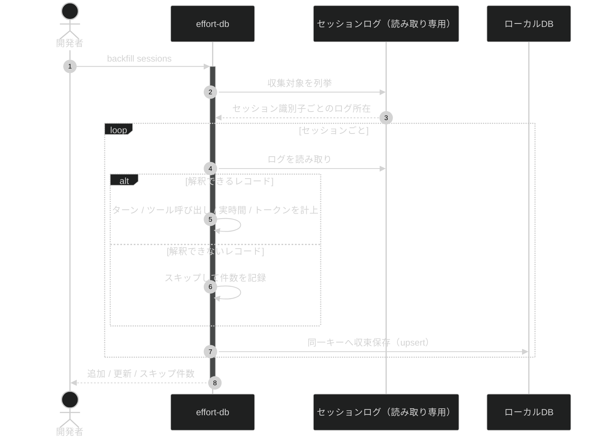
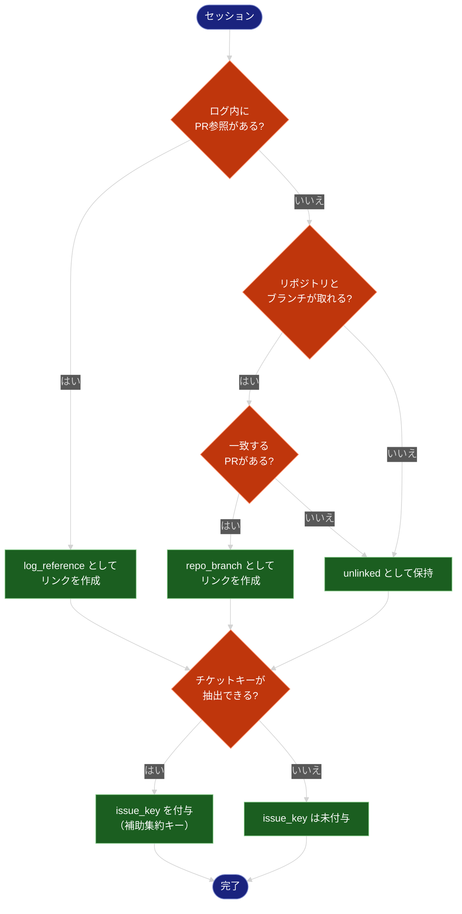
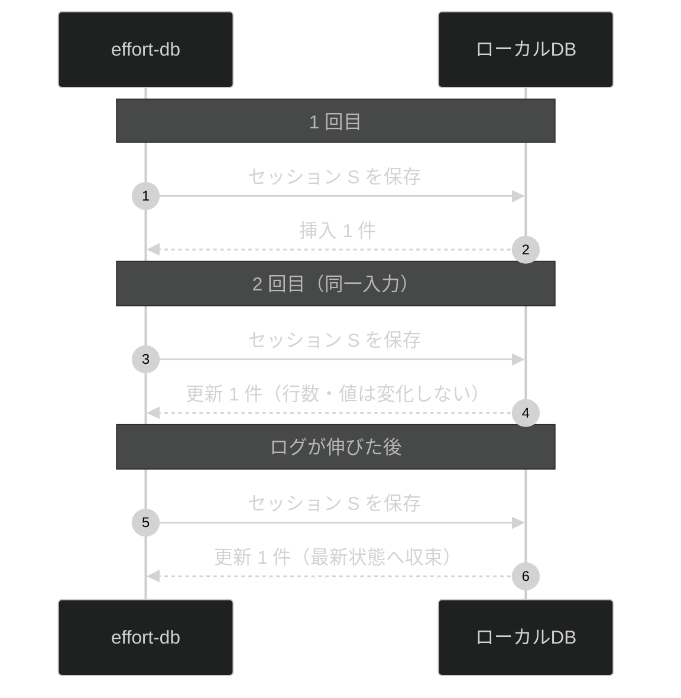

# AIエージェント実工数DB & CLI 抽象仕様書

**関連 Design Doc:** [effort-db_design.md](effort-db_design.md)
**関連 PRD:** [effort-db.md](../requirement/effort-db.md)

---

# 1. 背景

Claude Code / AI エージェントが出す工数見積もりは「人間が実施する前提」で算出されるため大きく外れる。
実際にかかった工数を実測から蓄積し、見積もりの参照母集団（reference class）として使える状態にすることが必要である（B-001）。

蓄積対象として最も情報量が多いのは Claude Code 自身のセッションログである。
ここからターン数・ツール呼び出し回数・実経過時間・トークン使用量が観測できる（A-005）。
GitHub の PR の経過時間はレビュー待ち・放置を含みノイジーであるため、補助的な特徴量として扱う。

本仕様は、これらの実測値を**欠損なく蓄積し、分布として参照できる**論理構造と公開インターフェースを定義する。
推定器は本システムの責務ではない（B-001）。

# 2. 概要

本システムは「収集」と「参照」を分離した 2 層構造を持つ（A-001）。

- **raw 層**: セッション単位・PR 単位の実測値と、**ログに含まれていた PR 参照そのもの**を保持する。加工・集約前のデータを失わない（A-002）
- **リンク層**: セッションと PR の対応関係を、**その対応が何によって得られたか（由来）とともに**保持する
- **集約層**: raw 層とリンク層を集約したビュー。実体としてデータを持たない

ログに含まれていた PR 参照（`SessionPullRequestRef`）と、突き合わせの結果（`SessionPullRequestLink`）を
別の層に置く。前者は観測した事実、後者はそこから導いた対応であり、
導出規則が変わったときに前者を再取得せずに後者だけを作り直せるようにするためである（A-002）。

## 2.1. 設計原則

| 原則             | 本仕様での現れ方                                                       |
|:---------------|:---------------------------------------------------------------|
| 収集と参照の分離（A-001） | 収集 API は参照形態を知らない。参照は SQL とビューのみで成立する                         |
| raw 層の保持（A-002） | 集約はビューとして定義する。収集時に集約値へ丸めない                                     |
| 冪等な収集（A-003）    | すべての収集操作は同一キーに対して最新状態へ収束する。実行回数が結果を変えない                        |
| 未紐付けの保持（A-004）  | 突き合わせに失敗したレコードも保持する。失敗は削除対象ではなく観測対象                            |
| エージェントネイティブな単位（B-002） | 観測量をそのまま保持する。人日等への換算を行わない                                      |
| 分布として扱う（B-003）  | 集約層は合計値だけでなく分布（中央値・p90）を算出できる粒度を保つ                             |

## 2.2. 突き合わせキーの階層

セッションと PR を結びつけるキーは 1 種類ではない。確実性の高い順に段階的に適用する（FR_005）。

| 順位 | 由来                | 内容                              | 確実性 |
|:---|:------------------|:--------------------------------|:----|
| 1  | `log_reference`   | セッションログ内に PR 参照が含まれる場合、それを採用する  | 高   |
| 2  | `repo_branch`     | リポジトリとブランチの組が一致する PR を対応づける     | 中   |
| 3  | （補助）`issue_key`   | チケットキーを抽出できた場合、チケット単位の集約キーとして付与する | 低   |

**チケットキーを単独の主キーとしない。** 実測において、ブランチ名にチケットキーが含まれる割合は
集約が成立する水準に達しないことが確認されている（根拠の詳細は design を参照）。

いずれのキーも得られない場合、レコードは `unlinked` として保持される（FR_006）。

# 3. 要求定義

## 3.1. 機能要件

| ID     | 要件                                                        | 優先度 | 根拠（PRD）           |
|:-------|:----------------------------------------------------------|:----|:------------------|
| FR-001 | DB ファイル・テーブル・ビューを冪等に作成できる                                 | 必須  | FR_001            |
| FR-002 | 過去のセッションログを走査し、セッション単位の実測値を取り込める                          | 必須  | FR_002            |
| FR-003 | セッションのターン数を計上できる。ターンは人由来の発話回数を指し、ツール応答を含まない               | 必須  | FR_002_01         |
| FR-004 | セッションのツール呼び出し回数を計上できる。主エージェントとサブエージェントの回数を区別して保持する         | 必須  | FR_002_02         |
| FR-005 | セッションの実経過時間を算出できる                                         | 必須  | FR_002_03         |
| FR-006 | セッションのトークン使用量（入力・出力・キャッシュ読み取り）を計上できる                       | 必須  | FR_002_04         |
| FR-007 | セッション本体のログのみを収集対象とし、サブエージェント transcript や workflow ジャーナルをセッションとして扱わない | 必須  | FR_002            |
| FR-008 | 対象リポジトリの PR メタ情報を取り込める                                    | 必須  | FR_003            |
| FR-009 | セッション識別子を指定して 1 件だけ取り込める。結果は一括取り込みと一致する                    | 必須  | FR_004            |
| FR-010 | リポジトリとブランチの組でセッションと PR を突き合わせられる                          | 必須  | FR_005_01         |
| FR-011 | セッションログ内に PR 参照が含まれる場合、それを優先して突き合わせられる                    | 必須  | FR_005_02         |
| FR-012 | 取得可能な範囲でチケットキーを抽出し、補助的な集約キーとして付与できる                       | 必須  | FR_005_03         |
| FR-013 | 突き合わせの結果に**その対応が何によって得られたか（由来）**を保持する                     | 必須  | FR_005 / FR_007   |
| FR-014 | 突き合わせキーが得られないレコードも `unlinked` として保持する                     | 必須  | FR_006            |
| FR-015 | 収集件数・キー種別ごとの join 率・未紐付け件数を表示できる                          | 必須  | FR_007            |
| FR-016 | 任意の SQL を実行して raw 層・リンク層・集約層を参照できる                        | 必須  | FR_008            |
| FR-017 | リポジトリ・ブランチ単位で実測値を集約したビューを提供する                             | 必須  | FR_009            |
| FR-018 | チケットキーが付与されたレコードについて、チケット単位で集約したビューを提供する                  | 必須  | FR_009            |
| FR-019 | 収集は同一キーに対して最新状態へ収束し、実行回数によって結果が変わらない                      | 必須  | DC_003            |
| FR-020 | 未知のフィールドを無視し、解釈できないレコードをスキップして収集を継続する                     | 必須  | DC_008            |
| FR-021 | DB の配置場所と環境固有値を、コード変更なしに外部から与えられる                         | 必須  | IR_004            |

## 3.2. 非機能要件

| ID      | カテゴリ | 要件                                     | 目標値                    |
|:--------|:-----|:---------------------------------------|:-----------------------|
| NFR-001 | 性能   | 単一セッションの収集が対話操作を妨げない時間内に完了する（PR_001）    | 3 秒以内（暫定。初回計測後に見直す）    |
| NFR-002 | 性能   | 過去ログの一括走査が現実的な待ち時間で完了する（PR_002）         | 1,000 セッション 60 秒以内（暫定） |
| NFR-003 | 堅牢性  | 1 レコードの解釈失敗が一括取り込み全体を失敗させない（DC_008）     | 失敗レコードはスキップし件数を報告      |
| NFR-004 | 堅牢性  | ログ形式のバージョン差異をまたいで収集できる（DC_008）          | 既知の全バージョンで収集が完走する      |
| NFR-005 | 保全性  | セッションログを読み取り専用として扱い、書き換え・移動・削除を行わない（IR_002） | 書き込み操作を持たない            |
| NFR-006 | 機密性  | 実データ・環境固有値をリポジトリに残さない（DC_004 / B-004）   | テストは合成データのみで成立する       |
| NFR-007 | 移植性  | GitHub 連携でトークンを保持・管理しない（IR_003）        | 認証は外部コマンドに委譲する         |
| NFR-008 | 資源効率 | 入力全体の大きさに依存しない定常メモリで収集できる（PR_002 の前提）    | 単一ファイルを全量メモリに載せない      |

# 4. API

| pkg                       | class                | member                                      | 概要                                              |
|:--------------------------|:---------------------|:--------------------------------------------|:------------------------------------------------|
| `effort_db`               | `config`             | `resolve_db_path() -> Path`                 | DB パスを環境変数 > 設定ファイル > デフォルトの順で解決する（FR-021）      |
| `effort_db`               | `config`             | `load_config() -> Config`                   | 設定（チケットキー形式、対象リポジトリ等）を読み込む（FR-021）              |
| `effort_db`               | `schema`             | `connect(db_path) -> Connection`            | DB への接続を取得する。永続化技術は design が定める                  |
| `effort_db`               | `schema`             | `init_db(conn) -> None`                     | テーブル・ビューを冪等に作成する（FR-001）                        |
| `effort_db`               | `schema`             | `SCHEMA_VERSION`                            | スキーマバージョン                                       |
| `effort_db.collectors`    | `session`            | `iter_session_files(root) -> Iterator[Path]`  | セッション本体のログを列挙する（FR-002 / FR-007）                    |
| `effort_db.collectors`    | `session`            | `parse_session_file(path) -> SessionRecord` | 1 ファイルから実測値を導出する（FR-003〜FR-006）                  |
| `effort_db.collectors`    | `session`            | `collect_all(conn, root) -> CollectResult`   | セッションを DB へ収束保存する（FR-002 / FR-019）               |
| `effort_db.collectors`    | `github`             | `fetch_pull_requests(repo) -> list[PullRequestRecord]` | PR メタ情報を取得する（FR-008）                            |
| `effort_db.collectors`    | `github`             | `collect_pull_requests(conn, repo) -> CollectResult` | PR を DB へ収束保存する（FR-008 / FR-019）                 |
| `effort_db`               | `linker`             | `extract_issue_key(text, patterns) -> str \| None` | 文字列からチケットキーを抽出する（FR-012）                        |
| `effort_db`               | `linker`             | `resolve_links(conn, patterns) -> LinkResult` | 突き合わせを段階適用し、由来付きでリンクを保存する（FR-010〜FR-014）        |
| `effort_db`               | `stats`              | `collect_stats(conn) -> Stats`              | 収集件数・キー種別ごとの join 率・未紐付け件数を算出する（FR-015）         |

## 4.1. 型定義

論理構造としての定義であり、永続化形式・実装上の型は design で定める。

```python
from dataclasses import dataclass
from datetime import datetime
from enum import Enum


class LinkSource(Enum):
    """突き合わせの由来。確実性の高い順に定義する（FR-013）。

    UNLINKED は「リンクが存在しない」ことを表す論理値であり、
    リンクの実体として永続化されることはない。
    集計時に未紐付け件数を由来別の内訳と同じ軸で扱うために定義する。
    """

    LOG_REFERENCE = "log_reference"   # セッションログ内の PR 参照
    REPO_BRANCH = "repo_branch"       # リポジトリとブランチの一致
    UNLINKED = "unlinked"             # リンク不在を表す（永続化しない。FR-014）


@dataclass(frozen=True)
class SessionRecord:
    """セッション単位の実測値（raw 層）。観測できなかった値は None とし、0 で埋めない。"""

    session_id: str
    repo: str | None
    branch: str | None
    issue_key: str | None            # 補助キー。抽出できない場合は None（FR-012）
    started_at: datetime | None
    ended_at: datetime | None
    wall_clock_min: float | None     # FR-005
    turns: int                       # 人由来の発話回数。ツール応答を含まない（FR-003）
    tool_calls: int                  # 主エージェントのツール呼び出し回数（FR-004）
    sidechain_tool_calls: int        # サブエージェントのツール呼び出し回数（FR-004）
    input_tokens: int                # FR-006
    output_tokens: int               # FR-006
    cache_read_tokens: int           # FR-006
    log_versions: tuple[str, ...]    # 観測されたログ形式バージョン（NFR-004）
    interrupted: bool                # 中断の有無。構造フィールドとテキストマーカーの両方で判定する
    skipped_records: int             # 解釈できずスキップしたレコード数（NFR-003）


@dataclass(frozen=True)
class PullRequestRecord:
    """PR 単位のメタ情報（raw 層）。経過時間は補助的な特徴量として保持する。"""

    repo: str
    pr_number: int
    head_branch: str | None          # 突き合わせに用いる（FR-010）
    issue_key: str | None
    additions: int | None
    deletions: int | None
    changed_files: int | None
    review_rounds: int | None
    created_at: datetime | None
    merged_at: datetime | None
    labels: tuple[str, ...]


@dataclass(frozen=True)
class SessionPullRequestRef:
    """セッションログに含まれていた PR 参照（raw 層）。観測した事実そのもの。"""

    session_id: str
    repo: str
    pr_number: int


@dataclass(frozen=True)
class SessionPullRequestLink:
    """セッションと PR の対応関係（リンク層）。由来を必ず伴う（FR-013）。"""

    session_id: str
    repo: str
    pr_number: int
    link_source: LinkSource


@dataclass(frozen=True)
class CollectResult:
    """収集の結果。成功件数だけでなく失敗の内訳を返す（NFR-003）。"""

    inserted: int
    updated: int
    skipped_sources: int
    skipped_records: int


@dataclass(frozen=True)
class LinkResult:
    """突き合わせの結果。由来ごとの件数を保持する（FR-015）。"""

    linked_by_source: dict[LinkSource, int]
    unlinked_sessions: int


@dataclass(frozen=True)
class Stats:
    """収集の健全性。join 率はキー種別ごとに区別する（FR-015）。"""

    sessions: int
    pull_requests: int
    links_by_source: dict[LinkSource, int]
    join_rate_by_source: dict[LinkSource, float]
    unlinked_sessions: int
    sessions_with_issue_key: int
```

## 4.2. 集約層

集約はビューとして提供し、実体を持たない（A-002）。

両ビューは**同一の列構成**を持ち、集約軸のみが異なる。

| 提供する値                        | 内容                                    |
|:-----------------------------|:--------------------------------------|
| `sessions`                   | セッション数                                |
| `total_turns`                | 総ターン数                                 |
| `total_tool_calls`           | 主エージェントのツール呼び出し数                      |
| `total_sidechain_tool_calls` | サブエージェントのツール呼び出し数                     |
| `total_min`                  | 総実経過時間                                |
| `total_input_tokens` / `total_output_tokens` / `total_cache_read_tokens` | トークン使用量        |
| `linked_prs`                 | 突き合わせられた PR の数                        |
| `diff_size`                  | 対応する PR の差分規模の合計                       |

| ビュー                | 集約軸              | 対象                        | 根拠     |
|:-------------------|:-----------------|:--------------------------|:-------|
| `effort_by_branch` | `(repo, branch)` | リポジトリとブランチが得られたレコード       | FR-017 |
| `effort_by_issue`  | `issue_key`      | `issue_key` が付与されたレコードのみ  | FR-018 |

分布（中央値・p90）は、集約ビューが**セッション単位の行を失わない粒度**を保つことで算出可能とする（B-003）。
合計値のみを持つ集約は行わない。

# 5. 用語集

| 用語               | 説明                                                            |
|:-----------------|:--------------------------------------------------------------|
| セッション            | エージェントとの 1 回の対話単位。1 つのセッション識別子で識別される。ログファイルと 1:1 に対応しない場合がある   |
| ターン              | 人由来の発話回数。ツール実行結果の返却は含まない                                      |
| ツール呼び出し          | エージェントがツールを実行した回数。主エージェントとサブエージェントを区別して保持する                    |
| サブエージェント         | 主エージェントから起動される下位のエージェント。その作業量は独立した観測量として保持する                  |
| 実経過時間（wall clock） | セッションの開始から終了までの実時間                                            |
| トークン使用量          | セッションで消費した入力・出力・キャッシュ読み取りトークン数                                |
| 突き合わせキー          | セッションと PR を同一の作業単位として結びつけるキー。リポジトリとブランチの組を主とし、ログ内 PR 参照・チケットキーを併用する。確実性の高い順に段階適用する |
| 由来（`link_source`） | 突き合わせがどのキーによって成立したかを示す値。join 率をキー種別ごとに観測するために保持する             |
| チケットキー（`issue_key`） | チケット単位の集約に用いる補助的なキー。単独の主キーとはしない                               |
| `unlinked`       | いずれの突き合わせキーも得られなかった状態。破棄せず保持する                                |
| join 率           | 収集レコードのうち突き合わせができた割合。キーの種類ごとに区別して観測する                         |
| raw 層            | セッション単位・PR 単位の実測値をそのまま保持する層                                   |
| リンク層             | セッションと PR の対応関係を由来とともに保持する層                                   |
| 集約層              | raw 層とリンク層を集約したビュー。実体を持たない                                    |
| 参照母集団（reference class） | 見積もり時に「似た作業が過去どれだけかかったか」を参照するための実測データの集合                      |

# 6. 使用例

## 6.1. CLI

```bash
# DB を作成する（冪等）
effort-db init

# 過去のセッションログを一括取り込み
effort-db backfill sessions

# PR メタ情報を取り込み
effort-db backfill prs --repo owner/repo

# 突き合わせを実行（段階適用）
effort-db link

# 収集の健全性を確認（キー種別ごとの join 率）
effort-db stats

# 単一セッションのみ取り込み
effort-db collect-session <session-id>

# 任意の SQL で参照
effort-db query "SELECT * FROM effort_by_branch ORDER BY total_turns DESC LIMIT 10"
```

## 6.2. 分布として参照する

点推定ではなく分布で扱う（B-003）。

```bash
# ブランチあたりのターン数の中央値と p90 を求める
effort-db query "
  SELECT COUNT(*)                                          AS samples,
         AVG(turns)                                         AS mean_turns,
         MAX(CASE WHEN pct <= 0.5 THEN turns END)           AS median_turns,
         MAX(CASE WHEN pct <= 0.9 THEN turns END)           AS p90_turns
  FROM (
    SELECT turns,
           CUME_DIST() OVER (ORDER BY turns) AS pct
    FROM sessions
    WHERE turns > 0
  )
"
```

## 6.3. Python API

```python
from effort_db import config, linker, schema
from effort_db.collectors import session

conn = schema.connect(config.resolve_db_path())
schema.init_db(conn)

result = session.collect_all(conn)
print(result.inserted, result.updated, result.skipped_records)

link_result = linker.resolve_links(conn, config.load_config().issue_key_patterns)
print(link_result.linked_by_source, link_result.unlinked_sessions)
```

# 7. 振る舞い図

## 7.1. セッションの一括取り込み



列挙の段でセッション本体だけに絞る（FR-007）。
サブエージェント transcript は親セッションのツール呼び出しとして加算するが、ターン数には加算しない。
workflow ジャーナルは複数セッションで同名のため、セッションとして扱うと識別子が衝突する。

## 7.2. 突き合わせの段階適用



`unlinked` になった場合もチケットキーの付与は試みる。
リンクの不成立とチケットキーの不在は独立した事象であり、片方の失敗が他方を打ち消さない（A-004）。

## 7.3. 収集の冪等性



# 8. 制約事項

| 制約                                  | 根拠            |
|:------------------------------------|:--------------|
| 収集と参照を分離し、参照側の都合で収集側の構造を変えない         | A-001 / DC_001 |
| raw 層を保持し、集約はビューとして提供する             | A-002 / DC_002 |
| 収集は同一キーに対して収束し、実行回数が結果を変えない          | A-003 / DC_003 |
| 実セッションログ・収集済み DB・環境固有値をリポジトリに含めない    | B-004 / DC_004 |
| 観測量をそのまま保持し、人日への換算・点推定への丸めを行わない       | B-002 / B-003 / DC_006 |
| セッションログは読み取り専用の入力として扱う               | IR_002 / NFR-005 |
| GitHub 連携でトークンを保持しない                | IR_003 / NFR-007 |
| すべての機能を単一の CLI コマンド体系から呼び出せる         | IR_001 / DC_007 |
| 単一利用者のローカル DB を前提とし、同時書き込みの競合制御は行わない | PRD 5.1（技術的制約） |

# 9. PRD 整合レビュー結果

## 9.1. トレーサビリティ

上位要求（`REQ_xxx`）は自身が直接実装対象になるのではなく、
`contains` で束ねた子要求を通じて満たされる。子要求の対応状況をもって充足を判断する。

| PRD 上位要求  | 内容            | 束ねる子要求                     | 対応する spec 要件                        |
|:-----------|:--------------|:---------------------------|:-----------------------------------|
| REQ_001    | 実工数の蓄積と参照     | REQ_002〜REQ_005            | 全体（本仕様書そのもの）                       |
| REQ_002    | 実測データの収集      | FR_001〜FR_005 / PR_001〜002 | FR-001〜FR-014 / NFR-001〜002        |
| REQ_003    | 蓄積データの参照      | FR_008 / FR_009            | FR-016〜FR-018                      |
| REQ_004    | データ品質と健全性     | FR_006 / FR_007            | FR-013〜FR-015                      |
| REQ_005    | アーキテクチャと制約    | IR_001〜004 / DC_001〜008    | NFR-003〜008 / 2.1 設計原則 / 8. 制約事項   |

| PRD 要求 ID  | 内容                | 対応する spec 要件            |
|:-----------|:------------------|:-----------------------|
| FR_001     | DB 初期化            | FR-001                 |
| FR_002     | セッションログの一括取り込み    | FR-002 / FR-007        |
| FR_002（対象の絞り込み） | セッション本体のみを対象とする   | FR-007                 |
| FR_002_01  | ターン数の計上           | FR-003                 |
| FR_002_02  | ツール呼び出し回数の計上      | FR-004                 |
| FR_002_03  | 実経過時間の算出          | FR-005                 |
| FR_002_04  | トークン使用量の計上        | FR-006                 |
| FR_003     | PR 情報の一括取り込み      | FR-008                 |
| FR_004     | 単一セッションの収集        | FR-009                 |
| FR_005     | セッションと PR の突き合わせ  | FR-010〜FR-013          |
| FR_005_01  | リポジトリ・ブランチによる突き合わせ | FR-010                 |
| FR_005_02  | ログ内 PR 参照による突き合わせ | FR-011                 |
| FR_005_03  | チケットキーの抽出と付与      | FR-012                 |
| FR_006     | 未紐付けレコードの保持       | FR-014                 |
| FR_007     | 収集健全性の確認          | FR-015 / FR-013        |
| FR_008     | 任意 SQL による参照      | FR-016                 |
| FR_009     | 集約ビューの提供          | FR-017 / FR-018        |
| PR_001     | 単一セッション収集の応答時間    | NFR-001                |
| PR_002     | 一括取り込みのスループット     | NFR-002                |
| IR_001     | CLI インターフェース      | 4. API / 8. 制約事項       |
| IR_002     | セッションログ入力         | NFR-005                |
| IR_003     | GitHub 連携         | NFR-007                |
| IR_004     | 設定インターフェース        | FR-021                 |
| DC_001     | 収集と参照の分離          | 2.1 / 8. 制約事項          |
| DC_002     | raw 層の保持          | 2. 概要 / 4.2 / 8. 制約事項  |
| DC_003     | 収集の冪等性            | FR-019 / 7.3           |
| DC_004     | 実データの非コミット        | NFR-006                |
| DC_005     | 依存の最小化            | design で担保             |
| DC_006     | エージェントネイティブな単位    | 8. 制約事項                |
| DC_007     | 将来の分岐を CLI の外側で吸収 | 8. 制約事項                |
| DC_008     | ログ形式差異への耐性        | FR-020 / NFR-003 / NFR-004 |
| PR_002（前提） | 定常メモリでの処理          | NFR-008                |

**PRD の全要求が spec に対応している**（未対応なし）。

## 9.2. spec 側で追加した要件

PRD にない要件を spec で追加した。いずれも PRD の要求を実現するために論理構造上必要なものである。

| spec 要件  | 追加理由                                                                 |
|:---------|:---------------------------------------------------------------------|
| FR-007   | ログツリーにはセッション本体でない transcript が同居し、区別しなければ実測値が汚染される（workflow ジャーナルは複数セッションで同名） |
| FR-013   | FR_007（キー種別ごとの join 率）を実現するには、リンクの由来を保持する必要がある                      |
| FR-004（区別保持） | サブエージェントのツール呼び出しが無視できない規模を占めるため、A-002 に従い区別して保持する                    |

FR-013 は PRD への昇格候補である。design での検証後に PRD へ反映するかを判断する。

> **訂正記録（2026-08-16）**: 当初 FR-007 を「1 セッションが複数ログファイルに分割される場合に束ねる」と定義していたが、
> これは観測の誤り（セッション本体でないファイルを母集団に混入させた）に基づくものだった。
> セッション本体に限れば 1 ファイル = 1 セッションである（design O4 / O8）。
> 本要件は「本体以外のファイルを誤ってセッションとして扱わない」という実在の要件に置き換えた。
