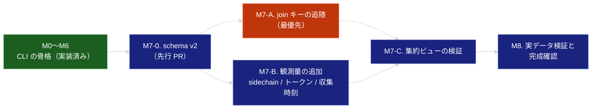

# ROADMAP

agent-effort-db を「CLI として完結する状態」まで到達させるための工程表。

- 何を・なぜ作るかは [effort-db.md](.sdd/requirement/effort-db.md)（PRD）が真実の源
- 論理構造と公開 API は [effort-db_spec.md](.sdd/specification/effort-db_spec.md)
- 技術設計・設計判断の根拠は [effort-db_design.md](.sdd/specification/effort-db_design.md)
- 交渉不可の原則は [CONSTITUTION.md](.sdd/CONSTITUTION.md) が定める
- 本ドキュメントは**実行順序と完了条件**のみを扱う

---

## 現在地

**CLI 一式が実装済み**（`init` / `backfill sessions` / `backfill prs` / `collect-session` / `link` / `stats` / `query`、テスト 94 件）。
突き合わせは `(repo, branch)` 主軸 + ログ内 PR 参照優先で動き、由来を `link_source` に残す。

**実測データに基づく設計判断への追随は完了した**（9 項目すべて）。

| 解消した項目                                 | 内容                                             |
|:---------------------------------------|:-----------------------------------------------|
| join キー / リンクの由来 / ログ内 PR 参照 / head ブランチ | `(repo, branch)` 主軸 + ログ内 PR 参照優先。由来を `link_source` に記録 |
| サブエージェント計上 / トークン使用量                   | ツール呼び出しとトークン 4 種を主・サブ別列で保持                      |
| `query` / スキーマ / 収集時刻                   | 読み取り専用の SQL 参照 / v2（リンク層 + 2 ビュー）/ `collected_at` の記録 |

**M0〜M8 はすべて完了した。** 実測値は以下のとおり（design 9.1 の O23〜O29）。

| 観測             | 実測値                                                |
|:---------------|:---------------------------------------------------|
| join 率          | **PR 収集済みリポジトリで 99.5%**（全体 43.9%。チケットキー単独では 0%）      |
| 一括取り込み         | 1,152 セッション / 約 1.6 GB を **9.0 秒**、ピークメモリ **75 MB** |
| 単一セッション収集      | **0.26 秒**                                         |
| サブエージェント比率     | ツール呼び出し **26.1%** / 出力トークン **12.4%**               |
| ターン数の分布        | 中央値 **1** / p90 **14**（ターン数 1 が 51.4%）             |

**repo の導出可能率 53% は調査を完了し、53% を上限として受け入れる（`git remote` 補完は不採用）。**
`git remote` で補完しても導出可能率は 53.7% → 54.5%（+0.8pt）にしかならず、
未導出セッションの大半（504/538）は cwd がそもそも git リポジトリの外を指していた（design O30 / D22）。

次の判断が必要なのは、残った繰り越し課題（トークンの解釈）と
「スコープ外項目の扱い」に挙げた前提の決定である。

---

## 進捗サマリ

| マイルストーン                     | 状態             | 対象要求（PRD）                                     |
|:----------------------------|:---------------|:----------------------------------------------|
| M0. 基盤                      | ✅ 完了           | FR_001 / IR_004                               |
| M1. セッション収集の中核              | ✅ 完了（M7-B で観測量を追加） | FR_002 / FR_002_01〜04 / DC_003 / DC_008       |
| M2. 参照の逃げ道                  | ✅ 完了（M7-A で `query` を実装） | FR_008                                        |
| M3. 突き合わせ                   | ✅ 完了（M7-A で `link` を実装） | FR_005 / FR_006                               |
| M4. 健全性の可視化                 | ✅ 完了（M7-A で由来別の内訳を実装） | FR_007                                        |
| M5. PR 収集                   | ✅ 完了（M7-A で `head_branch` を追加） | FR_003 / IR_003                               |
| M6. インクリメンタル収集              | ✅ 実装済み         | FR_004                                        |
| **M7. 設計差分の解消**             | ✅ 完了（M7-0 / A / B / C） | FR_002_04 / FR_005_01〜03 / FR_008 / FR_009    |
| M8. 実データでの検証と完成確認           | ✅ 完了           | PR_001 / PR_002                               |

### 起票済み issue

| issue | 対応するマイルストーン | 内容                                  |
|:------|:-------------|:------------------------------------|
| #1    | M7-A         | linker による段階的突き合わせと由来の記録（**最優先**）   |
| #2    | M7-B         | サブエージェント計上の分離とトークン使用量の収集            |
| #3    | M7-A         | stats のキー種別ごとの join 率（#1 が前提）       |
| #4    | M7-C         | 集約ビューの置き換え（スキーマ v2。#1 / #2 が前提）     |

**M7-0（schema v2）と、`query` の実装・収集時刻の記録は起票されていない。**
`query` は M2 の完了条件（FR_008）であり #1 と同じ PR で実装した。
`collected_at` の記録は #2 の PR に含める（増分判定は O25 の計測により不採用）。
M7-0 は #4 の DDL 部分を先行して切り出したものであり、#4 は検証に絞る。

進捗: **#1〜#4 と M7-0 / M8 はすべて完了**。

着手順は **schema v2（先行 PR）→ #1 → #3 / #4**（#2 は #1 と並行可）。

スキーマ変更を伴う項目が M7-A / M7-B / M7-C にまたがるため、
**DDL とマイグレーションだけを先行 PR として入れ**、以降の PR は列を使う側だけを変更する。
こうしないと `PRAGMA user_version` の版数が PR 間で衝突し、移行の冪等性テストが割れる。

なお `ruff format .` が `.sdd/` の設計ドキュメントを書き換える問題は対応済みである
（`pyproject.toml` の `extend-exclude = ["*.md"]`）。
ruff 0.16 以降は Markdown 内の Python コードブロックも format 対象になるため、
除外しないと実装作業中に設計ドキュメントへ差分が混入する。
`ruff check`（lint）は元から .py のみを対象とするため、除外による検査漏れは生じない。

---

## 依存関係

M7-A と M7-B は互いに独立しており、schema v2 が入った後は並列に着手できる。
集約ビューの DDL も M7-0 に含める（列が揃っていれば書けるため）。
M7-C は**ビューが正しい値を返すことの検証**に絞る。

---

## M0〜M6（実装済み）

CLI コマンド体系と収集・参照の基本機能は動作している。以下は各マイルストーンの達成状況。

| マイルストーン | 達成内容                                                              | 残る差分                          |
|:--------|:------------------------------------------------------------------|:------------------------------|
| M0      | `init` が冪等に動作。DB パスの解決（環境変数 > `config.toml` > 既定）                 | —                             |
| M1      | セッションログのパーサ。ターン数（人間のプロンプトのみ）・ツール呼び出し・実経過時間（min/max）・中断判定・最頻ブランチ・repo 導出 | —                             |
| M2      | `query` による素の SQL 参照（読み取り専用）                                    | —                             |
| M3      | `link` による段階適用（ログ内 PR 参照 → `(repo, branch)` → `issue_key` 付与）と由来の記録 | —                             |
| M4      | `stats` による由来ごとの join 率。PR 収集済みリポジトリに限った率も表示                     | —                             |
| M5      | `gh` 経由の PR 収集（`head_branch` 込み）。`review_rounds` は `CHANGES_REQUESTED` 件数と定義 | —                             |
| M6      | `collect-session` による単一セッション収集                                    | 応答時間の計測 → M8                  |

**実装が設計より優れていた点**（design D14〜D18 として取り込み済み）:

- `isMeta`（フック由来の擬似 user エントリ）もターン数から除外する
- セッションのブランチは最頻値で決める（途中でブランチが切り替わるため）
- `cwd` を右からホスト名で走査して `owner/repo` を導出する（社内ホストにも対応）
- 中断は構造フィールドとテキストマーカーの両方で判定する
- メッセージが 1 件も無いログは 0 ではなく NULL とする

---

## M7. 設計差分の解消 ★最優先

### M7-0. schema v2（先行 PR）✅ 完了

**目的**: 以降の PR が列を使うだけで済む状態にする。DDL とマイグレーションをここに閉じ込める。

| 項目   | 内容                                          |
|:-----|:--------------------------------------------|
| 対象要求 | FR_009 / DC_002（spec: FR-001 / FR-017 / FR-018） |
| 実装   | `schema.py` / `tests/test_schema.py`         |
| 設計   | design 5.1（DDL）/ 5.2（マイグレーション）              |

**完了条件**:

- [x] `sessions` に sidechain / トークン 8 列 / `log_versions` / `skipped_records` / `collected_at` を追加する
- [x] 件数列・トークン列に `NOT NULL DEFAULT 0` を付けない（D18: 0 と NULL を区別する）
- [x] `pull_requests` に `head_branch` / `collected_at` を追加する
- [x] `session_pr_refs` / `session_pr_links` を追加する（由来は NOT NULL）
- [x] `effort_by_branch` / `effort_by_issue` を追加し、`task_effort` を落とす
- [x] v1 の DB を `init` で v2 に移行でき、**既存行を失わない**
- [x] `init` を 2 回実行しても結果が変わらない（ビューは毎回作り直し、テーブルは落とさない）
- [x] 新規作成した DB と v1 から移行した DB の列構成が一致する

適用順序は「テーブル → 列の追加 → 索引 → ビュー」である。
索引とビューは後から追加された列（`head_branch` 等）を参照するため、
列が揃う前に実行すると `no such column` で落ちる（design 5.2）。

### M7-A. join キーの追随（issue #1 / #3）✅ 実装完了（実データでの測定のみ M8 に残す）

**目的**: 実データで join が成立する状態にする。

| 項目   | 内容                                                                    |
|:-----|:----------------------------------------------------------------------|
| 対象要求 | FR_005 / FR_005_01〜03 / FR_008（spec: FR-010〜FR-013 / FR-016）           |
| 実装   | `collectors/github.py` / `collectors/session.py` / `linker.py` / `stats.py`（新規） / `cli.py` |
| 設計   | design 6.4（段階適用）/ 9.2（D6 / D10 / D20）/ 6.5（CLI）                      |

**完了条件**:

- [x] `gh` から `headRefName` を取得し `pull_requests.head_branch` に保存する（FR_005_01 の前提）
- [x] `(repo, branch)` の一致でセッションと PR を突き合わせられる（FR_005_01）
- [x] セッションログ内の PR 参照（`type: pr-link` の `prNumber` / `prRepository`）を `session_pr_refs` に収集し、優先して突き合わせる（FR_005_02）
- [x] `issue_key` は補助的な集約キーとして扱い、単独の join キーにしない（FR_005_03）
- [x] リンクに**由来**（`log_reference` / `repo_branch`）を記録する
- [x] 後続の段が先行する段のリンクを上書きしない
- [x] 突き合わせを `link` コマンドとして提供する（`relink` は置き換える。design D11）
- [x] `stats` が join 率をキー種別ごとに表示する。**PR が収集済みのリポジトリに限った join 率**も出す（PR 未収集のリポジトリが分母を薄めて 0% に見える誤診を避ける）
- [x] `query` を読み取り専用で実装する（FR_008 / D20）
- [x] 実データで join 率を測定し、0% でなくなったことを確認する
      → **PR 収集済みリポジトリで 99.5%**（189/190）、全体 43.9%（`log_reference` 41.0% / `repo_branch` 2.9%）。design O24

ログ内 PR 参照は**対象 PR が未収集でもリンクを作る**（design D21）。
PR の収集範囲で join 率が動くと、突き合わせの良否を測る指標にならないため。

**根拠**: 実ログのユニークなブランチ名 84 個のうち、チケットキー様の文字列を含むものは **0 個**（design O10）。
`issue_key` 単独では集計が成立しない。一方 `gitBranch` は全レコードで取得でき（O9）、
ログ内 PR 参照はセッションの 43% が持つ（O18）。

### M7-B. 観測量の追加（issue #2）✅ 完了

**目的**: 後から復元できない観測量を取りこぼさない。

| 項目   | 内容                                                     |
|:-----|:-------------------------------------------------------|
| 対象要求 | FR_002_02（区別保持）/ FR_002_04 / PR_002（spec: FR-004 / FR-006 / NFR-002） |
| 実装   | `collectors/session.py` / `cli.py`                      |
| 設計   | design 9.2（D2 / D13 / D16 / D19）/ 5.1                   |

**完了条件**:

- [x] サブエージェントのツール呼び出しを `sidechain_tool_calls` として別列に保持する（合算をやめる）
- [x] 主エージェント分と合算した値はビューで得られることを確認する
- [x] トークン使用量 4 種（`input` / `output` / `cache_read` / `cache_creation`）を主・サブ別列で収集する
- [x] 観測されたログ形式バージョンを `log_versions` に保持する
- [x] スキップしたレコード数を `skipped_records` に保持する（NFR-003）
- [x] 収集時刻を `collected_at` に記録する（増分判定は入れない。D13 を計測により撤回）
- [x] メッセージが 1 件も無いログでは件数列を 0 ではなく NULL にする（D18）

実データでの再収集で **サブエージェント比率はツール呼び出し 26.1% / 出力トークン 12.4%**
（design O26。O6 の「約 37%」は母集団が異なる標本の値だった）。
スキップしたレコードは全 1,151 セッションで 0 件、全走査は 8.9 秒（O27）。

**根拠**: サブエージェントのツール呼び出しは全体の約 37%（design O6）、トークンでも output の約 12% を占める（O21）。
合算すると主エージェント分を後から復元できない（A-002）。
トークン 4 種は全 assistant レコードが保持しており（O20）、収集しなければ再 backfill でしか取れない。

### M7-C. 集約ビューの検証（issue #4）✅ 完了

**目的**: 集約軸が実データで意味のある値を返すことを確かめる。DDL 自体は M7-0 で入る。

| 項目   | 内容                                                          |
|:-----|:------------------------------------------------------------|
| 対象要求 | FR_009（spec: FR-017 / FR-018）                               |
| 実装   | `tests/` / spec 6.2 の使用例                                    |
| 設計   | design 5.1 / 9.2（D9）/ 9.3                                   |

**完了条件**:

- [x] 両ビューの列構成が集約軸以外で一致している
- [x] 1 セッションが複数 PR に紐づく場合に**重複計上が起きない**（相関サブクエリ。O22 のとおり 11% のセッションで実在する）
- [x] `sessions` に対する window 関数で中央値 / p90 が算出できる（B-003）
- [x] 相関サブクエリの実行時間を実データで測り、中間テーブル化の必要性を判断する
      → 440 グループの全件参照で **0.08 秒**。中間テーブル化は不要（design O29）

**分位点は `MIN(CASE WHEN pct >= p ...)` で求める。** 実データではターン数 1 のセッションが
過半（51.4%）を占めるため、`MAX(CASE WHEN pct <= p ...)` では中央値が NULL になる（design O28）。
spec 6.2 の例がこの誤りを含んでいたので訂正し、退行テストで固定した。

---

## M8. 実データでの検証と完成確認

| 項目   | 内容                                            |
|:-----|:----------------------------------------------|
| 対象要求 | PR_001 / PR_002（spec: NFR-001 / NFR-002 / NFR-008） |

**完了条件**:

- [x] 実データで `backfill sessions` を完走させ、スループットを計測した
      → 1,147 セッション / 約 1.6 GB を **8.4 秒**（design O25）。NFR-002 は全走査のまま達成、並列化は不要
- [x] `collect-session` の応答時間を計測した → **0.26 秒**（design O29）
- [x] 計測結果に基づき PRD の PR_001 / PR_002 を暫定値から確定値に更新した
      → PR_001: 3 秒 → **1 秒**、PR_002: 60 秒 → **30 秒**
- [x] 入力全体の大きさに依存しない定常メモリで完走することを確認した（NFR-008）
      → ピークメモリ **75 MB**（入力約 1.6 GB）
- [x] `stats` の由来別 join 率を記録し、design 9.1 に観測事実として追記した
- [x] design 9.3 の未解決課題を整理した（相関サブクエリのコストと NFR の目標値は解決済みへ移動。
      **repo の導出可能率 53%**（O23。影響度: 高）とトークンの解釈は明示的に繰り越し）
- [x] README の使い方が実際のコマンド体系（`link` / `query`）と一致している

---

## AI-SDD ドキュメントの整備状況

| ドキュメント                                                        | 状態                     | 次の更新タイミング                     |
|:-------------------------------------------------------------|:-----------------------|:------------------------------|
| [CONSTITUTION.md](.sdd/CONSTITUTION.md)                      | ✅ v1.0.0               | 原則の追加・変更時                     |
| [effort-db.md](.sdd/requirement/effort-db.md)                | ✅ draft                | PR_001 / PR_002 の確定値を M8 で反映  |
| [effort-db_spec.md](.sdd/specification/effort-db_spec.md)    | ✅ draft                | 公開 API の変更時。FR-013 の PRD 昇格判断 |
| [effort-db_design.md](.sdd/specification/effort-db_design.md) | ✅ draft（v0.3。観測の誤りを訂正済み） | 各 M で観測を 9.1 に、判断を 9.2 に追記    |

### design 更新の手順（厳守）

1. 実装中に新しい観測事実が見つかったら、**まず 9.1 に追記する**
2. **その観測が何を母集団としたかを「標本」列に必ず書く**
3. 観測に基づいて 9.2 の設計判断を追加・更新する
4. 判断が変わった場合は 10. 変更履歴に理由とともに記録する
5. 完了時に 1.1 の実装進捗と front matter の `impl-status` を更新する

**手順 2 は v0.3 の教訓である。** 母集団の定義を検証せずに統計を取った結果、
存在しない問題（複数ファイルに分割されたセッション）に対して設計してしまった。

---

## スコープ外項目の扱い

| 項目                    | 前提となる決定事項                                               |
|:----------------------|:--------------------------------------------------------|
| hook / cron による自動収集   | 収集タイミングの方式決定（Stop / SessionEnd / PR 作成後段 / cron）        |
| MCP 化                 | 参照側に必要な問い合わせパターンが実測データから見えてくること                        |
| プラグイン / skill としての参照側 | 同上                                                      |
| チーム共有 DB 化            | 共有範囲とプライバシー方針の決定                                        |
| 他エージェントのログ取り込み        | 対象エージェントのログ形式調査                                         |

---

| 日付         | 変更内容                                                                                       |
|:-----------|:-------------------------------------------------------------------------------------------|
| 2026-08-17 | design 9.3 の繰り越し課題「repo の導出可能率 53%」を調査。`git remote` 補完は効果が乏しい（+0.8pt）ため不採用と判断し、解決済みへ移動（design O30 / D22） |
| 2026-08-17 | M7-C（集約ビューの検証）と M8（実データ検証）が完了。分位点クエリの誤り（O28）を訂正し、PRD の PR_001 / PR_002 を実測値で確定。**M0〜M8 すべて完了** |
| 2026-08-17 | M7-B（観測量の追加）が完了し、**設計との差分をすべて解消**。実測（O26）でサブエージェント比率を 26.1% に訂正 |
| 2026-08-17 | M7-0（schema v2）と M7-A（join キーの追随・`link` / `query` の実装）が完了。M2〜M5 を完了に更新し、残差分を 3 件（サブエージェント計上 / トークン / 収集時刻）に更新。実測（O25）に基づき増分判定（D13）を撤回 |
| 2026-08-17 | 実装の実態を検証し、M2（`query` 未実装）/ M3（`link` 未実装）の記述を訂正。差分を 5 件から 9 件に更新。追加観測（design O18〜O22）に基づき M7 を再構成し、schema v2 を先行させる M7-0 を追加 |
| 2026-08-16 | リポジトリ移行に伴い issue 番号を更新（#12→#1 / #15→#2 / #13→#3 / #16→#4）                                |
| 2026-08-16 | 実装のマージを反映し M0〜M6 を実装済みに。観測の誤りの訂正に伴い、残作業を「設計差分の解消（M7-A/B/C）」と「実データ検証（M8）」に再構成 |
| 2026-08-16 | 実ログ調査の結果を反映。join キーの主軸を `(repo, branch)` に変更。spec / design への参照を追加                       |
| 2026-08-15 | 初版作成。PRD に基づき M0〜M7 を定義                                                                   |
