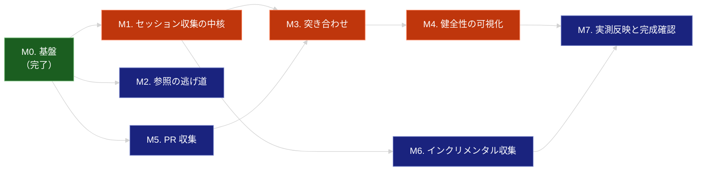

# ROADMAP

agent-effort-db を「CLI として完結する状態」まで到達させるための工程表。

- 何を・なぜ作るかは [effort-db.md](.sdd/requirement/effort-db.md)（PRD）が真実の源
- 論理構造と公開 API は [effort-db_spec.md](.sdd/specification/effort-db_spec.md)
- 技術設計・設計判断の根拠は [effort-db_design.md](.sdd/specification/effort-db_design.md)
- 交渉不可の原則は [CONSTITUTION.md](.sdd/CONSTITUTION.md) が定める
- 本ドキュメントは**実行順序と完了条件**のみを扱う。要求と設計の定義は行わない

完成ライン（スコープ）: `effort-db` の全コマンドが動作し、実測データが蓄積・参照できる状態。
hook 自動収集 / MCP / プラグイン / Jira API 連携 / チーム共有DB / 推定器はスコープ外
（PRD 7. スコープ外を参照）。

---

## 進捗サマリ

| マイルストーン                | 状態      | 対象要求（PRD）                                          |
|:-----------------------|:--------|:---------------------------------------------------|
| M0. 基盤                 | ✅ 完了    | FR_001 / IR_004（一部）                               |
| M1. セッション収集の中核         | ⬜ 未着手   | FR_002 / FR_002_01〜04 / DC_003 / DC_008            |
| M2. 参照の逃げ道             | ⬜ 未着手   | FR_008                                             |
| M3. 突き合わせ              | ⬜ 未着手   | FR_005 / FR_005_01〜03 / FR_006 / IR_004（残り）        |
| M4. 健全性の可視化            | ⬜ 未着手   | FR_007                                             |
| M5. PR 収集              | ⬜ 未着手   | FR_003 / IR_003                                    |
| M6. インクリメンタル収集コマンド     | ⬜ 未着手   | FR_004 / PR_001                                    |
| M7. 集約ビューの実測反映と完成確認    | ⬜ 未着手   | FR_009 / PR_002                                    |

**設計上の前提が実測で更新されている。** 実ログ調査の結果、
チケットキーを主 join キーとする当初の前提は成立しないことが判明した（ブランチ名にチケットキーを含むのは 1.3%）。
join キーの主軸は `(repo, branch)` であり、ログ内 PR 参照を優先適用し、チケットキーは補助とする。
根拠と判断の詳細は design 9.1（観測結果）と 9.2（決定事項 D6）を参照。

---

## 依存関係

赤系がクリティカルパス（M1 → M3 → M4 → M7）。

**M5（PR 収集）は M3 の前提になった。** `(repo, branch)` で突き合わせるには
PR 側の head ブランチが DB に入っている必要がある（design D6）。
当初は M3 の後に置いていたが、依存関係を反転させた。
M5 は M1 と独立に着手できるため、M1 と並列に進められる。

---

## M0. 基盤（完了）

**目的**: DB を作れる状態にする。

| 項目   | 内容                                                    |
|:-----|:------------------------------------------------------|
| 対象要求 | FR_001（DB 初期化）/ IR_004（DB パス解決の部分）                    |
| 実装   | `cli.py`（`init`）/ `schema.py`（v1）/ `config.py`         |
| 完了条件 | `effort-db init` が冪等に成功し、再実行で既存データが失われない（達成済み）        |
| 準拠原則 | A-002 / T-004 / T-005                                 |

実施済み issue: #1（実データ保護）/ #2（パッケージ骨格と `init`）

`schema.py` の v1 は `issue_key` を主軸にした `task_effort` ビューを持つ。
これは M1 の実測結果により置き換える（design D9 / 5.2 のマイグレーション）。

---

## M1. セッション収集の中核 ★最重要

**目的**: セッションログから実測値を取り出せる状態にする。本プロジェクトの作り込みポイント。

| 項目   | 内容                                                                                     |
|:-----|:---------------------------------------------------------------------------------------|
| 対象要求 | FR_002 / FR_002_01〜04 / DC_003 / DC_008（spec: FR-002〜FR-007 / FR-019 / FR-020）         |
| 実装   | `models.py`（新規）/ `collectors/session.py`（新規）/ `schema.py`（v2 へ拡張）/ `backfill sessions` |
| 準拠原則 | A-003 / A-005 / D-002 / D-003                                                          |
| 設計   | design 4.3（4 段構成）/ 6.1〜6.2（正規化）/ 9.2（D1〜D5 / D8 / D12 / D13）                          |

**完了条件**:

- [ ] 合成フィクスチャから `turns` / `tool_calls` / `sidechain_tool_calls` / `wall_clock_min` / トークン使用量を取得できる
- [ ] ターン数が**人由来の発話のみ**を数えている。ツール応答を加えても値が増えない（design D1）
- [ ] サブエージェントのツール呼び出しが主エージェントと**別列**で保持されている（design D2）
- [ ] セッション識別子をレコード内のキーから取得している。ファイル名から導出していない（design D3）
- [ ] 同一セッションが複数ファイルに分かれている場合、束ねて 1 レコードとして集計できる（design D4）
- [ ] 実経過時間が会話系レコードの**最小時刻と最大時刻の差**から算出されている。先頭・末尾のレコードを使っていない（design D5 / O17：約 22% のファイルで時刻が逆行する）
- [ ] 入力全体の大きさに依存しない定常メモリで完走する（spec NFR-008）
- [ ] 再収集で `issue_key` が消えない（突き合わせ段が付与した値を保全する / design 6.3）
- [ ] `backfill sessions` を 2 回実行しても行数と各列の値が一致する（DC_003）
- [ ] 未知フィールド・未知種別を含むレコードで例外を投げず、収集が継続する（DC_008）
- [ ] 解釈できない行が混在しても一括取り込みが完走し、スキップ件数が報告される（DC_008）
- [ ] 観測した形式バージョンが `log_versions` に保存されている
- [ ] スキーマ v1 → v2 のマイグレーションで既存行が失われない（design 5.2）
- [ ] `tests/fixtures/` がすべて合成データである（D-002）
- [ ] テストが「値」ではなく「関係」を検証している（design 8.1）

**注意点**:

- 実ログの構造は調査済み（design 9.1 に観測結果、9.2 に判断を記録）。
  実装時に新たな構造が見つかった場合は、design 9.1 に観測事実として追記してから設計判断を更新する
- 観測した断片をそのまま期待値としてテストに焼き付けてはならない（D-003 / design 8.1）
- 入力は約 1.6 GB 規模。行単位ストリーミングで処理し、ファイル全体をメモリに載せない

想定 issue: 「[add] セッションログパーサと backfill sessions（スキーマ v2 含む）」

---

## M2. 参照の逃げ道

**目的**: 蓄積された生データを確認できる手段を早期に確保し、以降の開発のデバッグ基盤とする。

| 項目   | 内容                            |
|:-----|:------------------------------|
| 対象要求 | FR_008（spec: FR-016）          |
| 実装   | `cli.py` の `query`            |
| 完了条件 | 任意の SQL を実行でき、raw 層・リンク層・集約層を参照できる |
| 準拠原則 | A-002                         |

実装量は小さい。M1 と独立に着手でき、先に入れておくと M1 以降の確認が容易になる。

想定 issue: 「[add] effort-db query による素の SQL 参照」

---

## M3. 突き合わせ

**目的**: セッションと PR を結びつけ、集約に必要なキーを付与できる状態にする。

| 項目   | 内容                                                                    |
|:-----|:----------------------------------------------------------------------|
| 対象要求 | FR_005 / FR_005_01〜03 / FR_006 / IR_004（残り）（spec: FR-010〜FR-014）      |
| 実装   | `linker.py`（新規）/ `config.py`（チケットキー形式の設定読み込み）/ `link` コマンド            |
| 準拠原則 | A-004 / B-004 / D-004                                                 |
| 設計   | design 6.3 / 9.2（D6 / D7 / D10 / D11）                                |
| 前提   | **M5 完了**（PR 側の head ブランチが DB にあること）                                 |

**完了条件**:

- [ ] ログ内 PR 参照によるリンクが作られる（由来 `log_reference`）
- [ ] `(repo, branch)` の一致によるリンクが作られる（由来 `repo_branch`）
- [ ] 後続の段が先行する段のリンクを上書きしない（確実性の順序が保たれる）
- [ ] リンクに**由来が記録**されている（design D10 / spec FR-013）
- [ ] チケットキーの形式が `config.toml` から与えられ、コードに既定値を持たない（B-004）
- [ ] チケットキーの付与がリンクの成否と独立に行われる（A-004）
- [ ] いずれのキーも得られないセッションが `unlinked` として保持される（FR_006）
- [ ] `link` が独立コマンドとして動作し、セッション再収集なしにリンクを作り直せる（design D11）
- [ ] リンクを 2 回作成しても重複行が増えない（DC_003）

**注意点**:

- チケットキーを主キーにしない。実測で 1.3% しか取得できないことが確認されている（design O10 / D6）
- リポジトリ名を作業ディレクトリのパスから機械的に導出しない（design O14 / D7）
- テストでは架空のチケットキー形式を使う（B-004 / D-002）

想定 issue: 「[add] linker による段階的突き合わせと由来の記録」

---

## M4. 健全性の可視化

**目的**: どのキーでどれだけ紐付いたかを観測できるようにし、設計判断の材料を得る。

| 項目   | 内容                              |
|:-----|:--------------------------------|
| 対象要求 | FR_007（spec: FR-015）            |
| 実装   | `stats.py`（新規）/ `stats` コマンド    |
| 準拠原則 | D-004                           |

**完了条件**:

- [ ] 収集件数（セッション / PR / リンク）が表示される
- [ ] join 率が**キー種別ごとに区別して**表示される（FR_007 / spec FR-015）
- [ ] 未紐付け件数と、チケットキーが付与された件数が表示される
- [ ] 実データで測定し、結果を design 9.1 に観測事実として記録した
- [ ] join 率が低い場合、抽出ロジックの複雑化ではなく、より確実なキーの採用または命名規約の見直しを検討した（D-004）

**このマイルストーンは判断ポイントである。**
キー種別ごとの join 率が、以降の集約軸の妥当性を決める。

想定 issue: 「[add] effort-db stats によるキー種別ごとの join 率の可視化」

---

## M5. PR 収集

**目的**: PR メタ情報を取り込み、突き合わせの相手側を用意する。

| 項目   | 内容                                                          |
|:-----|:------------------------------------------------------------|
| 対象要求 | FR_003 / IR_003（spec: FR-008 / NFR-007）                     |
| 実装   | `collectors/github.py`（新規）/ `backfill prs`                  |
| 準拠原則 | A-003 / A-005 / T-003                                       |
| 設計   | design 3（技術スタック）/ 9.3（`review_rounds` の定義は本 M で確定）          |

**完了条件**:

- [ ] `gh` CLI 経由で PR メタ情報（**head ブランチ** / 差分規模 / レビュー往復回数 / 作成・マージ時刻 / ラベル）を取得できる
- [ ] `head_branch` が保存されている（M3 の `repo_branch` 突き合わせに必要）
- [ ] 本システムが GitHub トークンを保持・保存・ログ出力していない（IR_003 / T-003）
- [ ] `backfill prs` を 2 回実行しても `(repo, pr_number)` 単位で結果が一致する（DC_003）
- [ ] `gh` が未認証・未インストールの場合に、原因が分かるメッセージで失敗する
- [ ] `review_rounds` の定義（レビューコメント数かレビュー提出数か）を決め、design 9.3 から解決済みに移した

M1 と独立に着手できる。M3 の前提となるため、M3 より先に完了させる。

想定 issue: 「[add] gh CLI 経由の PR 収集（backfill prs）」

---

## M6. インクリメンタル収集コマンド

**目的**: セッション 1 件だけを取り込むコマンドを提供する。将来の hook 収集の受け口となる。

| 項目   | 内容                                    |
|:-----|:--------------------------------------|
| 対象要求 | FR_004 / PR_001（spec: FR-009 / NFR-001） |
| 実装   | `cli.py` の `collect-session`          |
| 準拠原則 | A-003 / A-006                         |

**完了条件**:

- [ ] セッション識別子を指定して 1 件だけ取り込める
- [ ] 対象セッションのファイル群のみを開く。全走査を行わない（design NFR-001 の方針）
- [ ] `collect-session` の結果が `backfill sessions` の結果と一致する（DC_003）
- [ ] 収集時間を計測し、PR_001 の暫定目標値（3 秒以内）と比較した
- [ ] 計測結果に基づき PR_001 の目標値を確定値に更新した（暫定値のまま放置しない）

**スコープ境界**: このコマンドを起動する仕組み（hook / cron）は作らない。
起動方式は未決定であり、決定後に CLI の外側から 1 コマンド呼ぶ形で追加する（A-006）。

想定 issue: 「[add] collect-session によるインクリメンタル収集」

---

## M7. 集約ビューの実測反映と完成確認

**目的**: 実測データに基づいて集約ビューを確定し、CLI 完結スコープの完成を確認する。

| 項目   | 内容                                       |
|:-----|:-----------------------------------------|
| 対象要求 | FR_009 / PR_002（spec: FR-017 / FR-018 / NFR-002） |
| 実装   | `schema.py`（ビュー定義の確定）                    |
| 準拠原則 | A-002 / B-002 / B-003                    |
| 設計   | design 5.1（集約ビュー）/ 9.3（未解決の課題）           |

**完了条件**:

- [ ] `effort_by_branch` / `effort_by_issue` が実データで意味のある値を返す
- [ ] 1 セッションが複数 PR に紐づく場合に**重複計上が起きない**（design 5.1 の相関サブクエリ）
- [ ] 集約が分布として観察できる（`sessions` に対する window 関数で中央値 / p90 が算出できる）（B-003）
- [ ] raw 層を潰して集約値だけを保存していない（A-002）
- [ ] 相関サブクエリの実行コストを計測し、必要なら中間テーブル化を検討した（design 9.3）
- [ ] `backfill sessions` のスループットを計測し、PR_002 の目標値を確定値に更新した
- [ ] 逐次処理で NFR-002 を満たすか判断した。未達なら並列化を検討する（design D12）
- [ ] PRD の全要求 ID が spec / design にトレースされている
- [ ] design 9.3 の未解決課題がすべて解決または明示的に繰り越されている
- [ ] README の使い方が実際のコマンド体系と一致している

想定 issue: 「[update] 実測に基づく集約ビューの確定と完成確認」

---

## AI-SDD ドキュメントの整備状況

| ドキュメント                                                        | 状態      | 次の更新タイミング                                    |
|:-------------------------------------------------------------|:--------|:---------------------------------------------|
| [CONSTITUTION.md](.sdd/CONSTITUTION.md)                      | ✅ v1.0.0 | 原則の追加・変更時（セマンティックバージョニングに従う）                 |
| [effort-db.md](.sdd/requirement/effort-db.md)                | ✅ draft | PR_001 / PR_002 の確定値を M6 / M7 で反映            |
| [effort-db_spec.md](.sdd/specification/effort-db_spec.md)    | ✅ draft | 公開 API の変更時。FR-007 / FR-013 の PRD 昇格判断（M3 後） |
| [effort-db_design.md](.sdd/specification/effort-db_design.md) | ✅ draft | 各 M で観測事実を 9.1 に、判断を 9.2 に追記。`impl-status` を更新 |
| `task/` 配下のタスク分解                                             | ⬜ 未作成   | 各マイルストーン着手前に `/task-breakdown`               |

**各マイルストーンでの design 更新ルール**:

1. 実装中に新しい観測事実が見つかったら、まず 9.1 に追記する
2. その観測に基づいて 9.2 の設計判断を追加・更新する
3. 判断が変わった場合は 10. 変更履歴に記録する
4. 完了時に 1.1 の実装進捗と front matter の `impl-status` を更新する

観測 → 判断 → 記録の順序を守る。判断を先に書いて後から根拠を探してはならない（D-005）。

---

## スコープ外項目の扱い

以下は完成ライン到達後の候補であり、本ロードマップでは扱わない。
いずれも A-006 により CLI の外側の追加として実現できる。

| 項目                    | 前提となる決定事項                                               |
|:----------------------|:--------------------------------------------------------|
| hook / cron による自動収集   | 収集タイミングの方式決定（Stop / SessionEnd / PR 作成後段 / cron）        |
| MCP 化                 | 参照側に必要な問い合わせパターンが実測データから見えてくること                        |
| プラグイン / skill としての参照側 | 同上                                                      |
| チーム共有 DB 化            | 共有範囲とプライバシー方針の決定                                        |
| 他エージェントのログ取り込み        | 対象エージェントのログ形式調査。`models.py` の型を共通化できるかの検討               |

---

| 日付         | 変更内容                                                                                   |
|:-----------|:---------------------------------------------------------------------------------------|
| 2026-08-16 | 実ログ調査の結果を反映。join キーの主軸を `(repo, branch)` に変更し、M5 を M3 の前提に繰り上げ。spec / design への参照を追加 |
| 2026-08-15 | 初版作成。PRD（prd-effort-db）に基づき M0〜M7 を定義                                                 |
