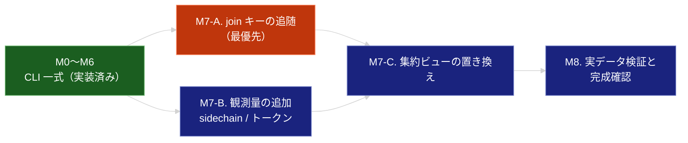

# ROADMAP

agent-effort-db を「CLI として完結する状態」まで到達させるための工程表。

- 何を・なぜ作るかは [effort-db.md](.sdd/requirement/effort-db.md)（PRD）が真実の源
- 論理構造と公開 API は [effort-db_spec.md](.sdd/specification/effort-db_spec.md)
- 技術設計・設計判断の根拠は [effort-db_design.md](.sdd/specification/effort-db_design.md)
- 交渉不可の原則は [CONSTITUTION.md](.sdd/CONSTITUTION.md) が定める
- 本ドキュメントは**実行順序と完了条件**のみを扱う

---

## 現在地

**CLI コマンド一式は実装済み**（`init` / `backfill sessions` / `backfill prs` / `collect-session` / `stats` / `relink` / `query`、テスト 61 件）。

ただし**実測データに基づく設計判断に実装が追随していない項目が 5 つ**残っている。
最も重大なのは join キーで、**現在の実装では実データに対して 1 件も紐付かない**。

| 項目            | 実装の現状               | 設計の判断                          | 根拠           |
|:--------------|:--------------------|:-------------------------------|:-------------|
| **join キー**   | `issue_key` 単独      | `(repo, branch)` 主軸 + ログ内 PR 参照優先 + `issue_key` 補助 | design O10 / D6 |
| リンクの由来        | 保持しない               | `link_source` として保持            | design D10   |
| サブエージェントのツール数 | `tool_calls` に合算    | `sidechain_tool_calls` として別列    | design D2 / D16 |
| トークン使用量       | 収集しない               | 入力・出力・キャッシュ読み取りを収集             | design O13   |
| スキーマ          | v1（`task_effort`）   | v2（リンク層 + 2 ビュー）               | design D9    |

---

## 進捗サマリ

| マイルストーン                     | 状態             | 対象要求（PRD）                                     |
|:----------------------------|:---------------|:----------------------------------------------|
| M0. 基盤                      | ✅ 完了           | FR_001 / IR_004                               |
| M1. セッション収集の中核              | ✅ 実装済み（差分あり）   | FR_002 / FR_002_01〜03 / DC_003 / DC_008       |
| M2. 参照の逃げ道                  | ✅ 実装済み         | FR_008                                        |
| M3. 突き合わせ                   | ✅ 実装済み（**差分大**） | FR_005 / FR_006                               |
| M4. 健全性の可視化                 | ✅ 実装済み（差分あり）   | FR_007                                        |
| M5. PR 収集                   | ✅ 実装済み         | FR_003 / IR_003                               |
| M6. インクリメンタル収集              | ✅ 実装済み         | FR_004                                        |
| **M7. 設計差分の解消**             | ⬜ **未着手（最優先）** | FR_002_04 / FR_005_01〜03 / FR_009             |
| M8. 実データでの検証と完成確認           | ⬜ 未着手          | PR_001 / PR_002                               |

### 起票済み issue

| issue | 対応するマイルストーン | 内容                                     |
|:------|:-------------|:---------------------------------------|
| #12   | M7-A         | linker による段階的突き合わせと由来の記録（最優先）          |
| #13   | M7-A         | stats のキー種別ごとの join 率（#12 が前提）         |
| #15   | M7-B         | サブエージェント計上の分離とトークン使用量の収集               |
| #16   | M7-C         | 集約ビューの置き換え（スキーマ v2。#12 が前提）            |
| #14   | —            | `ruff format .` が `.sdd/` を書き換える問題（✅ PR #17 で対応済み） |

**#14 は PR #17 で対応済み**（`pyproject.toml` に `extend-exclude = ["*.md"]` を追加）。
ruff 0.16 以降は Markdown 内の Python コードブロックも format 対象になるため、
除外しないと実装作業中に設計ドキュメントへ差分が混入する。
`ruff check`（lint）は元から .py のみを対象とするため、除外による検査漏れは生じない。

---

## 依存関係

M7-A と M7-B は独立しており並列に着手できる。
どちらもスキーマ変更を伴うため、**同一のスキーマ v2 マイグレーションにまとめる**のが望ましい。

---

## M0〜M6（実装済み）

CLI コマンド体系と収集・参照の基本機能は動作している。以下は各マイルストーンの達成状況。

| マイルストーン | 達成内容                                                              | 残る差分                          |
|:--------|:------------------------------------------------------------------|:------------------------------|
| M0      | `init` が冪等に動作。DB パスの解決（環境変数 > `config.toml` > 既定）                 | —                             |
| M1      | セッションログのパーサ。ターン数（人間のプロンプトのみ）・ツール呼び出し・実経過時間（min/max）・中断判定・最頻ブランチ・repo 導出 | sidechain の別列化 / トークン収集 → M7-B |
| M2      | `query` による素の SQL 参照                                              | —                             |
| M3      | `issue_key` の抽出（既定パターンなし）と `relink` による再計算。未抽出は NULL で保持            | **join キーの主軸 → M7-A**         |
| M4      | `stats` による充填状況・join 状況の集計。50% 未満で警告                              | キー種別ごとの内訳 → M7-A              |
| M5      | `gh` 経由の PR 収集。認証失敗の判定込み                                          | —                             |
| M6      | `collect-session` による単一セッション収集                                    | 応答時間の計測 → M8                  |

**実装が設計より優れていた点**（design D14〜D18 として取り込み済み）:

- `isMeta`（フック由来の擬似 user エントリ）もターン数から除外する
- セッションのブランチは最頻値で決める（途中でブランチが切り替わるため）
- `cwd` を右からホスト名で走査して `owner/repo` を導出する（社内ホストにも対応）
- 中断は構造フィールドとテキストマーカーの両方で判定する
- メッセージが 1 件も無いログは 0 ではなく NULL とする

---

## M7. 設計差分の解消 ★最優先

### M7-A. join キーの追随（issue #12 / #13）

**目的**: 実データで join が成立する状態にする。**現状は 1 件も紐付かない。**

| 項目   | 内容                                                                    |
|:-----|:----------------------------------------------------------------------|
| 対象要求 | FR_005 / FR_005_01〜03（spec: FR-010〜FR-013）                            |
| 実装   | `linker.py` / `schema.py`（`session_pr_refs` / `session_pr_links` の追加）  |
| 設計   | design 6.4（段階適用）/ 9.2（D6 / D10）/ 5.1（DDL）                            |

**完了条件**:

- [ ] `(repo, branch)` の一致でセッションと PR を突き合わせられる（FR_005_01）
- [ ] セッションログ内の PR 参照（`type: pr-link` の `prNumber` / `prRepository`）を収集し、優先して突き合わせる（FR_005_02）
- [ ] `issue_key` は補助的な集約キーとして扱い、単独の join キーにしない（FR_005_03）
- [ ] リンクに**由来**（`log_reference` / `repo_branch`）を記録する
- [ ] 後続の段が先行する段のリンクを上書きしない
- [ ] `stats` が join 率をキー種別ごとに表示する
- [ ] 実データで join 率を測定し、0% でなくなったことを確認する

**根拠**: 実ログのユニークなブランチ名 84 個のうち、チケットキー様の文字列を含むものは **0 個**（design O10）。
`issue_key` 単独では集計が成立しない。一方 `gitBranch` は全レコードで取得できる（O9）。

### M7-B. 観測量の追加（issue #15）

**目的**: 後から復元できない観測量を取りこぼさない。

| 項目   | 内容                                                     |
|:-----|:-------------------------------------------------------|
| 対象要求 | FR_002_02（区別保持）/ FR_002_04（spec: FR-004 / FR-006）       |
| 実装   | `collectors/session.py` / `schema.py`                   |
| 設計   | design 9.2（D2 / D16）/ 5.1                              |

**完了条件**:

- [ ] サブエージェントのツール呼び出しを `sidechain_tool_calls` として別列に保持する（合算をやめる）
- [ ] 主エージェント分と合算した値はビューで得られることを確認する
- [ ] トークン使用量（`input_tokens` / `output_tokens` / `cache_read_tokens`）を収集する
- [ ] 観測されたログ形式バージョンを `log_versions` に保持する

**根拠**: サブエージェントのツール呼び出しは全体の約 37%（design O6）。合算すると主エージェント分を後から復元できない（A-002）。
トークン使用量は全 assistant レコードが保持しており（O13）、収集しなければ再 backfill でしか取れない。

### M7-C. 集約ビューの置き換え（issue #16）

**目的**: 集約軸を実データで意味のあるものにする。

| 項目   | 内容                                                          |
|:-----|:------------------------------------------------------------|
| 対象要求 | FR_009（spec: FR-017 / FR-018）                               |
| 実装   | `schema.py`（v2 マイグレーション）                                    |
| 設計   | design 5.1 / 5.2 / 9.2（D9）                                  |

**完了条件**:

- [ ] `effort_by_branch`（`(repo, branch)` 単位）を提供する
- [ ] `effort_by_issue`（`issue_key` 付与分のみ）を提供する
- [ ] 両ビューの列構成が集約軸以外で一致している
- [ ] 1 セッションが複数 PR に紐づく場合に**重複計上が起きない**（相関サブクエリ）
- [ ] `task_effort` を置き換える（v1 → v2 マイグレーションで既存行を失わない）
- [ ] `sessions` に対する window 関数で中央値 / p90 が算出できる（B-003）

---

## M8. 実データでの検証と完成確認

| 項目   | 内容                                            |
|:-----|:----------------------------------------------|
| 対象要求 | PR_001 / PR_002（spec: NFR-001 / NFR-002 / NFR-008） |

**完了条件**:

- [ ] 実データで `backfill sessions` を完走させ、スループットを計測した
- [ ] `collect-session` の応答時間を計測した
- [ ] 計測結果に基づき PRD の PR_001 / PR_002 を暫定値から確定値に更新した
- [ ] 入力全体の大きさに依存しない定常メモリで完走することを確認した（NFR-008）
- [ ] `stats` の join 率を記録し、design 9.1 に観測事実として追記した
- [ ] design 9.3 の未解決課題（`review_rounds` の定義など）を解決または明示的に繰り越した
- [ ] README の使い方が実際のコマンド体系と一致している

---

## AI-SDD ドキュメントの整備状況

| ドキュメント                                                        | 状態                     | 次の更新タイミング                     |
|:-------------------------------------------------------------|:-----------------------|:------------------------------|
| [CONSTITUTION.md](.sdd/CONSTITUTION.md)                      | ✅ v1.0.0               | 原則の追加・変更時                     |
| [effort-db.md](.sdd/requirement/effort-db.md)                | ✅ draft                | PR_001 / PR_002 の確定値を M8 で反映  |
| [effort-db_spec.md](.sdd/specification/effort-db_spec.md)    | ✅ draft                | 公開 API の変更時。FR-013 の PRD 昇格判断 |
| [effort-db_design.md](.sdd/specification/effort-db_design.md) | ✅ draft（v0.3。観測の誤りを訂正済み） | 各 M で観測を 9.1 に、判断を 9.2 に追記    |

### design 更新の手順（厳守）

1. 実装中に新しい観測事実が見つかったら、**まず 9.1 に追記する**
2. **その観測が何を母集団としたかを「標本」列に必ず書く**
3. 観測に基づいて 9.2 の設計判断を追加・更新する
4. 判断が変わった場合は 10. 変更履歴に理由とともに記録する
5. 完了時に 1.1 の実装進捗と front matter の `impl-status` を更新する

**手順 2 は v0.3 の教訓である。** 母集団の定義を検証せずに統計を取った結果、
存在しない問題（複数ファイルに分割されたセッション）に対して設計してしまった。

---

## スコープ外項目の扱い

| 項目                    | 前提となる決定事項                                               |
|:----------------------|:--------------------------------------------------------|
| hook / cron による自動収集   | 収集タイミングの方式決定（Stop / SessionEnd / PR 作成後段 / cron）        |
| MCP 化                 | 参照側に必要な問い合わせパターンが実測データから見えてくること                        |
| プラグイン / skill としての参照側 | 同上                                                      |
| チーム共有 DB 化            | 共有範囲とプライバシー方針の決定                                        |
| 他エージェントのログ取り込み        | 対象エージェントのログ形式調査                                         |

---

| 日付         | 変更内容                                                                                       |
|:-----------|:-------------------------------------------------------------------------------------------|
| 2026-08-16 | 実装のマージを反映し M0〜M6 を実装済みに。観測の誤りの訂正に伴い、残作業を「設計差分の解消（M7-A/B/C）」と「実データ検証（M8）」に再構成 |
| 2026-08-16 | 実ログ調査の結果を反映。join キーの主軸を `(repo, branch)` に変更。spec / design への参照を追加                       |
| 2026-08-15 | 初版作成。PRD に基づき M0〜M7 を定義                                                                   |
